## The question

You built [sensor-analytics](https://github.com/dvhthomas/sensor-analytics) — a working data pipeline with TCP collectors, a Redis queue, a Parquet writer, DuckDB for analysis, and a Flask dashboard. It simulates 50 temperature sensors on one machine. It works.

Now imagine it's real. You're building the data platform for a regional wind utility — 500 turbines across 3 states, each with 50+ SCADA sensors reporting every 10 minutes. You have weather data from 12 stations, grid operator signals, maintenance records from SAP, and a compliance team that needs audit trails for NERC regulators.

**What breaks first, and what do you replace?**

## The scenario, concretely

A modern wind turbine has dozens of sensors: nacelle temperature, gearbox vibration, rotor speed, pitch angle, wind speed and direction, oil pressure, generator temperature, power output. A typical SCADA system records 60–100 signals per turbine at 10-minute intervals[^1], with burst vibration data captured at higher frequency during specific events.

For 500 turbines, the math:

- **Standard SCADA telemetry:** ~100 signals × 500 turbines × 144 intervals/day = **7.2 million readings/day** (~2–4 GB of Parquet)
- **Weather data:** 12 stations, hourly, maybe 50 variables each = ~14,000 readings/day (negligible)
- **Vibration/CMS burst data:** sporadic but large — a single 10-second burst at 25 kHz = ~250,000 samples per sensor
- **Maintenance records:** SAP work orders, inspection logs, calibration records — structured, low volume
- **Grid signals:** curtailment events, dispatch orders, frequency data — time-series, moderate volume

**Total: a few GB/day of structured telemetry.** This is not "big data" by any honest definition. A single machine with DuckDB could query the entire fleet's annual SCADA history comfortably.

So why would you need anything beyond what sensor-analytics already does?

## What actually breaks (and it's not the query engine)

The problems that force you to upgrade aren't about data volume. They're about the infrastructure around the data:

### 1. Redis loses your data

In sensor-analytics, Redis is the message queue between the collector and the Parquet writer. Redis is an in-memory cache — when it restarts, the buffer is gone. For a toy experiment, that's fine. For a utility where every reading could be evidence in an equipment failure investigation, it's not.

**What you need:** A durable, replayable event log. If the writer crashes, you need to replay from where it left off — not lose the data.

<strong>Apache Kafka</strong>
A distributed event streaming platform that stores ordered, immutable sequences of events (called topics) durably on disk. Unlike Redis, Kafka retains events for a configurable period (days, weeks, or forever), allowing multiple consumers to read the same data independently and at their own pace. For industrial IoT, Kafka is the standard backbone for ingesting sensor data at scale — it handles connectivity to SCADA systems, PLCs, and MQTT brokers through Kafka Connect[^2].

In the wind utility, Kafka replaces Redis. SCADA data flows from turbine controllers → a Kafka topic → multiple consumers: one writes to long-term storage, another feeds the real-time dashboard, a third streams to an ML model for anomaly detection. If any consumer fails, the data is still in Kafka — replay from the last offset and catch up.

### 2. Local files can't be shared or trusted

sensor-analytics writes Parquet files to the local filesystem. One process writes, one person reads. For the wind utility:

- The SCADA ingestion pipeline writes telemetry.
- A weather pipeline writes forecasts and actuals.
- A maintenance pipeline writes SAP work orders.
- 15 analysts query the same data.
- A data scientist trains an ML model on 3 years of history.

Local Parquet files on one machine can't serve this. You need **object storage** — S3, Azure Data Lake Storage (ADLS), or Google Cloud Storage — where data is durable, accessible from any compute node, and cost-effective for petabyte-scale retention.

<strong>Object storage (S3 / ADLS / GCS)</strong>
Cloud storage services that store data as objects (files) in a flat namespace of "buckets." Unlike local filesystems, object storage is: virtually unlimited in capacity, accessible from any machine with credentials, durable (designed for 99.999999999% — "eleven nines" — durability), and inexpensive for cold data (~$0.02/GB/month). The trade-off: individual file operations are slower than local disk (100ms+ latency per request), so access patterns matter.

But putting Parquet files in S3 doesn't solve everything — it actually creates new problems that didn't exist on local disk. We'll cover those in Module 2 (Delta Lake).

### 3. Nobody knows what data is trustworthy

sensor-analytics has no data quality layer. Readings go from sensor → Redis → Parquet. If a sensor sends garbage (negative wind speed, temperature of 5000°C), it's written to Parquet without question.

For the wind utility, bad data has real consequences:

- A faulty temperature reading triggers a false alarm → a technician drives 3 hours to a remote site for nothing ($2,000 wasted per false dispatch).
- An outlier corrupts the monthly capacity factor calculation → the grid operator penalizes you for underperformance.
- A sensor goes offline and nobody notices → the vibration model that predicts bearing failure stops getting inputs for that turbine, and the next failure is a surprise.

**What you need:** Data validation at ingestion, quality tracking through the pipeline, and clear separation between "raw data as received" and "cleaned data that analysts can trust." This is the medallion architecture (Module 3) and data quality expectations (Module 4).

### 4. Compliance can't prove anything

NERC CIP standards require utilities to prove who has access to Critical Energy Infrastructure Information (CEII)[^3]. Grid topology, generation capacity, vulnerability assessments — all regulated. A 2025 FERC audit found compliance gaps specifically in how utilities manage access controls and audit trails for critical cyber assets[^4].

sensor-analytics has no access control. Anyone who can reach the Parquet files can read everything. There's no audit log of who queried what.

**What you need:** A governance layer — centralized access control, audit logging, and data lineage. This is Unity Catalog (Module 5).

### 5. Analysts need concurrent access to the same data

sensor-analytics uses DuckDB for analysis. DuckDB is a single-process embedded database — perfect for one person exploring data, but it can't serve 15 analysts running concurrent queries against the same dataset with query isolation.

**What you need:** A shared query engine with concurrency support. This is Databricks SQL (Module 6).

### 6. Models need reproducibility

The data science team builds a vibration model in a notebook. It works. They deploy it. It gives different results. Nobody can trace what changed.

**What you need:** Experiment tracking, model versioning, and a deployment lifecycle. This is MLflow (Module 7).

## Where does Spark fit in this picture?

Notice that Spark hasn't come up yet. The first five problems — durable ingestion, shared storage, data quality, governance, and concurrent analytics — are solved by Kafka, object storage, Delta Lake, Unity Catalog, and Databricks SQL respectively. Spark is the compute engine underneath several of these, but it's not the reason you'd adopt the platform.

Spark becomes specifically necessary when:

- **You need to join large datasets across multiple sources.** Correlating 3 years of SCADA data with weather data, maintenance records, and grid signals — that's a multi-TB join that benefits from distributed compute.
- **You need to run complex transformations on the full dataset.** Computing rolling 30-day averages for every sensor on every turbine, or running feature engineering for an ML model across the full fleet history.
- **You need streaming + batch in one framework.** The real-time anomaly detection pipeline and the nightly batch aggregation pipeline share code and logic through Spark's unified engine.

For any single query against a year of SCADA data for a handful of turbines? DuckDB is probably faster and simpler. Spark earns its keep in the pipeline layer and at the joins-across-sources scale.

## The history: how we got from MapReduce to Spark 4.x

Understanding where Spark came from tells you what it's optimized for:

**MapReduce (2004).** Google published a paper describing how they processed the entire web by splitting work into *map* (transform each piece independently) and *reduce* (combine results)[^5]. The open-source world built Hadoop. It solved scale but was painfully slow — every step wrote to disk — and rigid: everything had to be expressed as map/reduce steps. Data scientists couldn't use it.

**Spark (2009–2014).** Apache Spark came out of UC Berkeley's AMPLab with a simple insight: keep intermediate data in memory instead of writing to disk between steps[^6]. This made it 10–100x faster than MapReduce for iterative workloads. Spark also added a richer set of operations (joins, aggregations, window functions), interactive notebook use, and Python/SQL/Scala/R APIs. It became an Apache top-level project in 2014.

**Spark 3.x (2020–2024).** Adaptive Query Execution (AQE) made the engine self-tuning. Spark Connect decoupled clients from the cluster. The DataFrame API matured into the standard interface.

**Spark 4.0 (2025).** A major release: ANSI SQL mode by default, the VARIANT data type for semi-structured data, a lightweight `pyspark-client` package (1.5 MB, no JVM), and the groundwork for Spark Declarative Pipelines[^7]. Spark 4.1 followed with declarative pipeline support as a first-class feature — you describe datasets and the engine handles execution order, parallelism, and retries.

**Databricks wraps Spark.** Databricks adds cluster management, Photon (a native C++ execution engine), collaborative notebooks, Delta Lake, Unity Catalog, and Databricks SQL. The pitch: you get Spark's power without Spark's operational pain. For utilities, Databricks offers industry-specific accelerators including a wind turbine predictive maintenance solution with pre-built notebooks for SCADA ingestion, anomaly detection, and maintenance scheduling[^8].

## The full picture: sensor-analytics → production platform

Here's how each sensor-analytics component maps to its production equivalent, and which module covers it:

```mermaid
graph TB
    subgraph "sensor-analytics (toy)"
        S1[TCP Sensors] --> R1[Redis Queue]
        R1 --> W1[Parquet Writer]
        W1 --> F1[Local Parquet Files]
        F1 --> D1[DuckDB Analysis]
        R1 --> FL1[Flask Dashboard]
    end

    subgraph "Wind Utility (production)"
        S2[SCADA / OPC-UA] --> K2[Kafka / Event Hubs]
        K2 --> AL2["Auto Loader / Structured Streaming"]
        AL2 --> DL2["Delta Lake on Object Storage<br/>(Module 2)"]
        DL2 --> MED2["Medallion Layers<br/>(Module 3)"]
        MED2 --> DLT2["DLT Pipelines<br/>(Module 4)"]
        DLT2 --> UC2["Unity Catalog<br/>(Module 5)"]
        UC2 --> DBSQL2["Databricks SQL<br/>(Module 6)"]
        UC2 --> ML2["MLflow / Model Serving<br/>(Module 7)"]
        DBSQL2 --> BI2[Tableau / PowerBI]
        ML2 --> ALERT2[Anomaly Alerts]
    end
```

| sensor-analytics | Production equivalent | Why you swap | Module |
|---|---|---|---|
| Redis queue | Kafka / Event Hubs | Durability, replayability, multiple consumers | — |
| Local Parquet files | Delta Lake on S3/ADLS | ACID transactions, schema enforcement, time travel | 2 |
| (no structure) | Medallion (Bronze/Silver/Gold) | Separate raw, cleaned, and business-ready data | 3 |
| (manual scripts) | DLT / Declarative Pipelines | Automated orchestration, data quality tracking | 4 |
| (no governance) | Unity Catalog | Access control, lineage, audit trails for NERC | 5 |
| DuckDB | Databricks SQL | Concurrent analyst access, BI tool connectivity | 6 |
| (no ML tracking) | MLflow | Experiment tracking, model versioning, reproducibility | 7 |

The compute engine (Spark) is shared infrastructure underneath several of these layers — it powers the DLT pipelines, the SQL warehouse, and the ML training. But you don't adopt Spark in isolation. You adopt the platform because of the problems above, and Spark comes along for the ride.

## Key takeaway

**Spark exists because data processing at scale needs distributed compute — but for a wind utility, Spark is one component in a larger platform, not the reason you adopt the platform. The real drivers are durability (Kafka replaces Redis), reliability (Delta replaces raw Parquet), governance (Unity Catalog for NERC compliance), and collaboration (Databricks SQL for analysts, MLflow for data scientists). Understanding which component solves which problem — and when simpler tools are sufficient — is more valuable than knowing any single API.**

---

[^1]: Pandit, R. et al. "SCADA data for wind turbine data-driven condition/performance monitoring: A review on state-of-art, challenges and future trends." *Journal of Wind Engineering and Industrial Aerodynamics*, 2023. Standard SCADA systems typically record data at 5–10 minute intervals, with 60–100 signals per turbine.

[^2]: Waehner, K. "Apache Kafka for Smart Grid, Utilities and Energy Production." 2021. https://www.kai-waehner.de/blog/2021/01/14/apache-kafka-smart-grid-energy-production-edge-iot-oil-gas-green-renewable-sensor-analytics/

[^3]: NERC CIP standards — particularly CIP-004 (Personnel & Training), CIP-006 (Physical Security), and CIP-011 (Information Protection) — govern access to Critical Energy Infrastructure Information. https://www.nerc.com/standards/reliability-standards/cip

[^4]: FERC. "Lessons Learned from Commission-Led CIP Reliability Audits." 2025. The report found compliance gaps in access management and audit logging for critical cyber assets.

[^5]: Dean, J. and Ghemawat, S. "MapReduce: Simplified Data Processing on Large Clusters." *OSDI*, 2004. https://research.google/pubs/mapreduce-simplified-data-processing-on-large-clusters/

[^6]: Zaharia, M. et al. "Apache Spark: A Unified Engine for Big Data Processing." *Communications of the ACM*, Vol. 59, No. 11, 2016. https://dl.acm.org/doi/10.1145/2934664

[^7]: Apache Software Foundation. "Spark Release 4.0.0." 2025. https://spark.apache.org/releases/spark-release-4-0-0.html

[^8]: Databricks. "IoT and Predictive Maintenance — Wind Turbine Demo." https://www.databricks.com/resources/demos/tutorials/lakehouse-platform/iot-and-predictive-maintenance
