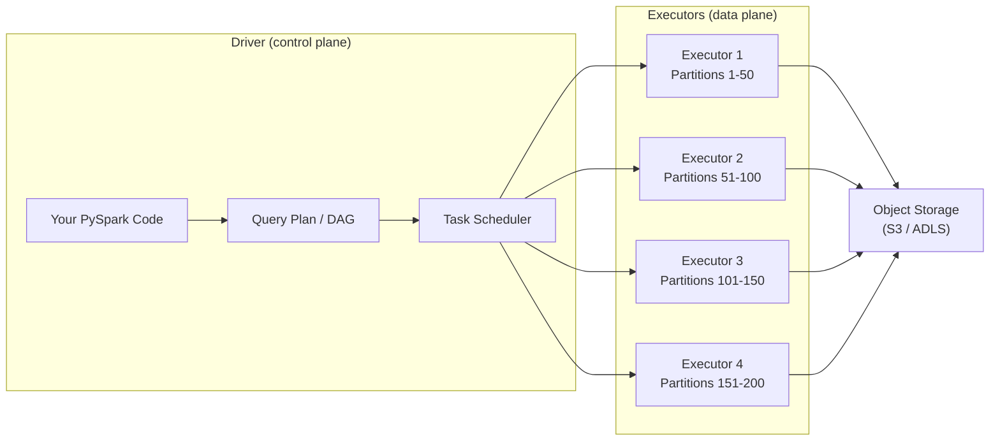
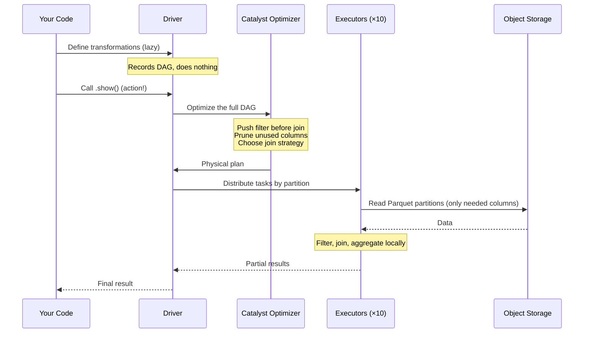

## The question

You write `df.filter(...).groupBy(...).count()` in PySpark and hit run. What actually happens? Where does this code execute? How does Spark decide which machines do what work, and how much data each one gets?

Understanding this machinery is the difference between someone who *uses* Spark and someone who can *reason about* Spark — debug slow jobs, explain performance decisions, or advise a team on cluster sizing.

In the wind utility scenario: you need to join 3 years of SCADA data (500 turbines × 100 signals × 144 intervals/day × 1,095 days ≈ 7.9 billion rows) with weather data from 12 stations to compute correlations between ambient temperature and gearbox failure rates. How does Spark handle that?

## A single machine, for comparison

On a single machine with pandas or DuckDB, the mental model is simple: your code runs top-to-bottom, one operation at a time, on the data sitting on your local disk. When you call `df.groupby("sensor_id").mean()`, the CPU reads the data, groups it, computes the means, and returns the result. Everything happens in one process, in one place.

This simplicity is a genuine advantage. When it works, nothing beats it for speed of development and ease of debugging.

## Two roles: driver and executors

When you submit code to Spark, it doesn't run on one machine. It runs on a cluster — a collection of machines coordinated to act as one system.

<div class="definition">

<strong>Driver</strong>
The single process that runs your main program. It accepts your code, plans the execution, and coordinates the work. The driver does NOT process your data — it manages the processes that do. Think of it as the control room at the wind farm's operations center: it doesn't generate power, but without it, the turbines can't coordinate.

</div>

<div class="definition">

<strong>Executor</strong>
A worker process that runs on a machine in the cluster. Each executor receives tasks from the driver, processes a portion of the data, and reports results back. A cluster typically has many executors — anywhere from 2 to hundreds, depending on the workload[^1].

</div>

When you write `spark.read.parquet("scada/")`, the driver doesn't read the data. It tells the executors where the data is and what to do with it. Each executor reads a portion of the files and processes its share.



## Partitions: how data gets divided

Spark doesn't send random chunks of data to each executor. It divides the data into logical slices called partitions.

<div class="definition">

<strong>Partition</strong>
A chunk of your dataset that one executor task processes independently. If your data has 200 partitions and you have 10 executors, each executor processes roughly 20 partitions (one at a time or a few in parallel, depending on cores). Partitions are the fundamental unit of parallelism in Spark[^1].

</div>

How does Spark decide on partitions?

- **Reading files:** Each file (or file block) typically becomes one partition. If your SCADA data is stored as 200 Parquet files (one per turbine per day, for example), you get roughly 200 partitions.
- **After a shuffle** (more on this in the next lecture): Spark repartitions the data based on a configuration parameter (`spark.sql.shuffle.partitions`, default 200).
- **You can control it:** `df.repartition(100)` explicitly sets the partition count.

Partition count matters more than most people think. Too few partitions means some executors sit idle while others are overloaded. Too many means the overhead of managing tiny tasks dominates actual processing. A reasonable starting point: 2–4 partitions per CPU core in your cluster.

**Wind utility example:** Your 3-year SCADA dataset is stored as daily Delta files — roughly 1,095 files. Spark creates ~1,095 partitions. With a 10-executor cluster (4 cores each = 40 cores), each core processes about 27 partitions sequentially. That's well-balanced. If instead you had one giant Parquet file, Spark would create just one partition — 39 cores idle, one doing all the work.

**Partition scheduling in practice:** If you have 1,000 partitions but only 40 executor cores, Spark queues the tasks — each core processes partitions sequentially, picking up the next one as it finishes. This is fine; it just means the job takes longer. The danger is at the extremes. Too *few* partitions — say 40 partitions on 40 cores — means one slow partition blocks everything (the job finishes when the slowest task finishes, and there's no work to fill the gap). Too *many* partitions — say 100,000 tiny partitions — means the overhead of scheduling, serializing, and tracking each task exceeds the actual computation. The task scheduler on the driver becomes the bottleneck, not the data processing on the executors.

## The DAG: Spark's execution plan

When you write a chain of transformations like:

```python
result = (
    scada_df
    .filter(col("signal") == "gearbox_temp")
    .join(weather_df, on=["station_id", "hour"])
    .groupBy("turbine_id")
    .agg(
        avg("gearbox_temp").alias("avg_temp"),
        avg("ambient_temp").alias("avg_ambient")
    )
    .withColumn("temp_delta", col("avg_temp") - col("avg_ambient"))
    .orderBy("temp_delta", ascending=False)
)
```

Spark doesn't execute each line as you write it. It records what you *want* to do and builds a plan.

<div class="definition">

<strong>DAG (Directed Acyclic Graph)</strong>
Spark's internal representation of your computation as a graph of steps. Each node is an operation (filter, join, aggregate); edges show data flow. "Directed" means data flows one way. "Acyclic" means no loops — the plan always moves forward. Spark uses this graph to optimize the entire computation before running anything[^3].

</div>

Why build a plan instead of executing immediately? Because the plan lets Spark optimize. It can:

- **Reorder operations.** Push the `gearbox_temp` filter before the join so less data gets shuffled.
- **Combine steps.** Merge adjacent operations that can run together without moving data.
- **Skip unnecessary work.** If you only select 3 columns from a 50-column Parquet file, Spark reads only those 3 columns from disk (this is called "column pruning"). Column pruning means Spark only reads the columns your query actually uses — if you `SELECT wind_speed` from a table with 60 columns, Spark skips the other 59 at the file level (Parquet stores columns independently, so unneeded columns are never read from disk or transferred over the network).

You can see the plan by calling `.explain()`:

```python
result.explain(True)
```

This prints the physical and logical plans — extremely useful for debugging slow queries. If you're ever wondering "why is this slow?", the plan is where you look first.

## Lazy evaluation: nothing runs until you ask for results

This is the concept that surprises people coming from pandas or SQL:

<div class="definition">

<strong>Lazy evaluation</strong>
Spark records transformations (filter, groupBy, join, select) but does NOT execute them. Execution only happens when you call an <em>action</em> — an operation that needs to return a result to the driver or write data to storage[^3].

</div>

**Transformations** (lazy — build the plan):
`filter()`, `select()`, `groupBy()`, `join()`, `withColumn()`, `orderBy()`

**Actions** (trigger execution):
`show()`, `count()`, `collect()`, `write.parquet()`, `take(10)`

This means you can build an arbitrarily complex chain of transformations and Spark won't touch any data. Only when you call `.show()` or `.write()` does the engine execute the entire plan.

Practical consequences:

- **Debugging is different.** An error in your transformation logic might not appear until you call an action — possibly many lines later in your code. This trips up everyone at first.
- **Chaining is free.** Adding another `.filter()` or `.select()` to a chain costs nothing at build time. Spark optimizes the whole thing together.
- **Plans can be inspected.** Since nothing has executed, you can call `.explain()` to see what Spark *would* do, without doing it.

## Putting it together: what happens when you hit "run"

Here's the full sequence for our turbine gearbox temperature query:



1. **You write transformations.** `scada_df.filter(...).join(...).groupBy(...).agg(...)` — Spark records each step in the DAG. Nothing executes.
2. **You call an action.** `.show()` — NOW Spark looks at the full DAG.
3. **The Catalyst optimizer kicks in.** Spark rewrites the plan: pushes the gearbox_temp filter down (less data to read), prunes unnecessary columns from both tables, and decides whether to broadcast the smaller weather table or hash-partition both sides for the join.
4. **The driver divides work into stages and tasks.** A stage is a group of operations that can run without moving data between executors. A task is one stage applied to one partition.
5. **Executors process their partitions.** Each executor reads its portion of the Parquet files from object storage, applies the filter, and processes its share of the join.
6. **Results come back.** The driver collects the final results and returns them to your notebook.

The next lecture covers the one thing that makes this machinery expensive: what happens when Spark DOES need to move data between executors.

## Looking ahead: Spark Connect

This driver/executor model is evolving. Traditionally, your PySpark code runs inside the driver process, which requires a full JVM. Spark 4.0 introduced **Spark Connect** — a thin client architecture where your code sends requests to a remote Spark server over gRPC. The `pyspark-client` package is only 1.5 MB and has no JVM dependency[^2]. This decouples "where you write code" from "where Spark runs" — useful on Databricks where serverless compute handles the cluster and you just connect to it. The driver/executor split still exists on the server side; Spark Connect changes how you *talk to* the driver, not how the driver talks to executors.

**Key takeaway: Spark separates planning from execution. The driver builds a DAG of your transformations, optimizes the whole plan, then distributes the work across executors that each process a partition of the data. Nothing runs until you call an action. This architecture lets Spark optimize across your entire query — but it also means errors surface later and debugging requires understanding the plan, not just the code.**

---

[^1]: Apache Spark. "Cluster Mode Overview." https://spark.apache.org/docs/latest/cluster-overview.html

[^2]: Apache Software Foundation. "Spark Release 4.0.0." 2025. Spark Connect GA with lightweight `pyspark-client` package. https://spark.apache.org/releases/spark-release-4-0-0.html

[^3]: Zaharia, M. et al. "Apache Spark: A Unified Engine for Big Data Processing." *Communications of the ACM*, Vol. 59, No. 11, 2016. https://dl.acm.org/doi/10.1145/2934664
