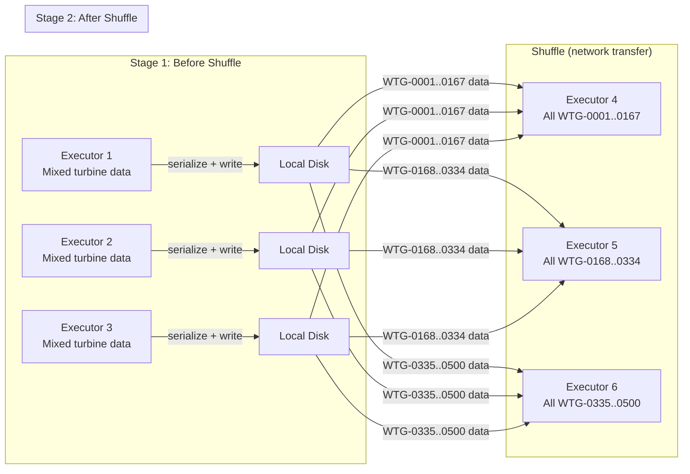

## The question

Your Spark job joins 3 years of SCADA data with weather data to find turbines with abnormal gearbox temperatures. Some operations finish in seconds. Others take 45 minutes. The data size didn't change. The cluster didn't change. So what's different about the slow operations?

The answer, almost every time, is the **shuffle**. Understanding what a shuffle is, why it's expensive, and how to minimize it is the single most practical thing you can learn about Spark performance.

## When operations are fast

Consider this transformation on wind turbine SCADA data:

```python
df = spark.read.parquet("scada/")
filtered = df.filter(col("signal") == "gearbox_temp")
selected = filtered.select("turbine_id", "value", "timestamp")
```

This is fast, regardless of data size. Why? Because every executor can do this work independently on its own partitions. Executor 1 filters its partition for `gearbox_temp` rows and selects three columns. Executor 2 does the same on its partition. No executor needs to talk to any other executor. No data moves between machines.

Spark calls these **narrow transformations** — each output partition depends on only one input partition.

## When operations get expensive

Now add a `groupBy`:

```python
avg_by_turbine = filtered.groupBy("turbine_id").agg(avg("value"))
```

This changes everything. To compute the average gearbox temperature for turbine `WTG-0042`, Spark needs ALL rows for that turbine — but those rows are spread across many executors (because the data was partitioned by file, not by turbine ID). Spark must physically move data from every executor to whichever executor is responsible for `WTG-0042`.

Multiply that by 500 turbines, and you have a significant data transfer.

<div class="definition">

<strong>Shuffle</strong>
The process of redistributing data across executors so that rows with the same key end up on the same machine. Shuffles happen during groupBy, join, distinct, repartition, and any operation that requires data from multiple partitions to be combined. During a shuffle, every executor writes its outgoing data to local disk, then every executor reads incoming data from every other executor over the network[^1].

</div>

## Why shuffles are expensive

A shuffle involves three costs that are each individually significant:



**Disk I/O.** Before transferring data, each executor writes its outgoing shuffle data to local disk (the "shuffle write"). On the receiving end, executors read the incoming data from disk again. All of this happens even though the data was already in memory.

**Network transfer.** The shuffle data must travel over the network from every executor to every other executor. On a large cluster processing terabytes, shuffle transfers can saturate the network.

**Serialization.** Data must be serialized (converted to bytes) for transfer and deserialized on arrival. This costs CPU time.

Approximate order-of-magnitude comparison (these are rough figures for intuition, not benchmarks):

| Operation | Typical throughput |
|---|---|
| Read from memory | ~10 GB/s |
| Read from local SSD | ~2 GB/s |
| Network transfer (same data center) | ~1 GB/s |
| Network transfer (cross-zone) | ~0.1–0.5 GB/s |

A shuffle turns an in-memory operation into a disk + network + serialization operation. That's often a 10–100x slowdown.

A common question: "If I double my executor memory, does shuffle get faster?" Usually no. Shuffle cost is dominated by network transfer and serialization, not memory. More memory helps if you're spilling (intermediate data overflowing to disk — see the Spark UI section below), but the fundamental bottleneck is moving data between machines. The fix is reducing the amount of data that moves: filter before joining, use broadcast joins for small tables, or pre-partition your data on the join key so matching rows are already co-located and no shuffle is needed.

## Stages: where the boundaries are

Spark uses shuffles to divide your job into **stages**.

<div class="definition">

<strong>Stage</strong>
A group of tasks that can run without a shuffle. When Spark encounters an operation that requires a shuffle (like groupBy or join), it creates a stage boundary. All tasks in the current stage must complete and write their shuffle data before the next stage can begin[^1].

</div>

For our wind turbine query:

```python
result = (
    spark.read.parquet("scada/")             # Stage 1: read + filter + select
    .filter(col("signal") == "gearbox_temp") #   (narrow transformations, no shuffle)
    .select("turbine_id", "value")           #
    .groupBy("turbine_id")                   # ── shuffle boundary ──
    .agg(avg("value"))                       # Stage 2: aggregate
    .orderBy("avg_temp", ascending=False)    # ── shuffle boundary ──
)                                            # Stage 3: sort
```

This job has 3 stages and 2 shuffles. The stages run sequentially — Stage 2 can't start until Stage 1's shuffle write is complete. This is why shuffles are also bottlenecks in wall-clock time: they create sequential barriers in an otherwise parallel computation.

## The Spark UI: seeing shuffles for yourself

When you run a Spark job on Databricks, the Spark UI shows you exactly what happened:

- **The Jobs tab** shows the overall timeline
- **The Stages tab** shows each stage, how many tasks it had, and how long they took
- **The SQL tab** shows the physical plan with shuffle boundaries marked

The most important numbers in the Spark UI for performance:
- **Shuffle Read / Shuffle Write** — how much data crossed the network
- **Task duration distribution** — are some tasks much slower than others? (this indicates data skew — e.g., one turbine with 10x more readings than others)
- **Spill (Memory) / Spill (Disk)** — did executors run out of memory and spill to disk? **Spill** means a partition exceeded available execution memory and Spark wrote intermediate data to disk. "Spill (Memory)" shows bytes that were moved from execution memory to a temporary in-memory buffer before being written out; "Spill (Disk)" shows bytes actually written to local disk. Any spill means your partitions are too large or your executors need more memory. Even modest spill degrades performance significantly because it turns an in-memory operation into a disk I/O operation.

If a job is slow, look at the Spark UI first. The shuffle metrics will almost always point you to the problem.

## Common shuffle triggers and how to think about them

| Operation | Why it shuffles | Can you avoid it? |
|---|---|---|
| `groupBy().agg()` | Rows for same key must be co-located | Not really — but you can reduce data before the group |
| `join()` | Matching rows from two datasets must meet | Use a **broadcast join** if one side is small (<100MB). Weather station data (12 stations) is a good candidate. |
| `distinct()` | Must compare all rows | Sometimes `dropDuplicates` on a subset of columns is cheaper |
| `orderBy()` | Global sort requires all data to be compared | Do you actually need a global sort, or is `sortWithinPartitions` enough? |
| `repartition()` | Explicitly redistributes data | Only use when you have a good reason |

The instinct to develop: before writing a transformation, ask yourself "does this need data from multiple partitions?" If yes, there's a shuffle, and you should make sure it's worth it.

**Wind utility example:** Joining SCADA data with weather data by station and hour. The SCADA table has billions of rows; the weather table has ~150,000 rows (12 stations × 8,760 hours/year × ~1.5 years). The weather table is small enough to broadcast — Spark sends a copy to every executor so they can join locally without a shuffle. If you don't hint this, Spark might hash-partition both sides and shuffle the entire SCADA table unnecessarily. AQE (below) often catches this automatically, but knowing the pattern helps you write faster queries.

## What Databricks does about this

Spark shuffles are inherently expensive, but Databricks has invested heavily in making them less painful:

**Photon engine.** Databricks' native execution engine, written in C++, that replaces the JVM-based Spark engine for supported operations. Photon runs by default on SQL warehouses and serverless compute[^2]. It is particularly effective at shuffle-heavy operations through **vectorized shuffle** — keeping data in compact columnar format and processing multiple values simultaneously using SIMD instructions, yielding roughly 1.5x higher throughput on CPU-bound workloads like large joins and wide aggregations[^3].

When does Photon *not* help? Photon accelerates scan, filter, aggregate, and join operations on structured data. It doesn't help with: (1) **Python UDFs**, which run in a separate Python process regardless of the execution engine — Photon can't optimize code that runs outside the engine; (2) **complex nested data types** that can't be vectorized efficiently; or (3) **operations that are already network-bound** — Photon makes computation faster, not the network, so a shuffle-dominated job won't see dramatic improvement from Photon alone. You can check whether a query used Photon by looking at the query profile in Databricks SQL — Photon-accelerated operators show as `PhotonGroupBy` or `PhotonHashJoin` instead of their standard Spark equivalents (`HashAggregate`, `SortMergeJoin`).

**Adaptive Query Execution (AQE).** Enabled by default in Spark 3.0+ and on all Databricks runtimes, AQE dynamically adjusts the query plan *during* execution based on actual runtime statistics[^4]. Key capabilities:

- **Skew handling:** If one partition ends up with much more data than others after a shuffle (data skew — e.g., a turbine in a high-wind region with 10x more curtailment events), AQE splits that partition into smaller pieces.
- **Partition coalescing:** After a shuffle, if many partitions are too small, AQE merges them to reduce task overhead.
- **Join strategy switching:** If AQE discovers at runtime that one side of a join is small enough to broadcast, it switches from sort-merge join to broadcast join automatically.

These don't eliminate shuffles, but they reduce the pain significantly. The fundamental rule still applies: the fewer shuffles, the faster your job.

**Key takeaway: A shuffle moves data across the network so that rows with the same key land on the same executor. Shuffles are the primary cause of slow Spark jobs because they replace fast in-memory operations with slow disk + network + serialization operations. Every groupBy, join, and sort triggers a shuffle. Learning to minimize shuffles — by filtering early, broadcasting small tables, and checking the Spark UI — is the most practical Spark skill you can develop.**

---

[^1]: Apache Spark. "RDD Programming Guide — Shuffle Operations." https://spark.apache.org/docs/latest/rdd-programming-guide.html#shuffle-operations

[^2]: Databricks. "What is Photon?" Photon is enabled by default on SQL warehouses and serverless compute. https://docs.databricks.com/aws/en/compute/photon

[^3]: Databricks. "Photon Engine." Vectorized shuffle keeps data in compact columnar format, improving throughput for CPU-bound workloads. https://www.databricks.com/product/photon

[^4]: Apache Spark. "Performance Tuning — Adaptive Query Execution." https://spark.apache.org/docs/latest/sql-performance-tuning.html
