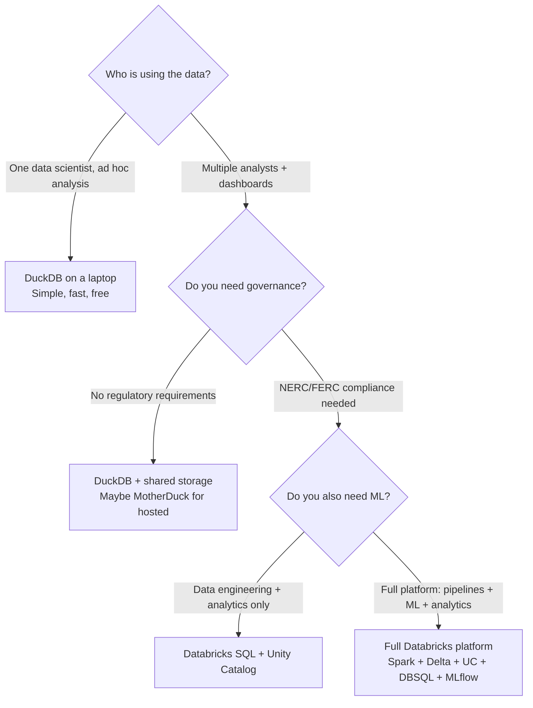

## The question

Your wind utility generates a few GB/day of SCADA telemetry. That's comfortably within single-machine territory. A data scientist on the team says DuckDB on a beefy laptop would be simpler, cheaper, and faster for most queries. An architect says you need Databricks.

Who's right? The honest answer: **both, for different parts of the problem.**

## The case for NOT using Spark

Here's an uncomfortable truth that Databricks sales engineers won't lead with: for most individual queries against your wind turbine data, a single machine is faster, cheaper, and simpler.

<div class="definition">

<strong>DuckDB</strong>
An embedded analytical database (like SQLite, but for analytics). It runs in a single process on a single machine, processes data in a columnar format, and is optimized for analytical queries on datasets that fit on one node. It requires zero infrastructure — no cluster, no configuration, no server[^1].

</div>

DuckDB has matured significantly. Version 1.0 shipped in June 2024 (stable storage format, no more breaking changes), and the 1.4 LTS release (October 2025) added database encryption, the MERGE statement, and Iceberg write support[^2]. DuckDB can now query Delta tables directly, and in benchmarks has processed 1 TB of Parquet data in approximately 30 seconds on a standard laptop[^3].

Let's run the numbers for the wind utility:

**DuckDB on a single machine:**
```python
import duckdb

result = duckdb.sql("""
    SELECT turbine_id, avg(value) as avg_temp
    FROM read_parquet('scada/gearbox_temp/*.parquet')
    WHERE signal = 'gearbox_temp'
      AND timestamp >= '2024-01-01'
    GROUP BY turbine_id
    ORDER BY avg_temp DESC
""").fetchdf()
```
- Startup time: milliseconds
- Query time on 1 year of SCADA (~1 TB): ~30–60 seconds
- Infrastructure: none
- Cost: $0

**PySpark on Databricks:**
```python
result = (
    spark.read.parquet("scada/gearbox_temp/")
    .filter(col("timestamp") >= "2024-01-01")
    .groupBy("turbine_id")
    .agg(avg("value").alias("avg_temp"))
    .orderBy("avg_temp", ascending=False)
)
result.show()
```
- Startup time: seconds (serverless) to minutes (classic cluster)
- Query time on 1 year of SCADA: ~15–45 seconds
- Infrastructure: serverless SQL warehouse or Spark cluster
- Cost: $2–10+ per hour of compute

For this query — one analyst, one table, one aggregation — DuckDB wins on every dimension. It's faster to start, simpler to operate, and free.

## Where the crossover happens

So when does Spark (and the Databricks platform) actually earn its keep? There are five inflection points, and for the wind utility, it's not just about data volume.

### 1. Multi-source joins at scale

The data scientist wants to build a predictive maintenance model. She needs to join:
- 3 years of SCADA gearbox temperature readings (billions of rows)
- Hourly weather data from 12 stations (150K rows)
- Maintenance work orders from SAP (50K rows)
- Curtailment events from the grid operator (10K rows)
- Component specifications from the asset registry (500 rows)

DuckDB can probably handle this join on a single machine — it's compute-intensive but the total data is a few TB. The question is whether the *development experience* of expressing complex multi-source pipelines in DuckDB SQL is better or worse than using Spark DataFrames with a managed execution environment.

For a one-time analysis: DuckDB is fine. For a pipeline that runs nightly and feeds production dashboards: Spark on Databricks gives you scheduling, monitoring, lineage, and the ability for someone else on the team to understand and modify it 6 months later.

### 2. Concurrent access

This is the inflection point most people underestimate. DuckDB runs in a single process. If 15 analysts all need to query the same dataset interactively, they can't share a DuckDB instance effectively.

Databricks SQL provides **SQL warehouses** — dedicated compute endpoints that serve concurrent queries against the same governed data, with query isolation, result caching, and resource management. For the wind utility, this means:

- The fleet performance analyst runs a capacity factor report
- A reliability engineer investigates a specific turbine's sensor history
- The CFO's dashboard auto-refreshes every 15 minutes

All three hit the same Gold tables through the same governance layer. This is the primary reason most organizations adopt Databricks SQL — not raw query speed, but shared, governed access.

### 3. Streaming + batch in one framework

The wind utility needs both:
- **Real-time:** Anomaly detection on incoming SCADA data (flag a gearbox temperature spike within minutes)
- **Batch:** Nightly aggregations, monthly compliance reports, ML model retraining

Spark's Structured Streaming handles the real-time path using the same DataFrame API as batch. The same transformation logic, the same data quality rules, the same Delta tables. You don't need a separate streaming framework (like Flink) for the real-time path and a batch framework for the rest.

DuckDB has no streaming story. You'd need a separate system for real-time processing.

### 4. Governance and compliance

This is the wind utility's dealbreaker. NERC CIP compliance requires:
- Proving who has access to CEII data
- Audit trails for all data access
- Lineage from raw readings to compliance reports

DuckDB has no governance layer. You could build access control around it with file permissions and wrapper scripts, but you'd be reimplementing what Unity Catalog provides out of the box — and you'd need to convince a NERC auditor that your custom solution is adequate.

### 5. ML lifecycle management

The data science team needs:
- Experiment tracking (which model version, which features, which hyperparameters)
- Model registry (which model is deployed to production)
- Reproducibility (can you recreate last month's predictions)

DuckDB doesn't address any of these. MLflow on Databricks integrates with the same governance layer — model access control, lineage from training data to deployed model, audit logs.

## The honest comparison (2026 edition)

| Dimension | DuckDB / single-node | Databricks platform |
|---|---|---|
| **Single-analyst queries** | Faster, simpler, free | Slower to start, costs money |
| **Multi-TB joins** | Possible up to ~1–5 TB | Scales linearly with data |
| **Concurrent users** | Limited (single process) | Built for it (SQL warehouses) |
| **Streaming** | No | Structured Streaming + batch unified |
| **Governance** | None | Unity Catalog (access, lineage, audit) |
| **ML lifecycle** | None | MLflow (experiments, registry, serving) |
| **Startup time** | Milliseconds | Seconds (serverless) to minutes (classic) |
| **Cost at small scale** | Free | $2–50/hour |
| **Operational complexity** | None | Managed, but still a platform to learn |

**DuckLake** (May 2025) is worth noting: DuckDB's own ACID lakehouse format with time-travel, MERGE, and Iceberg interoperability. This narrows the gap between DuckDB and a lakehouse platform for single-user or small-team scenarios. But DuckLake doesn't provide governance, concurrent access, or streaming — the problems that drive enterprise platform adoption[^4].

## The wind utility decision matrix

For the wind utility, the practical split looks like this:



The wind utility lands at the bottom right — not because of data volume, but because of governance requirements (NERC), concurrent analyst access (15+ users), streaming needs (real-time anomaly detection), and ML lifecycle management (predictive maintenance models).

A startup with 10 turbines, 2 engineers, and no regulatory requirements? DuckDB on a laptop, all day long.

## The question you need to answer fluently

If someone asks "why not just use DuckDB?" or "when do you actually need Databricks?", here's the shape of a good answer:

> "DuckDB is genuinely better for individual queries against small-to-medium datasets — it's faster to start, simpler, and free. For a single data scientist exploring a year of turbine data, DuckDB is the right tool. Databricks earns its keep when you need concurrent access for a team of analysts, governance for regulatory compliance, streaming for real-time monitoring, or ML lifecycle management. For a regulated utility with 15 analysts, NERC requirements, and a predictive maintenance program, the platform justifies itself through governance and collaboration — not raw query speed."

That answer builds trust because it's honest about when Spark ISN'T the right tool. Knowing the boundaries of a technology is more credible than being an unconditional advocate.

**Key takeaway: Your wind utility's SCADA data alone doesn't need Spark — DuckDB handles it fine. What drives platform adoption is the combination of concurrent analyst access, regulatory governance, streaming + batch in one framework, and ML lifecycle management. The decision isn't "Spark vs. DuckDB" — it's "do I need a platform or a tool?" For a regulated utility with multiple teams, the answer is platform.**

---

[^1]: DuckDB. "Why DuckDB?" https://duckdb.org/why_duckdb

[^2]: DuckDB. "Announcing DuckDB 1.4.2 LTS." November 2025. DuckDB 1.4.0 added database encryption with AES-256-GCM, the MERGE statement, and Iceberg write support. https://duckdb.org/2025/11/12/announcing-duckdb-142

[^3]: MotherDuck. "Making PySpark Code Faster with DuckDB." Benchmarks showed DuckDB processing 1 TB of Parquet data in approximately 30 seconds on commodity hardware. https://motherduck.com/blog/making-pyspark-code-faster-with-duckdb/

[^4]: DuckDB. "DuckLake." May 2025. A full ACID-compliant lakehouse format with time-travel queries, MERGE support, and Iceberg interoperability — but designed for single-user or small-team use, not enterprise governance.
