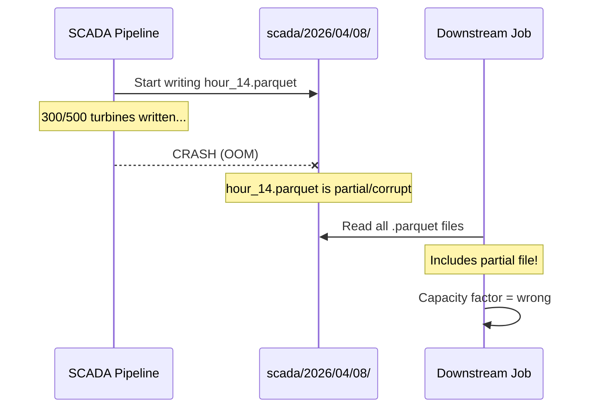
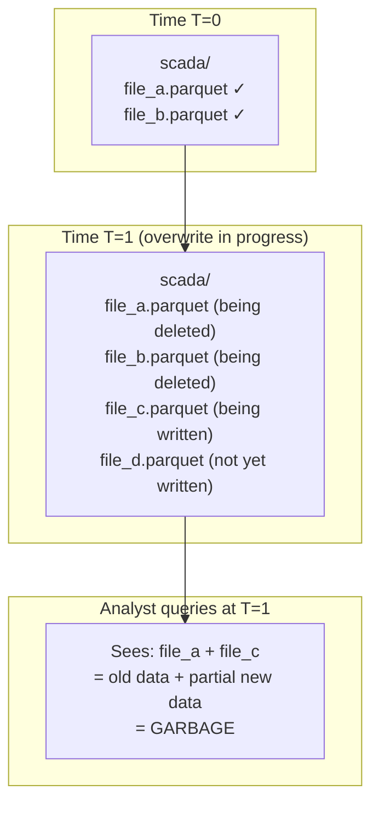

## The question

Your wind utility's sensor-analytics prototype writes Parquet files to a local directory. It works. Now imagine the production version: a SCADA ingestion pipeline writes turbine telemetry every 10 minutes. A weather pipeline appends forecast data hourly. A maintenance team backfills corrected calibration readings. 15 analysts query the data throughout the day.

**What breaks?**

Not the file format — Parquet is excellent. What breaks is everything around it: the assumptions about who writes, when, and what happens when things go wrong.

## Failure 1: The partial write

Your SCADA pipeline collects 10 minutes of readings from 500 turbines and writes them as a batch to `scada/2026/04/08/hour_14.parquet`. Halfway through the write — maybe 300 turbines in — the process crashes. The VM ran out of memory. The network dropped. The pipeline threw an unhandled exception.

**What's on disk now?** A partial Parquet file. It might be:
- **Corrupt** — the file footer wasn't written, so most readers can't open it
- **Incomplete** — it has a valid footer but only 300 of 500 turbines' data

The downstream aggregation job runs an hour later. If the file is corrupt, maybe it fails loudly. If it's incomplete, it succeeds silently — the daily capacity factor report just... doesn't include 200 turbines. Nobody notices until the monthly compliance review.

**The core problem:** Writing a Parquet file is not atomic. There's no mechanism that says "this file is complete and valid" or "this file should be ignored." A reader scanning the directory sees every file, including half-written ones.

## Failure 2: The concurrent write

Two pipelines write to the same directory at the same time:
- The SCADA pipeline writes `batch_001.parquet`
- The weather backfill writes `weather_2026Q1.parquet`

With Parquet files, this might actually work — they're writing different files. But what if both pipelines use a naming convention like `part-00000.parquet`? Or what if one pipeline does a "replace all data for today" operation while the other is appending?

The more realistic scenario: your ETL job runs `overwrite` mode to rewrite today's Silver table. While it's deleting old files and writing new ones, an analyst queries the directory. The analyst sees a mix of old files (not yet deleted) and new files (partially written). The query returns a mashup of yesterday's and today's data.

**The core problem:** There's no isolation between readers and writers. A directory of Parquet files has no concept of "this is a consistent snapshot." Readers see whatever files happen to exist at the moment they list the directory.

## Failure 3: The accidental delete

A field engineer runs a cleanup script to remove test data from the dev environment. The script has a path variable that defaults to production. 3 months of vibration data — gone.

With raw files, there's no undo. The files are deleted. You can recover from S3 versioning if it's enabled (and if you notice quickly enough), but there's no built-in mechanism to say "roll back to what the table looked like yesterday."

**The core problem:** Raw files have no history. There's no record of what the table used to contain or what changed.

## Failure 4: The schema surprise

A turbine manufacturer pushes a firmware update that adds a new sensor signal — `blade_ice_detection`. The SCADA pipeline starts writing files with this new column. Older files don't have it.

Some query engines handle this gracefully (DuckDB, Spark). Others don't. But even when they do, you have a bigger problem: nobody *told* the downstream pipeline about the new column. The data quality checks don't validate it. The analysts don't know it exists. The compliance reports don't include it. Months later, someone discovers that blade icing events were being recorded but nobody was monitoring them.

**The core problem:** Raw files have no schema enforcement. Any writer can add, remove, or change columns at any time, and there's no mechanism to detect or prevent it.

## Failure 5: The silent data quality collapse

This one is the most insidious. Your SCADA pipeline processes data correctly for months. Then a sensor starts reporting temperature in Fahrenheit instead of Celsius (a real firmware bug). The values are valid numbers — they just mean something different. The pipeline writes them to Parquet without complaint.

The gearbox temperature for turbine WTG-0342 jumps from 75°C to 167°F (which looks like 167°C). The threshold alert fires. A technician is dispatched. It's a false alarm. This happens 3 more times before someone investigates.

Meanwhile, the ML model that predicts bearing failure is retrained on this bad data. Its predictions shift. Nobody connects the model degradation to the firmware bug because there's no lineage from raw readings → training data → model version.

**The core problem:** Raw files have no built-in data quality enforcement. Bad data looks the same as good data.

## What these failures have in common

Every failure comes down to the same root cause: **a directory of Parquet files is not a table.** It's just files. There's no:

- **Atomicity** — writes are not all-or-nothing
- **Consistency** — readers can see partial states
- **Isolation** — concurrent readers and writers interfere
- **Durability** — deletes are permanent, no history

These four properties — ACID — are what databases have provided for decades. Your PostgreSQL database doesn't have these problems. But when the data industry moved to "data lakes" (files in cloud storage), it gave up ACID guarantees for flexibility and cost. The result: every organization that builds production pipelines on raw files eventually hits these failures.

<strong>ACID</strong>
A set of properties that guarantee reliable database transactions. <strong>Atomicity:</strong> a write either fully succeeds or fully fails — no partial results. <strong>Consistency:</strong> readers always see a valid state of the data. <strong>Isolation:</strong> concurrent operations don't interfere with each other. <strong>Durability:</strong> once committed, data survives crashes. Traditional databases provide ACID by default. Data lakes on raw files provide none of it.

## What Delta Lake does about it

Delta Lake adds ACID guarantees to Parquet files by putting a **transaction log** in front of them. The Parquet files themselves don't change — they're still the same columnar format, stored in the same cloud storage. What changes is how you interact with them:

- Instead of writing a file and hoping for the best, you **commit a transaction** that atomically records which files were added or removed.
- Instead of listing a directory to find files, you **read the transaction log** to determine which files constitute the current version of the table.
- Instead of deleting files permanently, you **mark them as removed** in the log — the files stay on disk, and you can time-travel back to any previous version.

The next lecture walks through exactly how this log works — you'll read the actual JSON files and see the mechanics.

**Key takeaway: A directory of Parquet files is not a table. It has no atomicity, no consistency guarantees for concurrent access, no isolation between readers and writers, and no history. Every production data pipeline built on raw files eventually hits partial writes, concurrent access corruption, accidental deletes, or schema surprises. Delta Lake solves this by adding a transaction log that provides ACID guarantees on top of the same Parquet files.**
