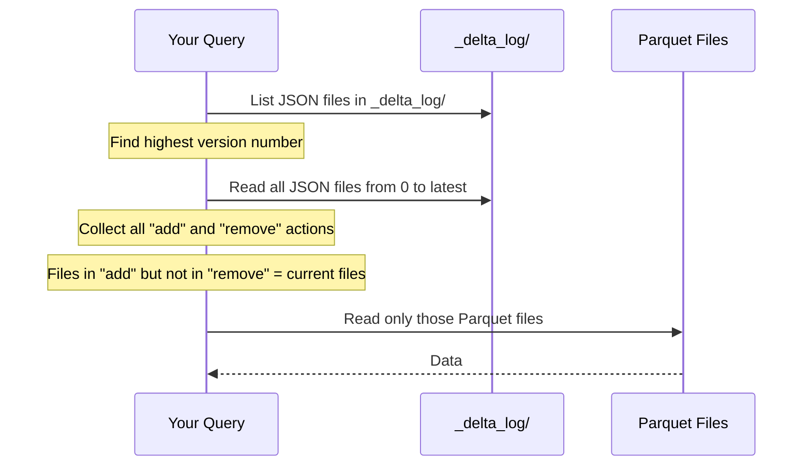
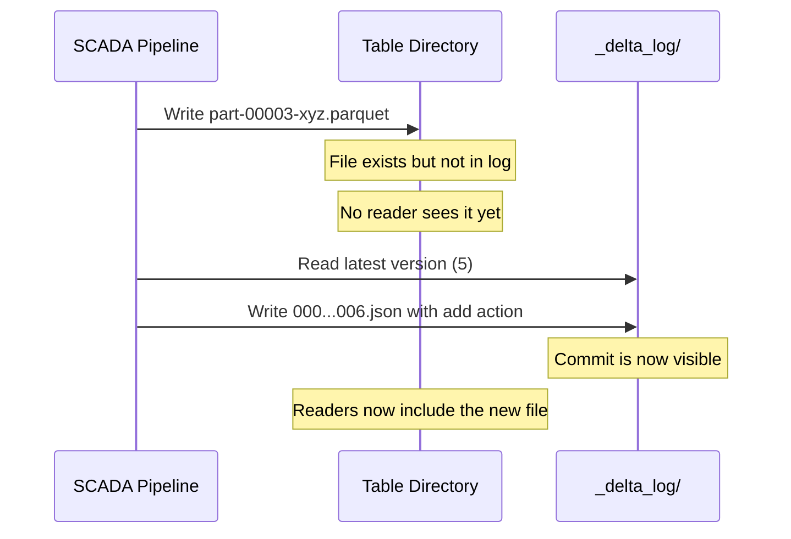

## The question

You know that raw Parquet files don't give you ACID guarantees. Delta Lake adds a transaction log that fixes this. But how does it actually work? What's in the `_delta_log/` directory? How does a reader know which files are "current"? How does it handle two writers at the same time?

This lecture answers those questions by walking through the actual file structure. You'll see real JSON log entries and understand every field. In the exercise, you'll inspect these files yourself.

## The physical layout

A Delta table looks like this on disk (or in S3/ADLS):

```
scada_readings/
├── _delta_log/
│   ├── 00000000000000000000.json    ← version 0 (table creation)
│   ├── 00000000000000000001.json    ← version 1 (first append)
│   ├── 00000000000000000002.json    ← version 2 (second append)
│   └── 00000000000000000010.checkpoint.parquet  ← snapshot at v10
├── part-00000-abc123.parquet        ← data files
├── part-00001-def456.parquet
├── part-00002-ghi789.parquet
└── part-00003-jkl012.parquet
```

The data is still Parquet files — same format, same compression, same columnar layout. The magic is the `_delta_log/` directory: a sequence of numbered JSON files, each representing one **commit** (one atomic change to the table).

<div class="definition">

<strong>Transaction log (_delta_log/)</strong>
An ordered sequence of JSON files that records every change to a Delta table. Each file represents one committed transaction and contains a list of actions: files added, files removed, metadata changes, or protocol updates. The log is append-only — entries are never modified or deleted. Together, the log entries define the complete history of the table.

</div>

## What's in a log entry

Let's look at what version 0 (the first commit) contains. When you create a Delta table by writing a batch of wind turbine SCADA readings, the JSON file `00000000000000000000.json` contains three entries (one per line — the file is newline-delimited JSON, not a single JSON object):

```json
{"commitInfo":{"timestamp":1712534400000,"operation":"WRITE","operationParameters":{"mode":"Overwrite","partitionBy":"[]"}}}
{"metaData":{"id":"a1b2c3d4-...","format":{"provider":"parquet"},"schemaString":"{\"type\":\"struct\",\"fields\":[{\"name\":\"turbine_id\",\"type\":\"string\"},{\"name\":\"signal\",\"type\":\"string\"},{\"name\":\"value\",\"type\":\"double\"},{\"name\":\"timestamp\",\"type\":\"timestamp\"}]}","partitionColumns":[],"configuration":{}}}
{"add":{"path":"part-00000-abc123.parquet","size":48576,"modificationTime":1712534400000,"dataChange":true}}
```

Each line is a separate **action**. Here's what they mean:

### commitInfo

Metadata about the commit itself — who did it, when, what operation. This is for auditing, not for reading the table. In a Databricks environment, this includes the user ID, notebook path, and cluster ID — exactly what a NERC auditor wants when they ask "who changed this table and when?"

### metaData

The table schema, partition columns, and configuration. This appears in the first commit and whenever the schema changes. The `schemaString` field is a JSON-encoded Spark schema — it defines what columns the table has and their types. This is what enforces schema: if a writer tries to add a column that isn't in the schema, the commit is rejected (unless schema evolution is explicitly enabled).

### add

A record that a specific Parquet file is now part of the table. It includes the file path, size, modification time, and whether this is a data change (vs. a compaction). **This is the key insight: the log records which files exist in the table, not the data itself.** A reader doesn't scan the directory — it reads the log to find out which files to read.

## How a reader assembles the table

When you open a Delta table — whether from Spark, DuckDB, or the Python `deltalake` package — here's what happens:



1. **Find the latest version** — list the `_delta_log/` directory and find the highest-numbered JSON file.
2. **Replay the log** — read every JSON file from version 0 to the latest version. Collect all `add` and `remove` actions.
3. **Compute the current file set** — a file is "in the table" if it has an `add` action and no subsequent `remove` action. This is a logical operation — the files themselves aren't modified.
4. **Read only those files** — pass the list of current files to the Parquet reader. Ignore everything else in the directory.

This is why a partial write doesn't corrupt the table: the Parquet file might exist on disk, but if the commit never completed (the JSON log entry was never written), no reader will ever see it. **The log is the source of truth, not the directory listing.**

## How a writer commits

When you write new data to a Delta table, here's what happens:

1. **Write the Parquet files** — the new data files are written to the table directory. At this point, no reader can see them because they're not in the log yet.
2. **Read the current log version** — check what the latest version number is. Say it's version 5.
3. **Write the new log entry** — create `00000000000000000006.json` with `add` actions for the new files.
4. **The commit is atomic** — the log entry is a single file write. On cloud storage (S3, ADLS), file creation is atomic — the file either exists or it doesn't. Once the JSON file appears, the commit is complete and every reader will see the new data.



**This is how Delta solves the partial write problem from Lecture 1.** If the pipeline crashes after writing the Parquet file but before writing the log entry, the data file is just an orphan — it sits in the directory but no reader will ever include it. The table remains consistent at version 5.

## Handling concurrent writers

What if two pipelines try to commit at the same time? Both read the current version as 5, both try to write version 6.

<div class="definition">

<strong>Optimistic concurrency control</strong>
A strategy where writers assume they won't conflict and proceed without locks. When committing, a writer checks whether the version it expected is still the latest. If another writer already committed that version, the first writer retries: it reads the new state, checks whether its changes still make sense, and tries the next version number. This is "optimistic" because conflicts are rare in practice — most writes touch different data.

</div>

Delta Lake uses optimistic concurrency. On local filesystems, it relies on atomic file creation (the OS guarantees only one process can create a file with a given name). On cloud storage, it uses conditional writes or a commit coordinator:

1. **Pipeline A** writes its Parquet files and tries to create `000...006.json`.
2. **Pipeline B** writes its Parquet files and also tries to create `000...006.json`.
3. **One wins** (whichever creates the file first). The other gets a conflict error.
4. **The loser retries** — reads the new log (which now includes version 6), checks whether its changes still apply, and writes version 7.

In practice, conflicts are rare for append-heavy workloads (like SCADA ingestion) because each writer adds new files, so version numbers don't collide often. Conflicts happen when two writers UPDATE or DELETE overlapping rows — both try to "remove" the same file and "add" a replacement. When a conflict occurs, Delta retries automatically: it re-reads the log, recomputes whether the changes still apply, and tries the next version number. The retry limit is controlled by `spark.databricks.delta.maxCommitAttempts` (default: 10,000,000 — effectively unlimited for most workloads)[^2]. For the wind utility's append-heavy SCADA ingestion, you'll almost never see a conflict. For MERGE operations on the same Gold table from two pipelines running concurrently, you might — but the retry mechanism handles it transparently as long as the operations touch different rows.

Delta's atomicity relies on the storage system supporting atomic file creation (put-if-absent). Amazon S3 achieved strong read-after-write consistency in December 2020[^3]; before that, Delta on S3 used a DynamoDB-based log store as a coordination layer to guarantee that only one writer could create a given log entry. On Azure (ADLS Gen2) and GCS, atomic rename operations are natively supported by the filesystem. If you're on S3 today, Delta handles this transparently — but it's worth knowing that the atomicity guarantee comes from the storage layer, not just the log format.

Delta Lake 4.0 introduced **Coordinated Commits** — a table feature that uses an external coordinator (like a catalog service) instead of relying on atomic file creation. This makes multi-engine and multi-cloud writes more reliable[^1].

## Checkpoints: keeping log replay fast

If the table has 10,000 versions, reading 10,000 JSON files on every query would be slow. Delta Lake solves this with **checkpoints**:

<div class="definition">

<strong>Checkpoint</strong>
A Parquet file that snapshots the complete table state (all current <code>add</code> actions, the schema, etc.) at a specific version. Written every 10 commits by default. When a reader opens the table, it finds the latest checkpoint and only replays log entries after it — instead of replaying from version 0.

</div>

```
_delta_log/
├── 00000000000000000000.json
├── 00000000000000000001.json
├── ...
├── 00000000000000000009.json
├── 00000000000000000010.checkpoint.parquet  ← snapshot at v10
├── 00000000000000000011.json                ← reader starts here
├── 00000000000000000012.json
```

A reader opening this table reads the checkpoint at v10 (one Parquet file) plus the 2 JSON files after it — not all 12 entries. This keeps read performance constant regardless of table history length.

## How time travel works

Time travel is now trivially simple to understand. When you query version 3 of a table, the reader just:

1. Replays the log from version 0 to version 3 (ignoring everything after).
2. Computes which files were in the table at version 3.
3. Reads those files.

The data files for version 3 are still on disk — they were never deleted (just marked as `remove` in later versions when the data was updated). This is why Delta tables take more storage than raw Parquet: "deleted" data is still physically present, just no longer referenced by the current version.

You can also time-travel by timestamp — Delta finds the latest version that was committed before that timestamp.

**Wind utility example:** A field engineer accidentally overwrites last month's vibration data at 2pm on Tuesday. At 3pm, someone notices the compliance report is wrong. With time travel, you query the table as of 1pm Tuesday, extract the correct data, and write it back. No data was lost — it was just temporarily invisible.

## What this means for the wind utility

For the SCADA pipeline writing every 10 minutes:

- **Partial writes** are impossible — the pipeline writes Parquet files first, then commits the log entry atomically. If it crashes between the two, the files are orphans.
- **Concurrent access** works — the SCADA pipeline and the weather pipeline can write simultaneously. The analyst querying the table always sees a consistent snapshot.
- **Accidental deletes are recoverable** — time travel to any previous version.
- **Every change is audited** — the `commitInfo` in each log entry records who, when, and what operation. NERC auditors can trace every modification.

The next lecture covers the practical features built on top of this log: schema enforcement (preventing bad writes), time travel (recovering from mistakes), and MERGE (handling late-arriving corrections).

**Key takeaway: Delta Lake's transaction log is a sequence of JSON files that records every change to the table. Readers use the log — not the directory listing — to determine which Parquet files constitute the current table. This single indirection gives you atomicity (commits are all-or-nothing), consistency (readers always see a valid snapshot), isolation (concurrent writers use optimistic concurrency), and durability (every version is preserved for time travel). The data files are still plain Parquet — the log is what makes them a table.**

---

[^1]: Delta Lake 4.0 introduced Coordinated Commits as a table feature for reliable multi-engine writes. See [Delta Lake 4.0 release blog](https://delta.io/blog/2025-09-25-delta-lake-40/).

[^2]: The `spark.databricks.delta.maxCommitAttempts` configuration controls how many times Delta retries a conflicted commit. The default of 10,000,000 makes retries effectively unlimited. See [Delta Lake Internals — Configuration Properties](https://books.japila.pl/delta-lake-internals/configuration-properties/).

[^3]: Amazon S3 delivered strong read-after-write consistency for all applications on December 1, 2020. See [AWS announcement](https://aws.amazon.com/about-aws/whats-new/2020/12/amazon-s3-now-delivers-strong-read-after-write-consistency-automatically-for-all-applications/).
