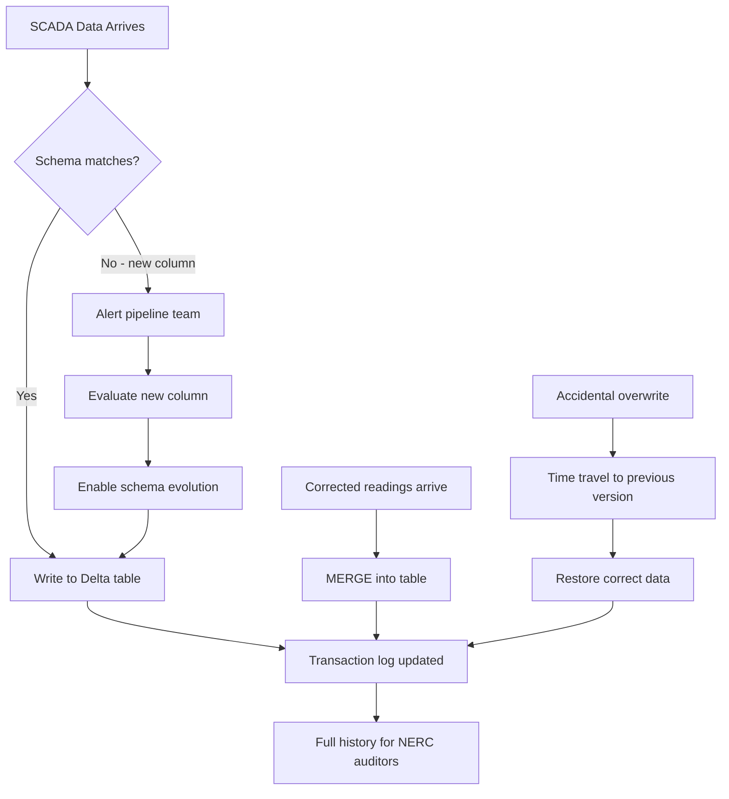

## The question

You understand how the transaction log works. Now: what can you *do* with it? Three features come up constantly in production — and in Databricks job conversations:

1. **Schema enforcement** — a SCADA sensor starts sending a new column. Does the pipeline silently accept it, or does it fail loudly so you can decide?
2. **Time travel** — someone overwrites last month's data by accident. Can you get it back?
3. **MERGE** — a field technician recalibrates a sensor and sends corrected readings for the past 48 hours. How do you update existing records without rewriting the entire table?

## Schema enforcement: the garbage-in-garbage-out fix

In the wind utility, data comes from many sources: SCADA systems from different turbine manufacturers (Vestas, GE, Siemens Gamesa), third-party weather providers, maintenance systems. Each has its own schema quirks. Without enforcement, your table slowly accumulates columns nobody expected, types that silently changed, and nulls where there used to be values.

<div class="definition">
<strong>Schema enforcement (schema on write)</strong>
When you write to a Delta table, the schema of the incoming data is checked against the table's existing schema. If they don't match — a new column, a missing column, a type change — the write is rejected with an error. This happens at commit time, before any data is visible to readers.
</div>

### What gets caught

Schema enforcement checks for:
- **New columns** — the incoming data has a column that doesn't exist in the table
- **Missing columns** — the table has a column that isn't in the incoming data (this is allowed — the missing column is filled with nulls)
- **Type mismatches** — a column that's `double` in the table is `string` in the incoming data

### Wind utility example

Your SCADA pipeline writes telemetry with columns: `turbine_id`, `signal`, `value`, `timestamp`, `quality_flag`. A firmware update on 50 turbines adds a new signal `blade_ice_detection` with an extra column `ice_severity` (an integer from 0–5).

**Without schema enforcement (raw Parquet):** The new files just get written with the extra column. Older files don't have it. Some query engines handle this, some don't. Nobody is notified. The ice detection data goes unmonitored.

**With Delta schema enforcement:** The pipeline write fails immediately:

```
AnalysisException: A schema mismatch detected when writing to the table.
  - Cannot write 'ice_severity' as it is not in the table schema.

To add this column, use schema evolution:
  write_deltalake(..., schema_mode="merge")
```

This is the right behavior — the pipeline should fail loudly so that:
1. Someone evaluates whether the new column belongs in the table
2. Data quality rules are added for the new column
3. Downstream queries and dashboards are updated to use it
4. The change is documented for compliance

### Schema evolution: when you *do* want the new column

When you've evaluated the change and decided it's valid, you explicitly opt in to **schema evolution**:

```python
# Python (delta-rs)
write_deltalake(table, new_data, mode="append", schema_mode="merge")

# SQL (Databricks)
SET spark.databricks.delta.schema.autoMerge.enabled = true;
INSERT INTO scada_readings SELECT * FROM new_data;
```

The `merge` mode adds the new column to the table schema. Existing rows get `null` for the new column. From this commit forward, the schema includes `ice_severity`.

What about columns that shouldn't be NULL? If you add a column with `mergeSchema` and existing rows don't have it, those rows get NULL. If you need a NOT NULL constraint on the new column, you have two options. Delta Lake 3.1+ supports DEFAULT values on columns using the `allowColumnDefaults` table feature — you can define a default at the column level so new rows without an explicit value get the default automatically[^3]. For tables without this feature enabled, you'll need to backfill manually: write a separate UPDATE setting the value for existing rows, then add the constraint. The `_delta_log` records the schema change as a new `metaData` action — you can see exactly when the schema changed and what columns were added by reading the log entries.

**The key insight:** Schema enforcement is the default. Schema evolution is the exception — an explicit decision that gets recorded in the transaction log. This is the opposite of raw Parquet, where any writer can write anything.

Delta Lake 4.0 added **Type Widening** — you can change a column from `int` to `long`, or `float` to `double`, without rewriting the underlying data files. The widening is recorded in the log and applied at read time[^1].

## Time travel: your undo button

Every commit to a Delta table creates a new version. Old versions remain accessible because the underlying Parquet files are never physically deleted (until you explicitly run `VACUUM`). This means you can query any historical version of the table.

### Two ways to time travel

**By version number:**
```python
# Python (delta-rs)
dt = DeltaTable("scada_readings", version=42)
df = dt.to_pandas()

# SQL (Databricks)
SELECT * FROM scada_readings VERSION AS OF 42;
```

**By timestamp:**
```python
# SQL (Databricks)
SELECT * FROM scada_readings TIMESTAMP AS OF '2026-04-07 14:00:00';
```

Delta finds the latest version that was committed before that timestamp.

### Wind utility examples

**Recovering from accidental overwrites.** A data engineer ran a pipeline with the wrong parameters and overwrote last month's Gold table. The CFO's dashboard now shows wrong numbers. With time travel:

```sql
-- What does the table look like right now? (wrong data)
SELECT count(*) FROM capacity_factors;  -- 12,500 rows

-- What did it look like before the bad overwrite? (correct data)
SELECT count(*) FROM capacity_factors VERSION AS OF 47;  -- 15,000 rows

-- Restore it
INSERT OVERWRITE capacity_factors
SELECT * FROM capacity_factors VERSION AS OF 47;
```

**Compliance auditing.** NERC auditors ask: "What data did your Q1 compliance report use?" You can query the exact table version that the report read from — even months later.

**Debugging data quality issues.** An analyst notices that the average gearbox temperature for turbine WTG-0042 jumped 15°C on March 20. Was it a real change in the data, or did someone modify the Silver table?

```sql
-- Compare the same turbine across versions
SELECT version, avg_temp
FROM (
  SELECT 'before' as version, avg(value) as avg_temp
  FROM scada_readings TIMESTAMP AS OF '2026-03-19'
  WHERE turbine_id = 'WTG-0042' AND signal = 'gearbox_temp'
  UNION ALL
  SELECT 'after', avg(value)
  FROM scada_readings TIMESTAMP AS OF '2026-03-21'
  WHERE turbine_id = 'WTG-0042' AND signal = 'gearbox_temp'
);
```

### How long does time travel last?

Time travel relies on old Parquet files still existing on disk. The `VACUUM` command deletes files that are no longer referenced by any version within the retention period (default: 7 days on Databricks). After a vacuum, versions older than the retention period are no longer accessible.

For compliance-heavy environments like the wind utility, you'd extend this retention — or archive old versions separately. Some organizations keep retention at 30 or 90 days.

### Costs of time travel

Time travel is not free. Every version retains its data files until you run `VACUUM`. For the wind utility ingesting ~2 GB/day of SCADA data, 90 days of time travel retention means ~180 GB of historical files on top of the current table. At S3 pricing (~$0.023/GB/month), that's about $4/month — negligible. But for a 500 GB/day enterprise pipeline, 90 days means 45 TB of retention at ~$1,035/month. The trade-off: shorter VACUUM retention saves storage but loses the ability to recover from older mistakes. Most teams use 7–30 day retention and rely on Bronze immutability for longer recovery — since Bronze is append-only, you can always reprocess from the raw data even after Gold versions have been vacuumed. The default VACUUM retention on Databricks is 7 days (controlled by the `delta.deletedFileRetentionDuration` table property)[^2].

## MERGE: handling late-arriving and corrected data

In the wind utility, data doesn't always arrive in order:

- A SCADA system was offline for 2 hours due to a network outage. When it reconnects, it sends the buffered readings. You need to **insert** these into the table, but some readings might overlap with data that arrived through a backup channel.
- A field technician recalibrates a sensor and the SCADA system retroactively sends corrected values for the past 48 hours. You need to **update** existing readings with the corrected values.
- A turbine is decommissioned. You need to **mark** all its readings as `status = 'decommissioned'` without deleting them.

All of these are "upsert" patterns — update if the row exists, insert if it doesn't.

<div class="definition">
<strong>MERGE (upsert)</strong>
A SQL operation that combines INSERT, UPDATE, and DELETE in a single atomic transaction. You specify a matching condition (e.g., same turbine_id and timestamp), then define what to do when rows match (update them) and when they don't (insert them). The entire operation is one commit in the Delta log — readers never see a half-updated table.
</div>

### MERGE in action

The sensor recalibration scenario:

```sql
MERGE INTO scada_readings AS target
USING corrected_readings AS source
  ON target.turbine_id = source.turbine_id
 AND target.signal = source.signal
 AND target.timestamp = source.timestamp
WHEN MATCHED THEN
  UPDATE SET
    target.value = source.value,
    target.quality_flag = 'recalibrated'
WHEN NOT MATCHED THEN
  INSERT (turbine_id, signal, value, timestamp, quality_flag)
  VALUES (source.turbine_id, source.signal, source.value,
          source.timestamp, 'backfill');
```

This atomically:
1. Updates existing readings with corrected values (and marks them as recalibrated)
2. Inserts new readings that were missed during the outage (marked as backfill)
3. Commits everything as a single version in the log

**Without MERGE (raw Parquet):** You'd have to read all the existing data, join it with corrections in your pipeline code, deduplicate, and rewrite the entire table. If this fails midway, you have a partial rewrite. If an analyst queries during the rewrite, they see inconsistent data.

### How MERGE works under the hood

MERGE doesn't update files in place — Parquet files are immutable. Instead:

1. Delta identifies which files contain rows that match the MERGE condition
2. It reads those files, applies the updates/inserts, and writes **new** files with the modified data
3. The commit log records `remove` actions for the old files and `add` actions for the new files
4. The old files remain on disk (for time travel) but are no longer part of the current table

This is called **copy-on-write** — modified rows are written to new files, and the log is updated to point to them. It means MERGE on a few rows can rewrite entire files (since files contain many rows), which is why file sizing and Z-ordering/liquid clustering matter for MERGE performance.

To make this concrete: if your target table has 100 files of 128 MB each (12.8 GB total) and your MERGE touches rows in 10 of those files, Delta reads and rewrites all 10 files — even if only 1 row per file changed. The old 10 files are marked as "removed" in the log and 10 new files are "added." For large tables, this means MERGE can be slow if your data isn't clustered well — a MERGE that logically updates 500 rows might physically rewrite gigabytes of data if those rows are scattered across many files. Liquid clustering (or Z-ordering) on the MERGE key columns keeps related rows in fewer files, reducing the number of files rewritten. For the wind utility's recalibration scenario, clustering the SCADA table on `(turbine_id, timestamp)` means a 48-hour correction for one turbine touches only a handful of files instead of the entire table.

## Putting it together: the SCADA pipeline with Delta

Here's what the wind utility's pipeline looks like with these three features:



Each of these operations is:
- **Atomic** — succeeds fully or not at all
- **Audited** — recorded in the transaction log with timestamp and operation type
- **Reversible** — previous versions remain accessible via time travel

**Key takeaway: Schema enforcement prevents garbage data from entering your table — the pipeline fails loudly instead of silently accepting bad writes. Time travel lets you recover from mistakes and audit historical states. MERGE handles the messy reality of late-arriving and corrected data in a single atomic operation. Together, these features are why production pipelines use Delta Lake instead of raw Parquet — not for performance, but for correctness and recoverability.**

---

[^1]: Delta Lake 4.0 Type Widening. Allows widening column types (int->long, float->double) without rewriting data. See [Delta Lake 4.0 release](https://delta.io/blog/2025-09-25-delta-lake-40/).

[^2]: The default VACUUM retention is 7 days, controlled by the `delta.deletedFileRetentionDuration` table property. See [Databricks VACUUM documentation](https://docs.databricks.com/aws/en/delta/vacuum).

[^3]: Delta Lake supports DEFAULT column values since version 3.1.0, using the `allowColumnDefaults` writer table feature. See [Delta Lake DEFAULT columns documentation](https://docs.delta.io/delta-default-columns/).
