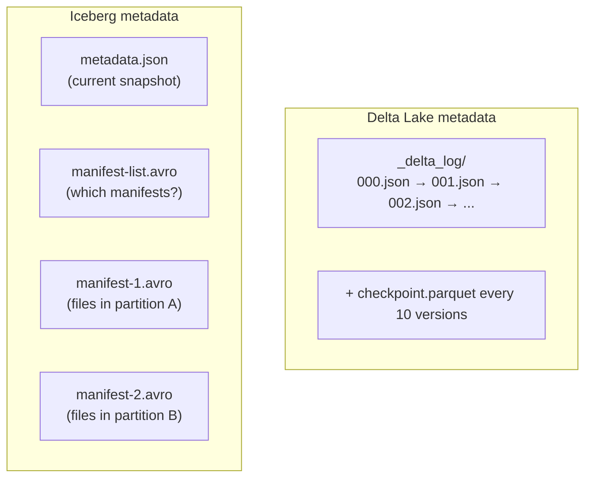
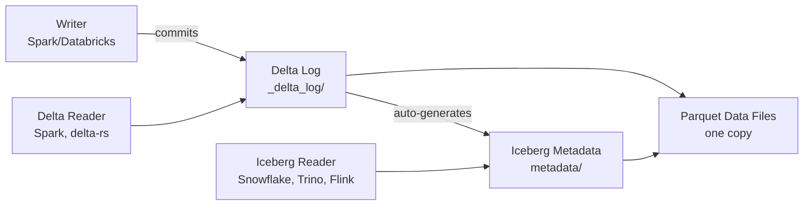

## The question

A customer evaluating Databricks for their wind utility says: "Our cloud team is standardizing on Apache Iceberg. Can we still use Databricks, or are we locked into Delta Lake?"

This is a question you will hear in every platform conversation. Having a nuanced, honest answer — not a Databricks sales pitch — is what makes you credible.

## The landscape: three formats, two that matter

There are three open table formats that add ACID guarantees to files in cloud storage:

<strong>Apache Iceberg</strong>
An open table format created at Netflix in 2017, now an Apache project. Like Delta Lake, it adds ACID transactions, schema evolution, time travel, and partition evolution to Parquet files. Iceberg's metadata is stored as Parquet files (not JSON) in a tree structure with manifest files. It's governed by the Apache Software Foundation with contributions from 30+ companies — no single vendor controls the roadmap.

<strong>Apache Hudi</strong>
An open table format created at Uber in 2016. Focuses on incremental processing and upserts — originally built for Uber's massive ride-event pipeline. Still maintained but has less industry momentum than Delta or Iceberg. Hudi is increasingly a niche choice for specific streaming upsert workloads.

In practice, the conversation is Delta Lake vs. Iceberg. Hudi still has users, but new platform decisions almost always come down to these two.

## What they have in common (more than you'd think)

Both Delta Lake and Iceberg:
- Store data as **Parquet files** in cloud object storage (S3, ADLS, GCS)
- Provide **ACID transactions** through metadata layers
- Support **schema enforcement and evolution**
- Support **time travel** (querying historical versions)
- Support **partition evolution** (changing how data is partitioned without rewriting)
- Are **open source** with published specifications

The actual data files are identical — it's Parquet either way. The formats differ in how they track metadata and which engines they integrate with.

## Where they differ

### Metadata structure

**Delta Lake** stores its transaction log as **JSON files** (one per commit) in a `_delta_log/` directory, with periodic Parquet checkpoints. The log is linear and append-only — easy to understand but can grow large for tables with many versions.

**Iceberg** uses a **tree of metadata files**: a metadata file → manifest list → manifest files → data files. The metadata files are Parquet, not JSON. This tree structure is more efficient for tables with thousands of partitions because a reader can prune branches without reading the full metadata.

### Engine support

This is the most practically important difference:

**Delta Lake** has first-class support in:
- Apache Spark (the reference implementation)
- Databricks (deeply integrated)
- delta-rs/Python `deltalake` package (Rust-native, no Spark needed)
- DuckDB, Polars (read support)
- Trino, Presto, Flink (via connectors, varying maturity)

**Iceberg** has first-class support in:
- Apache Spark
- Apache Flink
- Trino / Presto / Starburst
- Snowflake (native Iceberg tables)
- AWS Athena, EMR
- Dremio
- DuckDB (read support)
- Google BigQuery

**The honest assessment:** Iceberg has broader multi-engine support. If your organization uses Snowflake for analytics, Trino for ad-hoc queries, and Flink for streaming — all reading the same tables — Iceberg is the natural choice because all three have production-grade Iceberg support. Delta's best integration is with Spark/Databricks, and while connectors exist for other engines, they're not always at the same maturity level.

### Governance

**Delta Lake** governance centers on **Unity Catalog** — Databricks' proprietary catalog that manages access control, lineage, and auditing. Unity Catalog's governance features are the most complete in the ecosystem, but they're most powerful within Databricks. Outside Databricks, Delta tables can use the open-source Unity Catalog or other catalogs, but governance depth drops.

**Iceberg** governance works through the **REST Catalog API** — an open protocol that any catalog can implement. This means Iceberg tables can be governed by AWS Glue, Snowflake's catalog, Tabular (now Databricks), or any compliant catalog. The governance ecosystem is more fragmented but more portable.

For the wind utility's NERC compliance requirements, the question is: are you all-in on Databricks (where Unity Catalog gives you the deepest governance), or do you need governance across multiple engines (where Iceberg's catalog portability matters)?

## The Tabular acquisition and format convergence

In June 2024, Databricks acquired **Tabular** — the company founded by the creators of Apache Iceberg — for over $1 billion (source: [TechCrunch](https://techcrunch.com/2024/06/04/databricks-acquires-tabular-to-build-a-common-data-lakehouse-standard/)). This was a strategic move to bridge the format divide.

The result is **Delta Lake UniForm** — a feature that automatically generates Iceberg metadata alongside Delta metadata, both pointing to the same Parquet data files. You write through Delta, and Iceberg readers can read the same table without conversion (source: [Databricks blog](https://www.databricks.com/blog/delta-lake-universal-format-uniform-iceberg-compatibility-now-ga)).

**What this means practically:**
- Write through Delta/Databricks with full governance
- Read through Iceberg from any Iceberg-compatible engine
- One copy of the data, two sets of metadata
- Write path is Delta-only (UniForm is read-only for Iceberg clients)

UniForm is a bridge, not a merger. The write path is still Delta, so you're still committing to the Databricks ecosystem for writes. But it eliminates the "vendor lock-in" argument for reads — Snowflake analysts can query the same data that Databricks pipelines produce.

**UniForm lag and limitations.** UniForm metadata generation happens asynchronously after each Delta commit, using the same compute that completed the Delta transaction[^5]. The lag is typically negligible — Iceberg readers see new data within seconds of the Delta write completing. However, to prevent cascading latency for workloads with frequent commits (seconds to minutes between commits), Delta skips Iceberg metadata generation if a previous generation is still in progress[^5]. For the wind utility's batch workloads (10-minute SCADA intervals), this lag is invisible. For sub-second streaming use cases with very frequent commits, Iceberg readers may lag behind by several commits. Also note: UniForm is write-path only — you write through Delta, and Iceberg metadata is generated automatically. You cannot write through the Iceberg API and have Delta metadata generated. If a team needs to write Iceberg natively (e.g., from a non-Databricks Spark cluster or a Flink pipeline), UniForm doesn't help — they need native Iceberg tables. UniForm solves "we write in Databricks, others read" but not "everyone writes to the same table from different engines."

The industry is moving toward convergence. As [Capital One's engineering team wrote](https://www.capitalone.com/tech/cloud/lakehouse-format-convergence-delta-lake-iceberg/): "The principle emerging in 2025 is *write once, read anywhere*."

## The honest comparison table

| Dimension | Delta Lake | Apache Iceberg |
|---|---|---|
| **Best fit** | Spark/Databricks-centric orgs | Multi-engine environments |
| **Governance depth** | Deep (Unity Catalog) | Broad (REST Catalog API) |
| **Streaming** | Strong (Structured Streaming) | Strong (Flink integration) |
| **Snowflake interop** | Via UniForm (read-only) | Native support |
| **Metadata format** | JSON log + Parquet checkpoints | Parquet metadata tree |
| **Large partition handling** | Good (liquid clustering) | Excellent (manifest pruning) |
| **Ecosystem momentum** | Databricks ecosystem | Broader multi-vendor adoption |
| **Vendor governance** | Linux Foundation, led by Databricks | Apache Foundation, 30+ contributors |
| **Convergence path** | UniForm generates Iceberg metadata | Iceberg REST Catalog as standard |

## What to say in a customer conversation

**If the customer is standardizing on Databricks:**
> "Delta Lake is the native format. You'll get the deepest integration — Unity Catalog governance, liquid clustering optimization, and tight DLT pipeline support. For teams that need to read the same data from non-Databricks tools, UniForm automatically generates Iceberg metadata so Snowflake or Trino can read your Delta tables without conversion."

**If the customer uses multiple engines:**
> "Iceberg has broader multi-engine support today. If you're running Snowflake for analytics, Flink for streaming, and Trino for ad-hoc — all against the same tables — Iceberg is the more natural choice. Databricks can still participate via UniForm or by reading Iceberg tables directly."

**If the customer asks "which one wins?":**
> "They're converging. Both store Parquet, both provide ACID, and UniForm bridges the metadata gap for reads. The real question isn't format — it's which ecosystem gives you the governance, collaboration, and ML capabilities you need. For a regulated utility that needs NERC compliance, Unity Catalog's depth matters more than which metadata format is underneath."

## What about performance?

Both formats use Parquet for data, so raw read/write performance is comparable. The differences are in metadata overhead and optimization:

- **Delta** excels at loading and querying tables in Spark, particularly with Photon engine optimization
- **Iceberg** excels at partition pruning on large tables with many partitions, thanks to its manifest tree structure
- **Liquid clustering** (Delta) and **sort order** (Iceberg) both optimize data layout for common query patterns

For the wind utility's data volumes (a few hundred GB), neither format will be the bottleneck. The performance differences matter at multi-petabyte scale.

## Know the shape: data layout optimization

You don't need to master these for Module 2, but you should know they exist:

**Z-ordering** (Delta Lake): Physically sorts data within files by one or more columns to improve query performance when filtering on those columns. Like an index, but baked into the file layout. Being superseded by liquid clustering.

**Liquid clustering** (Delta Lake, recommended for new tables): Automatically reorganizes data layout based on clustering keys. Unlike Z-ordering, it doesn't require rewriting all data — it incrementally adjusts. Databricks recommends it for all new Delta tables (source: [Databricks docs](https://docs.databricks.com/aws/en/delta/clustering)).

**Sort order** (Iceberg): Iceberg's equivalent — specifies how data within files is sorted to enable predicate pushdown and data skipping.

**Key takeaway: Delta Lake and Iceberg are converging — both provide ACID on Parquet, and UniForm bridges the read path. Delta wins in Databricks-centric environments with deep Unity Catalog governance. Iceberg wins in multi-engine environments where Snowflake, Trino, and Flink need native access. For a regulated wind utility, the format matters less than the governance and collaboration capabilities of the platform around it.**

---

[^5]: UniForm generates Iceberg metadata asynchronously after each Delta commit. Concurrent metadata generation is skipped to prevent cascading latency. See [Delta Lake UniForm documentation](https://docs.delta.io/delta-uniform/) and [Databricks UniForm documentation](https://docs.databricks.com/aws/en/delta/uniform).
