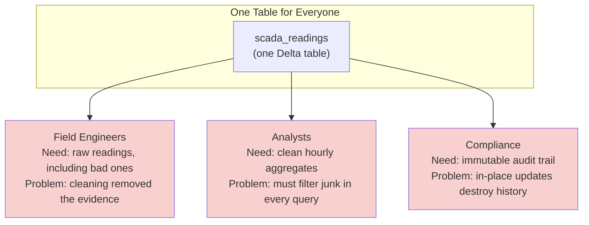

## The question

Module 2 gave you reliable Delta tables with ACID guarantees. The SCADA pipeline writes turbine telemetry every 10 minutes. The data is consistent, the schema is enforced, writes are atomic. Problem solved?

Not quite. Open any conference room at the wind utility and listen to the arguments:

- **Field engineers** need the raw 10-minute SCADA readings. When turbine WTG-0342 tripped offline at 2:47am, they want to see every reading in the minutes before the failure — including the ones that look weird. Especially the ones that look weird.
- **Analysts** need hourly averages with outliers removed. The fleet capacity factor report cannot include the 999.9 C reading that sensor_0004 sent during a firmware glitch. That reading is real (the sensor sent it), but it is not true (the gearbox was not at 999 degrees).
- **The compliance team** needs an immutable record of everything that arrived, including the bad readings, because NERC CIP auditors will ask "show me every reading you received for this turbine in Q3" and the answer cannot be "we cleaned some of those out."

**Three teams, three incompatible requirements, one dataset.** This is the problem that medallion architecture solves.

## Why a single table fails

Imagine you store everything in one Delta table: `scada_readings`. Every reading from every turbine, cleaned up, outliers removed, hourly aggregates computed as views on top.

This collapses immediately under real-world pressure:

**The field engineer problem.** They need the raw reading that your cleaning logic removed. If Silver-style transformations happen in place on the only copy, the original is gone. You cannot investigate a turbine failure if the suspicious readings were filtered out before anyone looked at them.

**The analyst problem.** They need stable, predictable data. If Bronze-style raw data includes duplicate readings (a sensor retransmitted), partially calibrated values, and schema changes from firmware updates, every analyst query has to handle all of that. The cleaning logic lives inside dashboard SQL — and every analyst writes their own version.

**The compliance problem.** They need to prove the data has not been tampered with. If you modify readings in place (even to fix legitimate quality issues), you cannot demonstrate to an auditor that the record is complete and unaltered.

No matter how you structure that single table, you are making one team's life harder to serve another.

## The CSV extract antipattern

When the single table does not work, teams create workarounds. The most common one is what every data organization discovers independently: **the CSV extract.**

<strong>CSV extract antipattern</strong>
A pattern where analysts download data from a shared source, transform it locally (in Excel, Python, or a personal database), and use the local copy for reporting. Each analyst's copy diverges from the source and from each other, creating "multiple versions of the truth."

Here is how it plays out at the wind utility:

1. Analyst A downloads last month's SCADA data to a CSV, cleans it in pandas, computes capacity factors, and puts the result in a spreadsheet.
2. Analyst B does the same thing — but uses slightly different outlier thresholds.
3. The CFO's monthly report uses Analyst A's numbers. The operations dashboard uses Analyst B's numbers. They do not match.
4. Nobody can trace the discrepancy because the transformations live in personal scripts on individual laptops.

This is not a hypothetical scenario. A 2023 survey by Monte Carlo found that 77% of data engineers reported that their organization had "multiple conflicting versions of key business metrics."[^1] The root cause is almost always the same: people create personal copies because the shared source does not serve their needs.

The CSV extract is a symptom, not the disease. The disease is that one table cannot simultaneously be raw, clean, and aggregated.

## Why views alone do not solve it

A reasonable response is: "Just create SQL views. A `raw_readings` view shows everything. A `clean_readings` view filters outliers. An `hourly_stats` view aggregates. Problem solved."

Views help, but they have three limits:

**Performance.** A view over 500 turbines, 50 sensors each, 144 readings per day, accumulating over months — that is billions of rows. Computing hourly aggregates on the fly for every dashboard refresh is expensive. Pre-computed Gold tables exist for a reason: the query that runs 50 times a day should not recompute the same aggregation 50 times.[^2]

**Schema divergence.** The raw data's schema changes when firmware updates add new fields. A cleaning view needs different logic than an aggregation view. When these are all views on one base table, a schema change in the base ripples through every view — and views have no built-in quality tracking.

**Auditability.** A view does not record that readings were rejected. If the compliance team asks "how many readings failed validation last month?", a view that filters them out cannot answer that question. You need to materialize the rejected readings somewhere.

Views are a tool, not an architecture. They work for simple cases. They do not work when different consumers need fundamentally different physical representations of the data — different granularity, different quality guarantees, different retention policies.

## What the wind utility actually needs

Step back and list what each consumer requires:

| Consumer | Granularity | Quality level | Retention | Schema stability |
|---|---|---|---|---|
| Field engineers | Per-reading (10 min) | Raw, including bad data | Years (NERC) | Tolerant of changes |
| Analysts | Hourly aggregates | Cleaned, validated | Months to years | Stable, documented |
| Compliance | Per-reading (10 min) | Unmodified from source | 7+ years (NERC CIP) | Must match source |
| ML team | Per-reading, validated | Cleaned, feature-enriched | Training window | Versioned |

No single physical table satisfies all four rows. You need at least two — probably three — physical representations of the same data, each optimized for its consumers.[^3]

This is the insight behind the medallion architecture: **data has different consumers with different needs, and the most reliable way to serve them is with multiple physical layers that progressively refine the data while preserving the original.** The raw layer serves field engineers and compliance. The cleaned layer serves analysts and ML. The aggregated layer serves dashboards and reports.

The next lecture defines those layers precisely — what goes in Bronze, Silver, and Gold, mechanically, using the wind utility's SCADA data as the example.

## The deeper principle

The medallion pattern is not a Databricks invention. It is a data architecture principle that appears independently in every mature data organization:

- **dbt** calls it staging / intermediate / marts.[^4]
- **Snowflake** customers build the same pattern manually using schemas (raw, staging, analytics).
- **Data warehousing** called it staging / ODS / data mart for decades before anyone said "lakehouse."
- **Event sourcing** in software engineering stores immutable events (Bronze) and derives projections (Silver/Gold) from them.

Databricks named it "medallion" and popularized the Bronze/Silver/Gold vocabulary.[^5] The vocabulary matters because every Databricks customer conversation uses it. But the underlying idea — keep the raw data, derive progressively refined versions, let different consumers read from the layer that fits their needs — is universal.[^6]

**Key takeaway: One table cannot simultaneously serve raw data consumers, clean data consumers, and aggregated data consumers. Workarounds like CSV extracts and complex views create more problems than they solve. The medallion architecture addresses this by organizing data into physical layers — each optimized for a different class of consumer — while preserving the original data for auditability and reprocessing.**

[^1]: Monte Carlo, "State of Data Quality 2023," reporting on survey results from 200+ data teams about metrics consistency challenges.
[^2]: Databricks, ["What is the medallion lakehouse architecture?"](https://docs.databricks.com/aws/en/lakehouse/medallion) — discusses performance optimization through pre-aggregated Gold tables.
[^3]: Databricks, ["What is Medallion Architecture?"](https://www.databricks.com/blog/what-is-medallion-architecture) — the original blog post framing progressive refinement as the core principle.
[^4]: dbt Labs, ["How we structure our dbt projects"](https://docs.getdbt.com/best-practices/how-we-structure/1-guide-overview) — staging/intermediate/marts as the recommended project structure.
[^5]: The term "medallion architecture" was coined by Databricks and first appeared in their documentation and blog posts around 2020-2021.
[^6]: InfoQ, ["The End of the Bronze Age: Rethinking the Medallion Architecture"](https://www.infoq.com/articles/rethinking-medallion-architecture/) — discusses the pattern's universality and its limitations.
