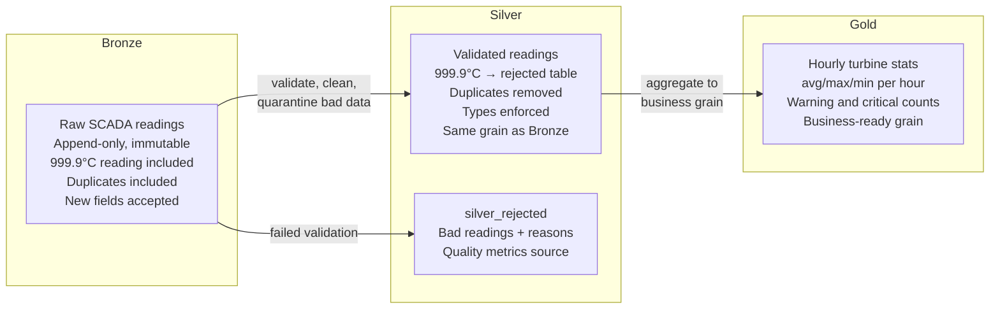

## The question

You know the wind utility needs multiple layers of data. But what actually goes in each layer? Where does the 999.9 C reading from sensor_0004 end up? Who decides the grain of the Gold table? And what happens when a new sensor field appears in the firmware?

This lecture defines Bronze, Silver, and Gold mechanically — not as abstract metaphors, but as concrete decisions about what data lives where and why.

## Bronze: the sacred record

<div class="definition">
<strong>Bronze layer</strong>
The raw data landing zone. Contains exactly what arrived from the source system, with no transformation beyond adding ingestion metadata (timestamps, source identifiers, batch IDs). Bronze is append-only — data is never modified or deleted. It serves as the system of record and the foundation for all downstream reprocessing.
</div>

When the SCADA pipeline delivers a batch of turbine readings, Bronze stores them exactly as they arrived. The 999.9 C reading from sensor_0004? It goes in Bronze. The duplicate reading where a sensor retransmitted? It goes in Bronze. The new `blade_ice_detection` field from a firmware update? It goes in Bronze.

### What Bronze contains

For the wind utility's SCADA data, a Bronze record looks like this:

```python
{
    "sensor_id": "sensor_0004",
    "value": 999.9,
    "units": "degrees_c",
    "timestamp": "2024-11-18T10:02:04Z",
    # -- Added by the ingestion pipeline, not the source --
    "ingested_at": "2024-11-18T10:03:12Z",
    "source_file": "scada_batch_2024-11-18_10-00.json",
    "batch_id": "batch-20241118-1003"
}
```

The first four fields are exactly what the sensor sent. The last three are ingestion metadata — they tell you when and how the data arrived, which is critical for debugging and reprocessing.

### Why Bronze is append-only

This is the single most important rule in the medallion architecture: **Bronze is never modified.**

Why? Because Bronze is your recovery mechanism. If a bug in Silver incorrectly filters out valid readings for three weeks, you reprocess from Bronze. If the compliance team needs the original readings as received, they query Bronze. If an analyst disputes a number, you trace it back to Bronze to see what actually arrived.[^1]

The moment you modify Bronze — even to "fix" a clearly wrong reading — you lose two things:
1. **Auditability.** You cannot prove to a NERC auditor what the system originally received.
2. **Recoverability.** You cannot reprocess from a clean starting point because the starting point has been altered.

Databricks recommends storing Bronze data with loose typing — using strings or the `VARIANT` type for fields that might change — to protect against unexpected schema changes from source systems.[^2] The philosophy is: accept everything, type it later.

### What Bronze is NOT

Bronze is not a staging area that gets cleared after processing. It is not temporary. It is a permanent, immutable record that grows over time. For regulated industries like energy, Bronze may need to be retained for 7+ years under NERC CIP requirements.

## Silver: where trust is built

<div class="definition">
<strong>Silver layer</strong>
The validated, cleaned, and conformed data layer. Silver applies business-agnostic quality rules: type casting, deduplication, null handling, range validation, and schema enforcement. Invalid readings are quarantined (not silently dropped) with rejection reasons. Silver maintains the same granularity as Bronze — individual readings — but guarantees that every record meets defined quality standards.
</div>

Silver is where the 999.9 C reading gets handled. Not silently dropped — *quarantined with a reason.*

### What Silver does to SCADA data

Here is what the Bronze-to-Silver transformation looks like concretely:

**Type casting.** Bronze may store values as strings (to survive unexpected schema changes). Silver casts `value` to `DOUBLE`, `timestamp` to `TIMESTAMP`, and validates that conversions succeed.

**Range validation.** A gearbox temperature of 999.9 C is physically impossible. Silver checks: is the value between -50 C and 150 C? If not, the reading goes to a `silver_rejected` table with a reason: `"value_out_of_range: 999.9 not in [-50, 150]"`.

**Deduplication.** If a sensor retransmitted a reading (same sensor_id, same timestamp, same value), Silver keeps one copy. The duplicate is logged, not silently absorbed.

**Null handling.** A reading with a null sensor_id is not useful. Silver rejects it with reason `"null_sensor_id"`.

**Schema enforcement.** Silver has a defined, stable schema. Downstream teams depend on it. When a new field arrives from a firmware update, Bronze accepts it (loose typing). Silver decides explicitly whether to incorporate it — and documents the change.

```python
# Silver validation logic — conceptual
is_valid = (
    (df["value"].between(-50, 150)) &
    (df["sensor_id"].notna()) &
    (df["timestamp"].notna())
)

valid_df = df[is_valid]
rejected_df = df[~is_valid]
rejected_df["rejection_reason"] = "value_out_of_range"
```

### The rejected readings table

This is the part most implementations get wrong. Silently dropping bad data feels clean. But it creates two problems:

1. **You cannot measure data quality.** If the compliance team asks "what percentage of readings were valid this month?", you need the rejected readings to compute the denominator.
2. **You cannot investigate anomalies.** That 999.9 C reading might be a firmware bug — or it might be a genuine sensor failure that indicates an impending mechanical problem. If you drop it, you will never know.

A production Silver layer should always have a companion `silver_rejected` table.[^3] At the wind utility, you should be able to report: "Silver turbine telemetry has a 99.7% validity rate this month. The top rejection reasons are: value out of range (0.2%), null sensor_id (0.08%), duplicate readings (0.02%)."

That sentence is worth more to a NERC auditor than any amount of documentation.

### Silver preserves grain

A critical detail: Silver is at the same granularity as Bronze. If Bronze has one row per sensor reading per 10 minutes, Silver has one row per sensor reading per 10 minutes. Silver cleans the data — it does not aggregate it. Aggregation is Gold's job.

## Gold: business-ready, not small

<div class="definition">
<strong>Gold layer</strong>
The business-ready analytics layer. Gold contains data aggregated to the grain that business stakeholders actually need — hourly averages, daily summaries, monthly capacity factors, anomaly counts. Gold tables are named in business language (not engineering language) and optimized for the queries that run against them. Gold is typically recomputed from Silver, not appended to.
</div>

Gold is where data meets the business. The CFO does not want 7.2 million individual sensor readings. They want: "What was the fleet capacity factor last month? Which turbines underperformed? How many maintenance alerts were triggered?"

### What Gold looks like

A Gold table for the wind utility might be `gold_hourly_turbine_stats`:

| turbine_id | hour | avg_temp_c | max_temp_c | reading_count | warning_count | critical_count |
|---|---|---|---|---|---|---|
| WTG-0001 | 2024-11-18 10:00 | 22.73 | 23.1 | 3 | 0 | 0 |
| WTG-0004 | 2024-11-18 10:00 | 36.85 | 37.5 | 2 | 2 | 0 |

Notice several things:
- **The grain changed.** Bronze and Silver had per-reading rows. Gold has per-turbine-per-hour rows.
- **Aggregates are pre-computed.** Average, max, counts — all done once, read many times.
- **Business thresholds are applied.** "Warning" (above 35 C) and "critical" (above 40 C) are business definitions baked into the Gold computation.
- **The naming is business language.** `avg_temp_c`, not `value_mean`. `warning_count`, not `gt_35_count`.

### Gold does not mean small

A common misconception: Gold tables are small, summary tables. This is wrong.

A Gold table with all 500 turbines' hourly stats across a year has 500 x 8,760 hours = 4.38 million rows. That is not small. Add 50 sensor types per turbine and you are at 219 million rows. Gold is about the *grain and trustworthiness*, not the size.[^4]

Gold means: "This data is at the grain that the business question requires, it has been aggregated from validated Silver data, and you can trust it for reporting and decision-making."

### Gold is recomputed, not appended

Unlike Bronze (always append) and Silver (typically append validated rows), Gold tables are often **overwritten** — recomputed from Silver. Why?

Because Gold embeds business logic (thresholds, aggregation rules, metric definitions). When the business changes the definition of "critical temperature" from 40 C to 38 C, you recompute Gold from Silver. You do not patch individual rows.[^5]

This is only safe because Silver exists as a stable, validated intermediate layer. If Gold were computed directly from Bronze, recomputation would require re-running all the cleaning logic too — a much more fragile operation.

## The flow through layers



Every reading that enters Bronze follows one of two paths:
1. Passes validation and enters Silver, then gets aggregated into Gold.
2. Fails validation and enters `silver_rejected`, where it is counted and available for investigation.

No data is lost. No data is silently dropped. Every reading is accounted for.

## How the layers serve different consumers

| Layer | Primary consumers | What they get |
|---|---|---|
| Bronze | Field engineers, compliance, reprocessing | Exactly what arrived, including bad data |
| Silver | Data engineers, ML team, advanced analysts | Clean, validated, per-reading data |
| Silver rejected | Data quality team, compliance | Bad readings with rejection reasons |
| Gold | Business analysts, dashboards, executives | Pre-aggregated, business-ready metrics |

The field engineer investigating a turbine trip reads Bronze. The ML engineer training a vibration model reads Silver. The analyst building a capacity factor dashboard reads Gold. Nobody creates CSV extracts because each team has a layer designed for their needs.

## The compliance story

For the wind utility under NERC CIP, the medallion architecture provides a complete audit story:

1. **What did we receive?** → Query Bronze. Every reading, unmodified.
2. **What did we reject and why?** → Query `silver_rejected`. Every bad reading with a documented reason.
3. **What is the validated record?** → Query Silver. Cleaned, typed, deduplicated.
4. **What did we report?** → Query Gold. The exact numbers that appeared in compliance reports.
5. **Can we reproduce the report?** → Recompute Gold from Silver. The numbers should match. If they do not, Delta Lake's time travel shows you what changed.

This is what makes medallion architecture compelling for regulated industries — not the data engineering convenience (though that matters), but the ability to answer an auditor's questions with traceable, layered evidence.[^6]

**Key takeaway: Bronze stores raw, immutable data exactly as received — including bad readings and duplicates. Silver validates and cleans at the same granularity, quarantining failures rather than dropping them. Gold aggregates to the grain the business needs. Each layer serves different consumers, and the combination provides complete auditability from source to report. Gold does not mean small — it means business-ready at the right grain.**

[^1]: Databricks, ["What is the medallion lakehouse architecture?"](https://docs.databricks.com/aws/en/lakehouse/medallion) — "Bronze layer data is often stored in its raw form, enabling reprocessing if needed."
[^2]: Databricks Community, ["Best practices in bronze layer regarding column data types"](https://community.databricks.com/t5/data-engineering/what-are-the-best-practices-in-bronze-layer-regarding-the-column/td-p/41649) — discussion of VARIANT and string typing in Bronze.
[^3]: Databricks, ["Building Data Quality into Your Lakehouse"](https://www.databricks.com/blog/2022/02/10/building-data-quality-into-your-lakehouse-with-delta-lake.html) — discusses quality tracking as a core lakehouse principle.
[^4]: Databricks, ["What is Medallion Architecture?"](https://www.databricks.com/blog/what-is-medallion-architecture) — "Gold layer data is typically organized into consumption-ready 'project-specific' databases."
[^5]: Microsoft Learn, ["Medallion lakehouse architecture"](https://learn.microsoft.com/en-us/azure/databricks/lakehouse/medallion) — discusses progressive refinement and recomputation patterns.
[^6]: Hexacorp, ["Databricks Data Pipeline Best Practices"](https://hexacorp.com/databricks-data-pipeline-best-practices/) — covers auditability patterns across Bronze/Silver/Gold layers.
