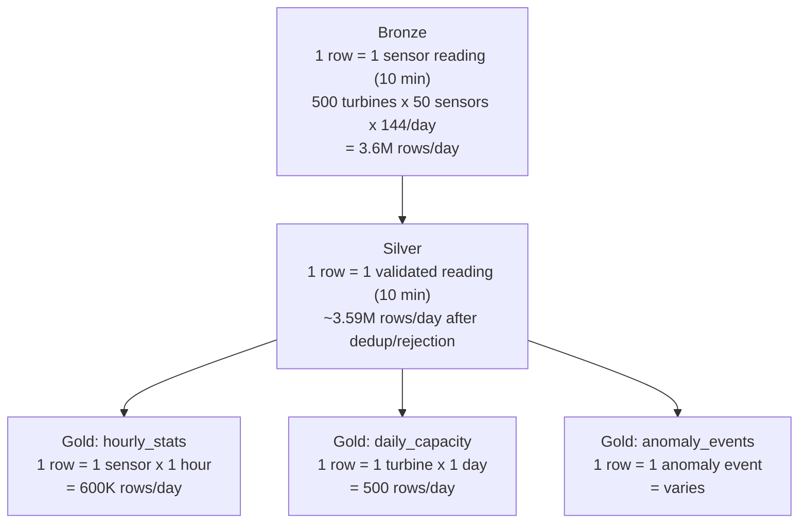

## The question

You understand the theory: Bronze stores raw data, Silver validates it, Gold aggregates it. But when you sit down to build the wind utility's pipeline, practical questions pile up fast. How do you decide the grain at each layer? What happens when you run the pipeline twice — do you get duplicate data? What do you do when the SCADA system adds a new field?

This lecture covers the patterns that make medallion work in production and the anti-patterns that quietly undermine it.

## Deciding the grain at each layer

<div class="definition">

<strong>Grain</strong>
The level of detail a table represents — what one row means. A table with one row per sensor reading per 10 minutes has a finer grain than a table with one row per turbine per hour. Choosing the wrong grain is the most common design mistake in data architectures.

</div>

The grain decision is different at each layer:

**Bronze grain: match the source.** If the SCADA system sends one reading per sensor per 10 minutes, Bronze has one row per sensor per 10 minutes. Do not aggregate in Bronze. Do not split in Bronze. Bronze mirrors the source exactly.

**Silver grain: usually the same as Bronze.** Silver validates and cleans but typically does not change the grain. One raw reading in Bronze becomes one validated reading in Silver (or one rejected reading in `silver_rejected`). The exception is deduplication — if a sensor retransmitted, Silver collapses two identical Bronze rows into one.

**Gold grain: match the business question.** This is where grain gets interesting. The fleet capacity factor report needs one row per turbine per month. The operations dashboard needs one row per turbine per hour. The maintenance alert table needs one row per anomaly event. You might have multiple Gold tables at different grains.



Multiple Gold tables are normal and expected. The anti-pattern is having one Gold table that analysts must re-aggregate for their specific use case — that means Gold is at the wrong grain.

A common question: what if the source sends 1-second readings but you only care about 10-minute averages? You still ingest at 1-second grain in Bronze (it is the raw record). But you have a choice at Silver: keep 1-second grain (more storage, more flexibility) or downsample to 10-minute grain (less storage, but you lose the ability to compute sub-10-minute features later). The decision depends on your downstream use cases. If ML models need sub-minute features, keep the high grain. If all consumers need 10-minute or coarser data, downsample in Silver and document the decision.

## Anti-pattern 1: Gold that is just filtered Silver

The symptom: your Gold table has the same grain as Silver, but with a `WHERE` clause applied. For example, `gold_readings` is just Silver readings where `sensor_type = 'temperature'`.

This is not Gold — it is a filtered view of Silver. It provides no aggregation, no pre-computation, no business-level metric. Analysts still have to aggregate it themselves, which defeats the purpose of having a Gold layer.[^1]

**The fix:** Ask what business question this table answers. If the answer is "hourly average temperature per turbine," then the Gold table should have one row per turbine per hour with `avg_temp_c` as a column. If the answer is "I need per-reading data but only for temperature sensors," that is a Silver view, not a Gold table.

## Anti-pattern 2: Too many layers

Some teams add layers: Bronze, Bronze+, Silver, Silver+, Gold, Platinum. Each layer does a small transformation. The result is a pipeline with 6 stages where 3 would suffice, increased storage costs from data duplication, and a lineage graph that nobody can follow.[^2]

The medallion pattern works because three layers map to three distinct purposes: raw storage, validation, and business aggregation. If your "Silver+" layer exists because Silver validation is too complex for one step, the answer is to break Silver into multiple transformations that all write to the same Silver table — not to add another layer.

**The rule of thumb:** If you cannot explain what a layer does in one sentence that a non-engineer would understand, the layer should not exist.

## Anti-pattern 3: Skipping Silver

The temptation: "Our data is already clean from the source system. We can go straight from Bronze to Gold."

This works until:
- The source system has a bug and sends bad data for a week before anyone notices
- A new data source is onboarded with different quality characteristics
- An auditor asks what validation logic was applied and when

Silver is cheap insurance. Even if your validation rules pass 100% of readings today, having the Silver layer means you have a place to add validation when — not if — the source data quality degrades. And you have a record of what passed and what did not.[^3]

## Anti-pattern 4: Modifying Bronze

This is the most dangerous anti-pattern. Someone "fixes" a batch of bad readings in Bronze because "they never should have been written that way." Now:
- You cannot reprocess to the original state
- The compliance audit trail is broken
- Any Silver/Gold tables reprocessed from "fixed" Bronze may produce different results than the originals

**The rule is absolute: Bronze is immutable.** If readings need correction, write the corrections as new rows in Bronze (with a flag like `is_correction = true` and a reference to the original) or handle the correction in Silver. Never modify existing Bronze rows.

## Idempotent reprocessing

<div class="definition">

<strong>Idempotency</strong>
A property where running the same operation multiple times produces the same result as running it once. An idempotent Bronze-to-Silver pipeline can be re-run without creating duplicate Silver rows.

</div>

Imagine the Silver pipeline fails halfway through processing a batch. You fix the bug and re-run it. What happens?

**Without idempotency:** The readings that were successfully written before the failure are written again. Silver now has duplicates. The hourly aggregates in Gold are inflated. The capacity factor report is wrong.

**With idempotency:** The pipeline detects which readings have already been processed and skips them. The result after re-running is identical to what it would have been if the first run had succeeded.

There are several strategies for achieving idempotency:

**MERGE on natural key.** Use Delta Lake's `MERGE` to upsert based on `(sensor_id, timestamp)`. If the row exists, skip or update it. If it does not exist, insert it.

```python
# Idempotent write using merge
from deltalake import DeltaTable

dt = DeltaTable(silver_path)
dt.merge(
    source=new_batch,
    predicate="s.sensor_id = t.sensor_id AND s.timestamp = t.timestamp",
    source_alias="s",
    target_alias="t"
).when_not_matched_insert_all().execute()
```

**Partition overwrite.** If Bronze data is partitioned by date, reprocessing a day's data can overwrite that entire partition in Silver. This is idempotent as long as the same input produces the same output.

**Watermark tracking.** Record which Bronze version or batch_id has been processed. On re-run, start from where you left off. This is what Delta Live Tables (Module 4) does automatically with change data feed.[^4]

The manual exercise in `exercises/medallion.py` does not handle idempotency — running it twice produces duplicates. This is intentional: you should feel the gap, because DLT fills it.

## Schema evolution across layers

The SCADA system gets a firmware update. Turbines now report a new field: `blade_ice_detection`. What happens at each layer?

**Bronze:** Accepts the new field immediately. Bronze uses loose typing (strings, VARIANT) specifically so that source schema changes do not break ingestion. The new field appears in new rows. Old rows do not have it — and that is fine.[^5]

**Silver:** Does not accept the new field automatically. Silver has a defined, stable schema that downstream teams depend on. Adding `blade_ice_detection` to Silver is an explicit decision:
1. Define the validation rules for the new field (what values are valid?)
2. Update the Silver schema using Delta's schema evolution (`mergeSchema`)
3. Document the change for downstream consumers
4. Decide whether to backfill (old Silver rows get `null` for the new field)

```python
# Explicit schema evolution in Silver
valid_df.write.format("delta") \
    .mode("append") \
    .option("mergeSchema", "true") \
    .save(silver_path)
```

**Gold:** May or may not incorporate the new field, depending on business requirements. If no Gold table needs blade ice detection data, Gold does not change. If a new Gold table (`gold_icing_events`) is needed, it is added as a new table, not by modifying existing Gold tables.

The key principle: **schema changes flow forward through explicit decisions at each layer, not automatically.** Bronze absorbs them silently. Silver incorporates them deliberately. Gold reflects them only when the business requires it.

### End-to-end schema evolution example

Here is what schema evolution looks like across all three layers when a firmware update adds `blade_ice_detection` to the SCADA payload: (1) **Bronze** — the new field appears automatically because Bronze ingests raw data (if using Auto Loader with `cloudFiles.schemaEvolution = addNewColumns`, or VARIANT columns that already capture everything). (2) **Silver** — your validation logic does not know about the new field, so it passes through as NULL until you update the Silver pipeline to validate it. Use `mergeSchema=True` on the Silver write to add the column to the Delta schema. (3) **Gold** — if Gold does not aggregate `blade_ice_detection`, nothing changes. If you want ice detection metrics in Gold, you add a new aggregation and recompute. The key: schema evolution is a pipeline change, not a one-time migration. Each layer needs explicit attention.

## Code example: Bronze through Gold

Here is the complete flow for a batch of SCADA readings, showing what happens at each layer:

```python
# Bronze: store exactly what arrived
raw = pd.read_json("scada_batch.json")
raw["ingested_at"] = pd.Timestamp.now(tz="UTC")
write_deltalake(BRONZE_PATH, raw, mode="append")
```

```python
# Silver: validate and quarantine
bronze_df = DeltaTable(BRONZE_PATH).to_pandas()
is_valid = (
    bronze_df["value"].between(-50, 150) &
    bronze_df["sensor_id"].notna() &
    bronze_df["timestamp"].notna()
)
valid = bronze_df[is_valid].copy()
valid["processed_at"] = pd.Timestamp.now(tz="UTC")

rejected = bronze_df[~is_valid].copy()
rejected["rejection_reason"] = "out_of_range_or_null"

write_deltalake(SILVER_PATH, valid, mode="append")
write_deltalake(SILVER_REJECTED_PATH, rejected, mode="append")
```

```python
# Gold: aggregate to business grain
silver_df = DeltaTable(SILVER_PATH).to_pandas()
silver_df["hour"] = silver_df["timestamp"].dt.floor("h")

gold = silver_df.groupby(["sensor_id", "hour"]).agg(
    avg_temp_c=("value", "mean"),
    max_temp_c=("value", "max"),
    min_temp_c=("value", "min"),
    reading_count=("value", "count"),
).reset_index()

write_deltalake(GOLD_PATH, gold, mode="overwrite")
```

Notice the mode difference: Bronze and Silver use `append` (new data is added to existing data). Gold uses `overwrite` (the entire table is recomputed from Silver). This reflects the fundamental nature of each layer: Bronze and Silver accumulate; Gold is derived.

## What this manual pipeline is missing

Building Bronze-to-Silver-to-Gold manually — as in the code above and in `exercises/medallion.py` — works, but it leaves significant gaps:

| Concern | Manual pipeline | DLT (Module 4) |
|---|---|---|
| Dependency ordering | You ensure Bronze runs before Silver | Declared in the pipeline graph |
| Incremental processing | You read all of Bronze every time | Automatically tracks what is new |
| Error recovery | Pipeline fails, you figure out what ran | Automatic checkpointing and retry |
| Quality metrics | You write rejection logic yourself | `@dlt.expect` built in |
| Idempotency | You implement MERGE or dedup logic | Handled by the framework |
| Lineage | You document it manually | Tracked automatically in Unity Catalog |

This is why Module 4 exists. The medallion architecture is the *what*; DLT is one answer to the *how*.[^6]

**Key takeaway: In practice, medallion architecture succeeds or fails on grain decisions, anti-pattern avoidance, and reprocessing strategy. Bronze grain matches the source. Silver grain usually matches Bronze. Gold grain matches the business question. The most common mistakes are Gold at the wrong grain, skipping Silver, modifying Bronze, and adding unnecessary layers. Idempotent reprocessing is essential but hard to implement manually — which is exactly what DLT automates.**

[^1]: Vishal Dutt, ["Why Your Medallion Architecture Is Actually a Mess"](https://medium.com/@vishal.dutt.data.architect/why-your-medallion-architecture-is-actually-a-mess-and-how-to-fix-it-6b608575b74e) — discusses Gold-as-filtered-Silver and other common implementation failures.
[^2]: InfoQ, ["The End of the Bronze Age: Rethinking the Medallion Architecture"](https://www.infoq.com/articles/rethinking-medallion-architecture/) — argues that unnecessary layers add complexity without value.
[^3]: Databricks, ["What is the medallion lakehouse architecture?"](https://docs.databricks.com/aws/en/lakehouse/medallion) — Silver as the quality enforcement layer.
[^4]: Databricks, ["Building Data Quality into Your Lakehouse"](https://www.databricks.com/blog/2022/02/10/building-data-quality-into-your-lakehouse-with-delta-lake.html) — discusses change data feed and incremental processing patterns.
[^5]: Matterbeam, ["Beyond the Medallion"](https://blog.matterbeam.com/beyond-the-medallion-rethinking-data-architecture-from-first-principles/) — discusses schema flexibility in raw layers and rigidity in refined layers.
[^6]: Databricks, ["What is Medallion Architecture?"](https://www.databricks.com/blog/what-is-medallion-architecture) — the original framing of medallion as a pattern that can be implemented by various tools.
