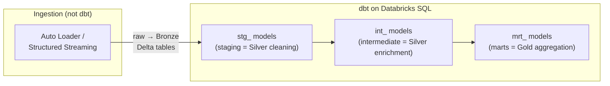
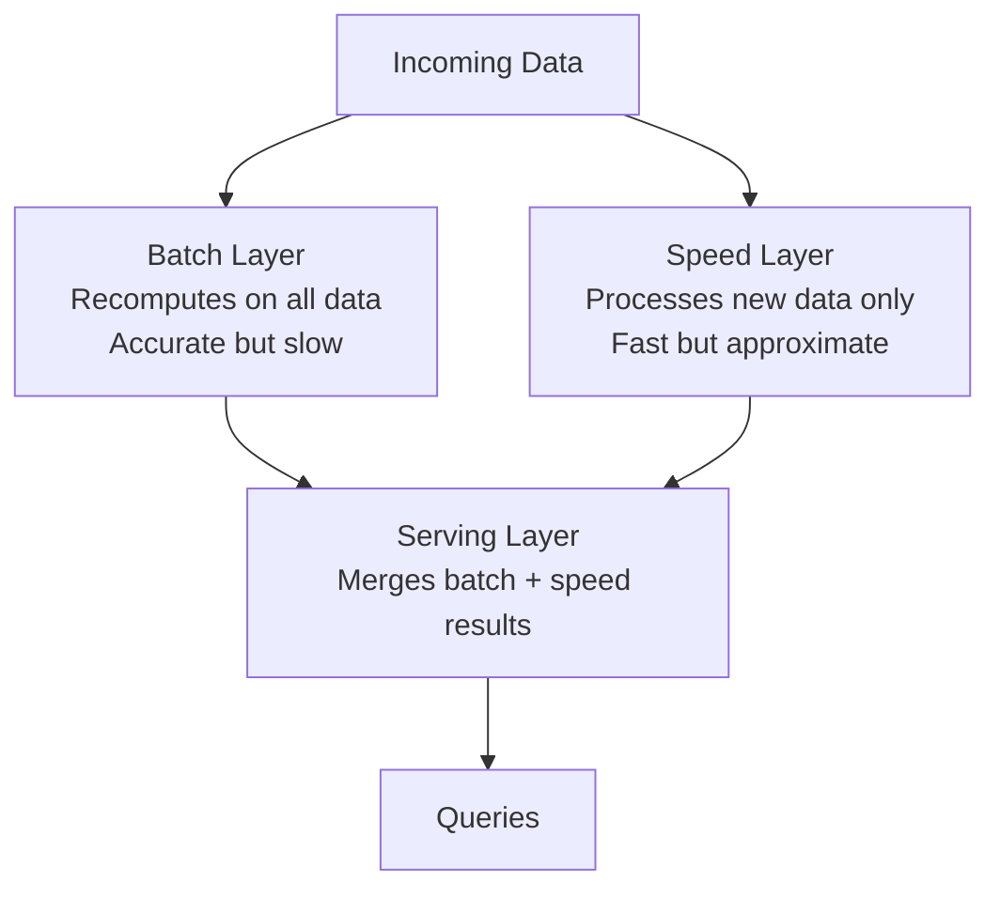

## The question

A customer says: "We already use dbt. Why would we adopt medallion architecture?" Another says: "We're on Snowflake. Does medallion even apply to us?" A third says: "We're a 3-person team with one data source. Do we really need Bronze, Silver, Gold?"

These are real questions you will hear. Having honest, nuanced answers — not "medallion is always better" — is what makes you credible.

## dbt's staging / intermediate / marts

<div class="definition">

<strong>dbt (data build tool)</strong>
An open-source transformation framework that lets data teams write SQL SELECT statements to define data models, then handles dependency ordering, testing, documentation, and incremental materialization. dbt operates inside a warehouse (Snowflake, BigQuery, Databricks SQL) — it transforms data that is already loaded, not the loading itself.

</div>

dbt organizes transformations into three layers that map directly to medallion:

| dbt layer | Medallion equivalent | What it does |
|---|---|---|
| **Staging** (`stg_`) | Bronze-to-Silver boundary | Renames columns, casts types, deduplicates. One staging model per source table. |
| **Intermediate** (`int_`) | Silver | Joins, business-agnostic transformations, filtering. Not exposed to end users. |
| **Marts** (`mrt_` or `fct_`/`dim_`) | Gold | Business-ready tables. Named in business language. Exposed to analysts and BI tools. |

The mapping is real — dbt's creators have explicitly acknowledged the parallel.[^1] A dbt project that follows the staging/intermediate/marts convention is implementing the same architectural idea as medallion. The vocabulary differs, the implementation technology differs, but the principle is identical: progressive refinement from raw to business-ready.

### Where they differ

**Execution model.** dbt runs SQL transformations inside a warehouse. Medallion (as implemented in Databricks) runs Spark or Python transformations on a lakehouse. dbt is SQL-first; medallion is engine-agnostic.

**Ingestion.** dbt does not handle data loading — it transforms data that is already in the warehouse. Medallion includes the Bronze ingestion layer. A dbt project typically has a separate ingestion tool (Fivetran, Airbyte, custom scripts) that loads raw data, and dbt starts from there.[^2]

**Raw data storage.** In dbt, "sources" (the equivalent of Bronze) are declared but not created by dbt — they are external tables loaded by other tools. In medallion, Bronze is explicitly managed as part of the pipeline. This matters for compliance: medallion gives you explicit control over the raw data layer, while dbt assumes someone else handles it.

**Quality tracking.** dbt has `tests` (assertions that run after transformations) and more recently `data contracts` for schema enforcement. Medallion (via DLT) has `@dlt.expect` for inline quality tracking during transformation. Both solve the same problem differently — dbt tests after the fact, DLT validates during the transformation.

**When a customer already uses dbt.** Do not tell them to replace it with medallion. They are doing the same thing. Instead, explain how dbt's staging/intermediate/marts maps to Bronze/Silver/Gold, and discuss whether Databricks adds value through the Bronze layer (ingestion), Unity Catalog (governance), or ML capabilities — things dbt does not do.

### dbt on Databricks

dbt runs on Databricks SQL. Many Databricks customers use dbt for their Silver-to-Gold transformations while using Auto Loader or DLT for Bronze ingestion. This is not contradictory — dbt and medallion are complementary when used this way.[^3]



## Snowflake's approach

Snowflake does not prescribe a medallion architecture, but nearly every mature Snowflake deployment ends up building one — using schemas instead of separate databases.

A typical Snowflake data architecture:

```sql
-- Snowflake "medallion" using schemas
CREATE SCHEMA raw;       -- Bronze: loaded by Fivetran/Airbyte
CREATE SCHEMA staging;   -- Silver: cleaned by dbt
CREATE SCHEMA analytics; -- Gold: marts built by dbt
```

The pattern is identical. The differences are in what the platform provides around it:

**Snowflake advantages for this pattern:**
- Simpler concurrency model — warehouses scale independently, no cluster management
- Mature dbt integration (dbt was originally built for Snowflake)
- Time Travel built into every table by default
- Simpler for SQL-only teams

**Databricks advantages for this pattern:**
- Bronze ingestion is a first-class concern (Auto Loader, Structured Streaming)
- DLT provides declarative pipeline management across all three layers
- Unity Catalog provides governance across the entire stack (not just SQL)
- ML workloads can read directly from Silver without ETL to a separate system
- Better for mixed workloads (streaming + batch + ML + SQL)

**The honest comparison for the wind utility:** If the utility's data team is 15 SQL analysts with no data engineering staff, Snowflake + dbt is simpler to operate. If the team includes data engineers doing streaming ingestion, ML engineers building predictive models, and analysts running SQL — all on the same data — Databricks is the more natural fit because it handles the entire pipeline, not just the transformation and query layers.[^4]

## Lambda architecture: historical context

<div class="definition">

<strong>Lambda architecture</strong>
A data processing pattern proposed by Nathan Marz in 2011 that runs every computation through two paths: a batch layer (for complete, accurate results on historical data) and a speed layer (for low-latency results on recent data). A serving layer merges the two. Lambda solved the problem of getting both accuracy and speed when the same data pipeline could not provide both.

</div>

Lambda architecture was the dominant pattern before lakehouses. Understanding it matters because some customers still run Lambda systems, and medallion is partly a response to Lambda's pain points.



**Lambda's core problem:** You maintain two codebases — one for batch processing, one for stream processing — that must produce consistent results despite using different technologies (e.g., Hadoop MapReduce for batch, Storm for speed). In practice, the two paths drift. Results do not match. Debugging requires understanding both systems.[^5]

**How medallion relates:** Medallion does not have separate batch and speed paths. With Delta Lake's streaming support (Structured Streaming reads Delta tables as a stream), the same Bronze-to-Silver-to-Gold pipeline can process both batch and streaming data. You write one transformation, not two.

**The Kappa architecture** (proposed by Jay Kreps in 2014) simplified Lambda by using only the streaming path — treat everything as a stream, replay historical data through the same pipeline.[^6] Medallion is closer to Kappa than Lambda in philosophy: one pipeline, one set of transformations, applied to both new and historical data.

| Dimension | Lambda | Medallion |
|---|---|---|
| **Processing paths** | Two (batch + speed) | One (batch or streaming) |
| **Code duplication** | Yes (two codebases) | No (same transformations) |
| **Latency** | Speed layer: low. Batch layer: high. | Depends on configuration |
| **Complexity** | High (merge logic) | Lower (progressive refinement) |
| **Cost** | High (dual infrastructure) | Lower (30-40% less operational cost) |
| **When it makes sense** | Legacy systems with separate batch/stream | Modern lakehouse environments |

## When medallion is overkill

This is the part that makes you credible in a consulting conversation: knowing when *not* to recommend the full pattern.

**Small team, single source.** A 3-person data team with one PostgreSQL source and 5 analysts does not need Bronze, Silver, and Gold as separate physical tables. A dbt project with staging and marts — two layers — is sufficient. Adding Bronze as a separate persistence layer adds storage cost and operational complexity with minimal benefit.[^7]

**Simple, trusted source.** If your source data comes from an internal system with strong data quality guarantees (e.g., a well-maintained transactional database), the Silver validation layer may add little value. You might go from source to staging (light cleaning) to marts (aggregation) — effectively Bronze-to-Gold with minimal Silver logic.

**Prototype or exploration.** If a data scientist needs to explore a new dataset, making them wait for the full medallion pipeline to be built is counterproductive. Let them work with the raw data first. Build the layers when the work moves to production.

**The anti-pattern of the anti-pattern:** Some teams read the criticisms of medallion and conclude that layers are bad. They build flat architectures with no separation between raw and refined data. Six months later, a data quality issue takes down production dashboards, and nobody can trace the problem to its source. The answer is not "no layers" — it is "the right number of layers for your context."

### The decision framework

Ask three questions:

1. **Do you need to reprocess from raw data?** If yes (regulatory requirements, data quality concerns, multiple downstream consumers), you need a Bronze layer.
2. **Do different consumers need different quality levels?** If yes (raw for engineers, clean for analysts), you need a Silver layer separate from Bronze.
3. **Are analysts re-aggregating data in their queries?** If yes, you need pre-computed Gold tables.

If you answered "no" to all three, you probably do not need medallion. If you answered "yes" to all three — which the wind utility does — medallion is the right pattern.

## What to say in customer conversations

**"We already use dbt."**
> "Great — you're already doing the same pattern. dbt's staging/intermediate/marts maps directly to Bronze/Silver/Gold. The question is whether you need what Databricks adds around that: streaming ingestion in Bronze, Unity Catalog for governance, ML on the same data. dbt handles transformation beautifully — it does not handle ingestion, governance, or ML."

**"We're on Snowflake. Does medallion apply?"**
> "Most mature Snowflake deployments build the same layered pattern using schemas. The pattern is universal — Snowflake calls it raw/staging/analytics, Databricks calls it Bronze/Silver/Gold, dbt calls it staging/intermediate/marts. The question is not whether to layer your data — it is which platform gives you the best experience for your specific mix of workloads."

**"We're a small team. Do we need all three layers?"**
> "Probably not all three as separate physical tables. Start with two: raw storage and business-ready tables. Add the validation layer when you have data quality problems — and you will, eventually. The medallion pattern is a target state, not a prerequisite."

**Key takeaway: Medallion, dbt's staging/intermediate/marts, and Snowflake's schema-based layering are the same architectural idea implemented in different tools. dbt is complementary to medallion, not competitive with it. Lambda architecture is the historical predecessor that medallion simplifies by eliminating dual codebases. Medallion is overkill for small teams with simple sources, but essential for regulated, multi-consumer environments like the wind utility. The credible answer is always "it depends on your context" — and being able to explain why.**

[^1]: i-spark, ["dbt Naming Conventions and Medallion Architecture"](https://i-spark.nl/en/blog/dbt-naming-conventions-and-medallion-architecture/) — explicit mapping of dbt layers to medallion layers.
[^2]: dbt Labs, ["How we structure our dbt projects"](https://docs.getdbt.com/best-practices/how-we-structure/1-guide-overview) — the canonical guide to staging/intermediate/marts, noting that sources are external to dbt.
[^3]: ModelDock, ["The Medallion Architecture Explained with dbt"](https://modeldock.run/blog/medallion-architecture-dbt) — discusses using dbt on Databricks with medallion.
[^4]: InfoQ, ["The End of the Bronze Age"](https://www.infoq.com/articles/rethinking-medallion-architecture/) — discusses when the full medallion pattern adds value versus unnecessary complexity.
[^5]: Nathan Marz and James Warren, *Big Data: Principles and Best Practices of Scalable Realtime Data Systems* (Manning, 2015) — the foundational text introducing Lambda architecture.
[^6]: Jay Kreps, ["Questioning the Lambda Architecture"](https://www.oreilly.com/radar/questioning-the-lambda-architecture/) (2014) — proposes Kappa as a simplification, arguing that one processing path is sufficient.
[^7]: Modern Data 101, ["Data Products: A Case Against Medallion Architecture"](https://medium.com/@community_md101/data-products-a-case-against-medallion-architecture-139096ceea08) — argues that medallion adds unnecessary complexity for smaller organizations.
