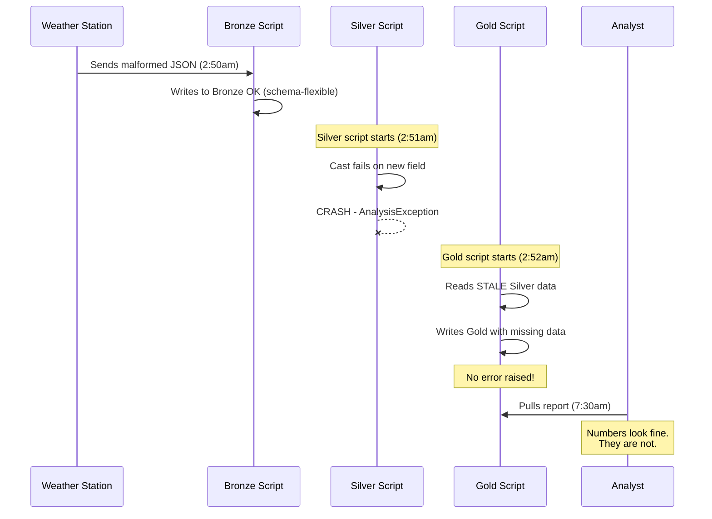
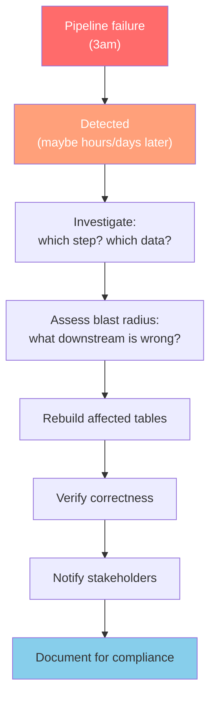

## The question

You built the medallion pipeline in Module 3. Bronze ingests raw SCADA data. Silver cleans and validates it. Gold aggregates it for the analysts. Three Python scripts, run in order by a cron job every 10 minutes. It works on your laptop. It works in dev.

**What happens when it runs in production at 3am on a Tuesday and nobody is watching?**

## The 3am failure

Here is the actual sequence of events. You have seen variations of this if you have ever operated a data pipeline in production.

At 2:50am, a weather station in western Kansas pushes its 10-minute forecast update. The firmware was updated last week and now sends a new field -- `wind_gust_confidence` -- as a nested JSON object instead of a flat number. Your Bronze ingestion script reads the file, parses it, and writes it to the Bronze Delta table. This works fine. Bronze is append-only and schema-flexible; it takes whatever arrives.

At 2:51am, the Silver script starts. It reads from Bronze, applies cleaning rules, casts types, and writes to Silver. But the `wind_gust_confidence` field is now a struct where the code expects a double. The cast fails. The script throws a `pyspark.sql.utils.AnalysisException`. The Silver write aborts.

At 2:52am, the Gold script starts on schedule. It reads from Silver and computes hourly aggregates. Silver was not updated -- but Gold does not know that. It reads stale data and writes a Gold table that looks correct but is missing the last 10 minutes of readings. No error. No alert.

At 7:30am, the compliance analyst pulls the overnight capacity factor report. The numbers look fine. They are not. Three turbines in the Kansas cluster are underreported because the weather correlation data is stale. Nobody notices until the monthly NERC filing review, when the numbers do not match the SCADA system's own logs.

## Why imperative pipelines fail this way

The Module 3 pipeline is **imperative**: you wrote the steps, the ordering, the error handling, and the retry logic yourself. This approach has three structural weaknesses that the 3am scenario exposes.

### Weakness 1: No dependency awareness

Your cron job runs Bronze at 2:50, Silver at 2:51, Gold at 2:52. These are three independent processes. Gold has no way to know that Silver failed. It runs on schedule regardless, consuming whatever data Silver last successfully produced. This is not a bug in your code -- it is a fundamental limitation of scheduling independent scripts[^1].

You could add checks: "did Silver update in the last 10 minutes?" But now you are writing orchestration logic. Every check you add is another thing to maintain, another thing that can have bugs, another thing that is not tested under the exact production conditions where it matters.

### Weakness 2: Partial state after failure

When the Silver script crashes, what state is the Silver table in? That depends on exactly where the crash happened. If it crashed before writing, Silver is stale but consistent. If it crashed mid-write and you were not using Delta Lake's transaction guarantees carefully, Silver might contain a partial batch -- some turbines updated, others not. The next run might or might not fix this, depending on whether your script is idempotent[^2].

<strong>Idempotent</strong>
An operation that produces the same result whether you run it once or multiple times. A truly idempotent pipeline can be safely re-run after a failure without producing duplicates or corrupted data. Achieving idempotency in hand-coded pipelines requires careful design -- it does not come for free.

In Module 3, you handled this by overwriting the Silver table on each run. That works for a small dataset. At 500 turbines with 10-minute intervals, reprocessing the entire Silver table on every run becomes expensive. You want incremental processing -- but incremental processing with correct failure recovery is genuinely hard to implement by hand.

### Weakness 3: No quality tracking

The 3am failure was silent. The pipeline did not record that Silver was not updated. It did not track how many rows passed validation. It did not log that Gold was built on stale data. When the compliance analyst pulls the report, there is no metadata to indicate anything went wrong.

This is not just an engineering inconvenience. For a NERC-regulated wind utility, it is a compliance risk. NERC CIP-003 through CIP-013 require that Critical Energy Infrastructure Information (CEII) be accurately reported and auditable[^3]. If your pipeline silently produces incorrect capacity factors, and you cannot demonstrate when the error occurred or what data was affected, you have a compliance gap that no amount of after-the-fact investigation can fix cleanly.

## The cost of manual recovery

When someone finally notices the problem -- maybe days later, maybe at the monthly review -- the recovery process is manual and painful:

1. **Identify the failure point.** Which script failed? When? The cron log shows the Silver script exited with code 1 at 2:51am. But was that the only failure? You need to check every run since then.

2. **Assess the blast radius.** Which Gold tables consumed stale Silver data? Which reports were generated from those Gold tables? Who received those reports? This requires tracing dependencies by hand through your code.

3. **Determine the fix.** Can you just re-run Silver for the affected time window? Will that cascade correctly to Gold? Or do you need to backfill both?

4. **Execute and verify.** Re-run the scripts, verify the output, update the reports, notify the analysts, document the incident for the compliance team.

This is a 4-hour process for a single 10-minute batch failure. At scale -- 500 turbines, 144 intervals per day, multiple data sources -- these failures compound. The data engineering team spends more time recovering from failures than building new features[^4].

## What a declarative pipeline would change

Imagine if instead of writing three scripts with scheduling and error handling, you described the three datasets and their relationships:

- **Bronze** is the raw readings, appended as they arrive.
- **Silver** is Bronze with these quality rules applied: temperature between -50 and 100, sensor ID not null, timestamps not in the future.
- **Gold** is Silver aggregated by turbine and hour.

And the system figured out the rest: when to run each step, what to do when a step fails, how to track quality metrics, how to handle incremental processing.

That is what Delta Live Tables -- now called Lakeflow Declarative Pipelines -- provides. The next lecture shows exactly how it works.

**Key takeaway: Hand-coded medallion pipelines have three structural weaknesses in production: no dependency awareness between steps (Gold runs even when Silver fails), partial state after failures (mid-write crashes leave inconsistent tables), and no quality tracking (silent data staleness is invisible to downstream consumers and compliance auditors). These weaknesses are not bugs in your code. They are inherent to the imperative approach of writing orchestration logic yourself.**

---

[^1]: Databricks. "Lakeflow Spark Declarative Pipelines." Databricks documentation. https://docs.databricks.com/aws/en/ldp/

[^2]: Databricks. "Spark Declarative Pipelines: Why Data Engineering Needs to Become End-to-End Declarative." Databricks Engineering Blog, 2025. https://www.databricks.com/blog/spark-declarative-pipelines-why-data-engineering-needs-become-end-end-declarative

[^3]: NERC. "CIP Standards." North American Electric Reliability Corporation. Critical Infrastructure Protection standards CIP-003 through CIP-013 govern cybersecurity and data integrity for bulk electric system entities. https://www.nerc.com/pa/Stand/Pages/CIPStandards.aspx

[^4]: Databricks. "2025 DLT Update: Intelligent, Fully Governed Data Pipelines." Databricks Blog, 2025. https://www.databricks.com/blog/2025-dlt-update-intelligent-fully-governed-data-pipelines
