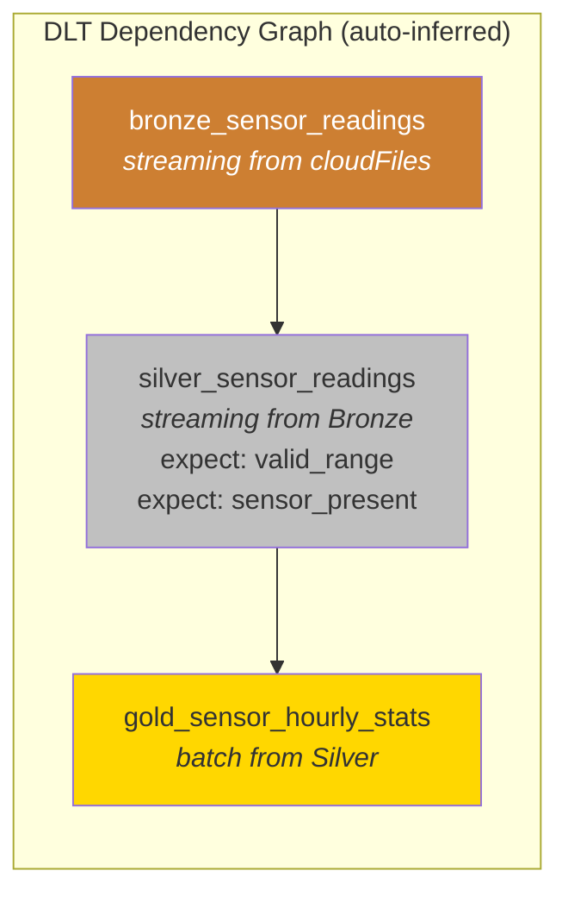
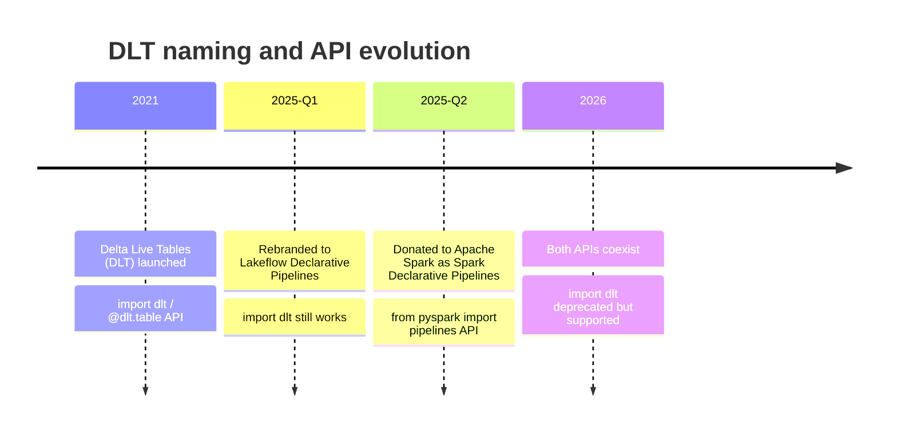

## The question

You saw in the last lecture how a hand-coded medallion pipeline fails at 3am: Silver crashes, Gold does not know, the compliance report is silently wrong. You could fix this by writing more code -- retry logic, dependency checks, quality tracking, idempotent writes. But every line of orchestration code you write is a line you have to maintain, test, and debug at 3am.

**What if you did not write any of it?**

## The core concept

<div class="definition">
<strong>Declarative pipeline</strong>
A pipeline where you define the desired state of each dataset -- its schema, its source, its quality constraints -- and the engine determines the execution plan: dependency ordering, incremental processing, error handling, and retry logic. You describe WHAT the data should look like. The engine decides HOW and WHEN to produce it.
</div>

This is the same shift that happened in other domains. SQL is declarative: you say `SELECT ... WHERE ...` and the query optimizer figures out the execution plan. You do not write the hash join or the index scan yourself. Kubernetes is declarative: you say "I want 3 replicas of this container" and the scheduler figures out placement. Terraform is declarative: you describe the infrastructure and it computes the diff.

Delta Live Tables -- now Lakeflow Declarative Pipelines -- applies this pattern to data pipelines. You define tables and their relationships. The engine handles everything else[^1].

## The same pipeline, two ways

Here is the Bronze-Silver-Gold pipeline from Module 3, written imperatively (plain Spark) and then declaratively (DLT). The data is the same: SCADA turbine readings, cleaned and aggregated.

### Imperative (plain Spark)

```python
# bronze.py -- runs on schedule (cron / Airflow)
raw_df = (
    spark.readStream.format("cloudFiles")
    .option("cloudFiles.format", "json")
    .schema(sensor_schema)
    .load("/raw/sensors/")
)
raw_df.writeStream \
    .format("delta") \
    .outputMode("append") \
    .option("checkpointLocation", "/checkpoints/bronze") \
    .toTable("bronze.sensor_readings")
```

```python
# silver.py -- runs after bronze, must be scheduled separately
bronze_df = spark.readStream.table("bronze.sensor_readings")
silver_df = (
    bronze_df
    .filter("value BETWEEN -50 AND 100")
    .filter("sensor_id IS NOT NULL")
    .withColumn("ts", F.to_timestamp("timestamp"))
    .withColumn("processed_at", F.current_timestamp())
)
silver_df.writeStream \
    .format("delta") \
    .outputMode("append") \
    .option("checkpointLocation", "/checkpoints/silver") \
    .toTable("silver.sensor_readings")
```

```python
# gold.py -- runs after silver, separate schedule again
silver_df = spark.read.table("silver.sensor_readings")
gold_df = (
    silver_df
    .groupBy("sensor_id", F.date_trunc("hour", "ts").alias("hour"))
    .agg(F.avg("value").alias("avg_temp_c"),
         F.count("*").alias("reading_count"))
)
gold_df.write.format("delta") \
    .mode("overwrite") \
    .saveAsTable("gold.sensor_hourly_stats")
```

That is three files, three checkpoint locations, three schedules to coordinate, and zero quality tracking. If Silver fails, Gold runs on stale data. If you want to know how many rows failed validation, you have to add logging yourself.

### Declarative (DLT / Lakeflow Declarative Pipelines)

```python
import dlt
from pyspark.sql import functions as F

@dlt.table(comment="Raw sensor readings, append-only")
def bronze_sensor_readings():
    return (
        spark.readStream.format("cloudFiles")
        .option("cloudFiles.format", "json")
        .schema(sensor_schema)
        .load("/raw/sensors/")
    )

@dlt.table(comment="Validated sensor readings")
@dlt.expect_or_drop("valid_range", "value BETWEEN -50 AND 100")
@dlt.expect_or_drop("sensor_present", "sensor_id IS NOT NULL")
def silver_sensor_readings():
    return (
        dlt.read_stream("bronze_sensor_readings")
        .withColumn("ts", F.to_timestamp("timestamp"))
        .withColumn("processed_at", F.current_timestamp())
    )

@dlt.table(comment="Hourly stats per sensor")
def gold_sensor_hourly_stats():
    return (
        dlt.read("silver_sensor_readings")
        .groupBy("sensor_id", F.date_trunc("hour", "ts").alias("hour"))
        .agg(F.avg("value").alias("avg_temp_c"),
             F.count("*").alias("reading_count"))
    )
```

One file. No checkpoint management. No scheduling between steps. No explicit error handling. And the quality expectations (`@dlt.expect_or_drop`) automatically track how many rows pass and fail at each step -- visible in a dashboard, queryable in system tables, trendable over time[^2].

## What DLT handles automatically

The declarative version is not just shorter. It is structurally different in what the engine takes responsibility for.

### Dependency resolution

DLT reads your code and builds a dependency graph from the `dlt.read()` and `dlt.read_stream()` calls. It knows Silver depends on Bronze and Gold depends on Silver. If Bronze has no new data, Silver does not run. If Silver fails, Gold does not run on stale data -- it waits or fails explicitly[^1].



### Incremental processing

DLT tracks what data has already been processed. When new SCADA readings arrive, it processes only the new rows through Bronze and Silver -- no full recomputation. This is what you would build with checkpoint management in plain Spark, but DLT manages the state automatically[^3].

How does DLT know what data is "new"? For `dlt.read_stream()` (streaming sources), DLT uses Spark Structured Streaming's checkpoint mechanism -- it tracks the last processed offset (Kafka offset, file modification timestamp for Auto Loader, etc.) in a checkpoint directory. When the pipeline restarts, it resumes from the last checkpoint. For `dlt.read()` (batch sources), DLT recomputes the entire table on each run -- there is no incremental tracking. This is why the choice between `read()` and `read_stream()` matters: streaming reads are incremental (fast, append-only), batch reads are full recompute (slower, but guaranteed complete). For the wind utility's SCADA data: use `read_stream()` for Bronze-to-Silver (new readings arrive continuously) and `read()` for Silver-to-Gold if Gold is a full recompute of daily aggregates.[^3]

### Error handling and retries

If a transformation fails, DLT knows exactly which step failed and which downstream tables are affected. It can retry the failed step without re-running the entire pipeline. The failure is visible in the pipeline UI with the exact error, the affected table, and the data that triggered it.

### Schema management

DLT can enforce or evolve schemas automatically. If a new column appears in the source data, you can configure whether to accept it, reject it, or fail the pipeline -- without writing schema validation code.

## `read()` vs. `read_stream()`: the key distinction

These two functions determine how DLT processes data for each table, and choosing the right one is important.

<div class="definition">
<strong>dlt.read_stream()</strong>
Streaming read. Processes only new rows since the last update. Use for tables that should be incrementally updated as new data arrives. Bronze and Silver tables typically use streaming reads because new SCADA readings arrive continuously and should be processed incrementally.
</div>

<div class="definition">
<strong>dlt.read()</strong>
Batch read. Recomputes the entire table from its source on each update. Use for tables that need full recomputation, like aggregations where the result depends on all input rows. Gold tables typically use batch reads because the hourly average changes when any row in the hour changes.
</div>

You can mix both in one pipeline. The standard pattern for the wind utility:

- **Bronze**: `spark.readStream` (stream from source files)
- **Silver**: `dlt.read_stream("bronze_...")` (incrementally clean new readings)
- **Gold**: `dlt.read("silver_...")` (recompute aggregates from all Silver data)

This gives you near-real-time ingestion feeding periodically recomputed business tables -- exactly what the 15 analysts need[^2].

## The naming transition: DLT to Lakeflow to open source

The product you are learning has three names, and understanding the timeline matters for interviews and documentation.

**Delta Live Tables (DLT)** -- the original name, introduced in 2021. The `import dlt` API and `@dlt.table` decorators come from this era. Most existing documentation, blog posts, and community answers use this name[^4].

**Lakeflow Declarative Pipelines** -- the rebranding that began in 2025, as Databricks consolidated its data engineering products under the "Lakeflow" umbrella. The concepts are identical. The `import dlt` API still works. REST endpoints with `/dlt/` in the path continue to function with at least a 12-month deprecation window[^4].

**Spark Declarative Pipelines** -- in June 2025, Databricks donated the core declarative pipeline framework to the Apache Spark open-source project. This means the `from pyspark import pipelines` API is becoming part of Spark itself, not just a Databricks proprietary feature. The Databricks-specific features (quality dashboard, enhanced autoscaling, Unity Catalog integration) remain proprietary, but the core declarative API is open source[^5].

For practical purposes in 2026: use `import dlt` in Databricks notebooks today. Know that the new API uses `from pyspark import pipelines as dp` with `@dp.table` and `@dp.materialized_view` decorators. The concepts (declarative tables, expectations, dependency graphs) are identical across both APIs.

Which import should you use today? If you are writing a new pipeline in 2026, use `import dlt` -- it is stable, well-documented, and will be supported through a long deprecation window. The `from pyspark import pipelines` API is the future but is still maturing as of mid-2026. When it stabilizes, migration will be mechanical (rename decorators and imports). Do not let the naming transition paralyze you -- the concepts and architecture are identical across both APIs.



## What DLT does NOT do

Being honest about the boundaries is important for customer conversations:

- **DLT does not orchestrate across systems.** It does not trigger an API call to fetch data from a weather vendor, then load it, then transform it. That is what Airflow or Databricks Workflows does. DLT handles the transformation and quality enforcement within Databricks.

- **DLT does not replace dbt for SQL-centric teams.** If a team's entire pipeline is SQL batch transformations and they need to run on Snowflake and Databricks, dbt is more portable. DLT is deeper on streaming and quality tracking but locked to Databricks.

- **DLT is not free.** It uses a higher-tier compute SKU (DLT pricing is separate from standard compute). For simple batch jobs that run once a day with no quality requirements, plain Spark might be cheaper.

These trade-offs are covered in detail in the "When to use DLT vs. alternatives" lecture.

**Key takeaway: Declarative pipelines shift responsibility from you to the engine. Instead of writing three scripts with scheduling, checkpoint management, error handling, and quality logging, you define three tables with their sources and quality rules. DLT infers the dependency graph, handles incremental processing, tracks data quality metrics automatically, and prevents downstream tables from consuming stale data when upstream steps fail. The API is evolving -- from `import dlt` to `from pyspark import pipelines` -- but the core concept is stable: describe the outcome, let the engine handle the execution.**

---

[^1]: Databricks. "Lakeflow Spark Declarative Pipelines." Databricks documentation. https://docs.databricks.com/aws/en/ldp/

[^2]: Databricks. "Manage Data Quality with Pipeline Expectations." Databricks documentation. https://docs.databricks.com/aws/en/ldp/expectations

[^3]: Databricks. "What's New in Lakeflow Declarative Pipelines: July 2025." Databricks Blog. https://www.databricks.com/blog/whats-new-lakeflow-declarative-pipelines-july-2025

[^4]: Databricks. "What Happened to Delta Live Tables (DLT)?" Databricks documentation. https://docs.databricks.com/aws/en/ldp/where-is-dlt

[^5]: Databricks. "Bringing Declarative Pipelines to the Apache Spark Open Source Project." Databricks Blog, June 2025. https://www.databricks.com/blog/bringing-declarative-pipelines-apache-spark-open-source-project
