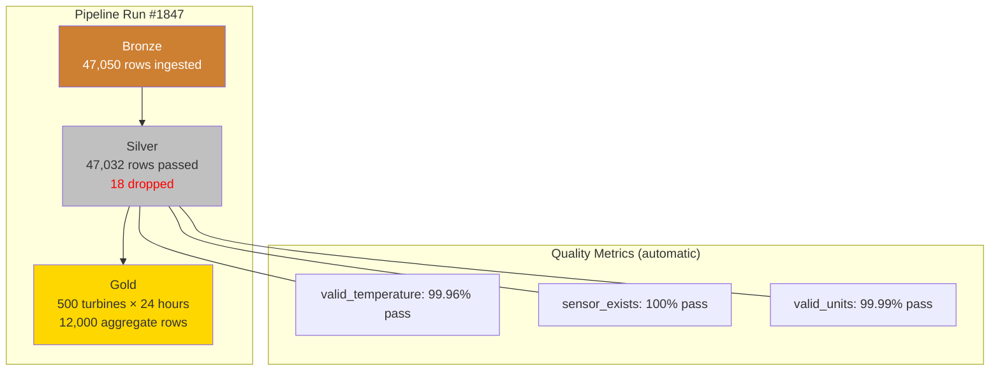

## The question

Your Silver table has 47 million SCADA readings from the last quarter. How many of them are valid? Not "probably valid" -- actually valid, with a number you can show to an auditor?

If you built your pipeline with plain Spark, the honest answer is: you do not know. You wrote some `.filter()` calls that dropped bad rows, but you did not count them. You did not track the rejection rate over time. You cannot say whether data quality improved or degraded last month. When the NERC auditor asks "what is the integrity rate of your compliance data?" you have to go digging through logs -- if they exist.

**DLT expectations solve this.** They are not just validation rules. They are a quality measurement system that runs automatically, records metrics historically, and surfaces them in a dashboard you can show to an auditor.

## The three expectation variants

Every expectation is a SQL boolean expression evaluated against each row. The three variants differ in what happens when a row fails the check[^1].

### `@dlt.expect` -- warn and keep

```python
@dlt.table
@dlt.expect("reasonable_wind_speed", "wind_speed_ms >= 0 AND wind_speed_ms <= 60")
def silver_wind_readings():
    return dlt.read_stream("bronze_wind_readings")
```

**What happens:** Every row passes through to the output table, whether it satisfies the condition or not. The expectation just counts: how many rows passed, how many failed. The metrics are recorded in the pipeline's event log and visible in the quality dashboard.

**When to use it at the wind utility:** Monitoring conditions where you want visibility but not data loss. A wind speed of 65 m/s is suspicious (that is a category 5 hurricane) but not impossible. You want to know it happened. You do not want to lose the reading -- the analyst or the ML model might need it for anomaly detection.

**The mental model:** A sensor on the wall. It measures. It does not intervene.

### `@dlt.expect_or_drop` -- filter silently

```python
@dlt.table
@dlt.expect_or_drop("valid_temperature", "value BETWEEN -50 AND 100")
@dlt.expect_or_drop("sensor_exists", "sensor_id IS NOT NULL")
def silver_sensor_readings():
    return (
        dlt.read_stream("bronze_sensor_readings")
        .withColumn("ts", F.to_timestamp("timestamp"))
    )
```

**What happens:** Rows that fail the condition are dropped from the output table. They are not written to Silver. But -- and this is the key difference from a plain `.filter()` -- the count of dropped rows is recorded. You can query it later. You can trend it. You can alert on it.

**When to use it at the wind utility:** Data that is definitively invalid and should not reach analysts or models. A temperature of 999.9 degrees is a sensor error code, not a reading. A null sensor ID means you cannot attribute the reading to a turbine. These rows are garbage and should not pollute Silver -- but you need to know they existed[^1].

**The mental model:** A quality gate. Bad parts go to the reject bin. The reject bin is counted.

### `@dlt.expect_or_fail` -- halt the pipeline

```python
@dlt.table
@dlt.expect_or_fail("no_future_timestamps",
                     "ts <= current_timestamp()")
def silver_compliance_readings():
    return dlt.read_stream("bronze_compliance_readings")
```

**What happens:** If any row fails the condition, the entire pipeline update stops. The write is rolled back atomically -- no partial data is committed. This is a hard stop that requires human investigation before the pipeline can resume[^2].

**When to use it at the wind utility:** Conditions that indicate a systemic problem, not just a bad reading. Timestamps in the future mean the SCADA system's clock is wrong -- every reading from that turbine is suspect, not just this one. For NERC compliance data, you may prefer the pipeline to halt and alert rather than silently producing data from a misconfigured system.

**The mental model:** An emergency stop button. Production halts. Someone investigates.

## Choosing the right variant: a decision framework

The choice is not about severity -- it is about what kind of problem the violation indicates.

| Signal | Variant | Reasoning |
|--------|---------|-----------|
| Temperature = 999.9 | `expect_or_drop` | Known sensor error code. Row is garbage. |
| Temperature = 55 C | `expect` | High but possible (hot day, south-facing nacelle). Flag, don't drop. |
| Sensor ID is null | `expect_or_drop` | Cannot attribute reading to a turbine. Useless for analysis. |
| Timestamp is 2030 | `expect_or_fail` | Clock sync failure. All data from this source is suspect. |
| Duplicate reading | `expect_or_drop` | Network retransmission. Keep one copy, drop the rest. |
| New unknown sensor type | `expect` | Might be a firmware update. Warn, investigate, do not block. |

The pattern that emerges: **`expect`** for anomalies you want to study, **`expect_or_drop`** for rows that are definitively bad, **`expect_or_fail`** for conditions that indicate the pipeline's inputs are fundamentally broken[^1].

## Grouping expectations

When you have many rules, defining them individually gets verbose. DLT provides group decorators that accept a dictionary of rules[^1]:

```python
quality_rules = {
    "valid_temperature": "value BETWEEN -50 AND 100",
    "sensor_exists": "sensor_id IS NOT NULL",
    "valid_units": "units IN ('degrees_c', 'degrees_f')",
    "recent_reading": "ts >= current_timestamp() - INTERVAL 24 HOURS",
}

@dlt.table
@dlt.expect_all_or_drop(quality_rules)
def silver_sensor_readings():
    return dlt.read_stream("bronze_sensor_readings")
```

The three group variants -- `expect_all`, `expect_all_or_drop`, `expect_all_or_fail` -- apply the same action to all rules in the dictionary. If you need mixed actions (drop on some, warn on others), use individual decorators.

As of 2025, Databricks also supports storing expectation rules in Unity Catalog tables. This means a data quality team can define rules centrally and share them across multiple pipelines -- without modifying pipeline code[^3].

## The quality dashboard: what compliance actually wants

When a DLT pipeline runs, every expectation produces metrics that are recorded in the pipeline's event log. The DLT UI surfaces these as a quality dashboard showing:

- **Pass/fail counts per expectation, per table, per run.** "Silver had 47,032 rows pass `valid_temperature` and 18 rows dropped."
- **Pass rate trends over time.** "The `valid_temperature` pass rate has been 99.96% for the last 30 days, with a dip to 99.2% on March 15."
- **Dropped row counts.** "412 rows were dropped across all expectations this month."



These metrics are also available in DLT event log system tables, which means you can query them with SQL, build dashboards in DBSQL, and set up alerts when quality drops below a threshold[^3].

**This is the feature that closes enterprise deals.** The conversation with a NERC compliance officer is not "we validate data." It is:

> "Our Silver turbine data has a 99.7% validity rate this month, trending stable. Here is the dashboard. Here are the 312 rows that failed -- sensor error codes from turbine WTG-0087, which we reported to the maintenance team on March 3. Here is the lineage showing that Gold tables consumed only validated data."

That is an auditable quality story. It is not something you can build quickly with plain Spark and `.filter()`.

## What happens to the dropped rows?

A common concern: if `expect_or_drop` silently removes rows, how do you investigate what was dropped?

DLT tracks the count of dropped rows per expectation per run in the event log. If you need the actual rows -- not just the count -- the recommended pattern is to add a parallel table with quarantine logic[^2]:

```python
@dlt.table
@dlt.expect_or_drop("valid_temperature", "value BETWEEN -50 AND 100")
def silver_sensor_readings():
    return dlt.read_stream("bronze_sensor_readings")

@dlt.table(comment="Quarantined readings that failed quality checks")
def quarantine_sensor_readings():
    return (
        dlt.read_stream("bronze_sensor_readings")
        .filter("NOT (value BETWEEN -50 AND 100)")
    )
```

This gives you the best of both worlds: Silver is clean, but the quarantine table preserves the evidence. The maintenance team can query quarantine to identify which sensors are producing bad data.

## How this differs from testing frameworks

If you have used dbt tests or Great Expectations (now GX), the DLT approach will feel familiar but different in an important way:

**dbt tests** run after the transformation. They check the output table and fail the job if assertions are violated. This is post-hoc validation -- the bad data was already written.

**Great Expectations** can run inline or post-hoc, but it is a separate system you integrate into your pipeline. You manage the configuration, the execution, and the metric storage yourself.

**DLT expectations** are inline, per-row, and automatic. They run as part of the write operation -- a row is evaluated before it enters the target table. The metrics are stored by the engine without any configuration. There is no separate system to manage[^1].

The trade-off: DLT expectations are Databricks-only. dbt tests and GX are portable. If your quality rules need to run on Snowflake and Databricks, DLT expectations are not the answer.

**Key takeaway: DLT expectations are not just data validation -- they are a quality measurement system. The three variants (`expect`, `expect_or_drop`, `expect_or_fail`) give you graduated control over how invalid data is handled, and every variant automatically records pass/fail metrics that are queryable, trendable, and auditable. For NERC-regulated utilities, this transforms "we validate data" into "here is our 99.7% quality rate with full traceability" -- which is what compliance teams actually need to hear.**

---

[^1]: Databricks. "Manage Data Quality with Pipeline Expectations." Databricks documentation. https://docs.databricks.com/aws/en/ldp/expectations

[^2]: Databricks. "Expectation Recommendations and Advanced Patterns." Databricks documentation. https://docs.databricks.com/aws/en/ldp/expectation-patterns

[^3]: Databricks. "2025 DLT Update: Intelligent, Fully Governed Data Pipelines." Databricks Blog, 2025. https://www.databricks.com/blog/2025-dlt-update-intelligent-fully-governed-data-pipelines

[^4]: Databricks. "Lineage System Tables Reference." Databricks documentation. https://docs.databricks.com/aws/en/admin/system-tables/lineage
