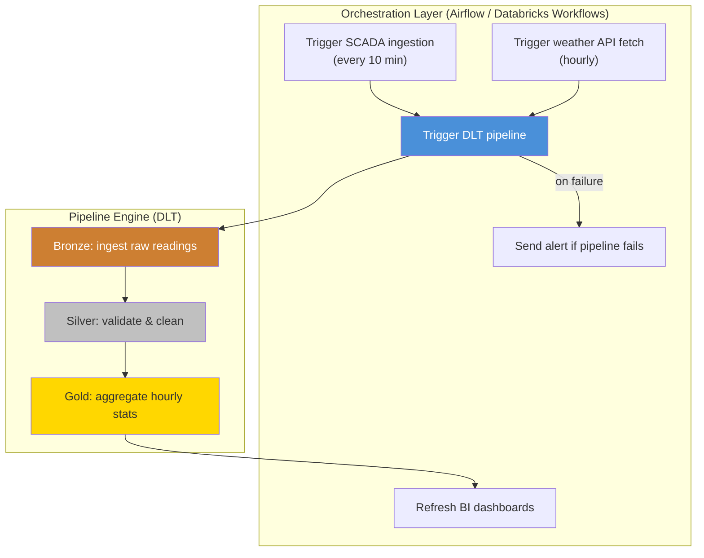
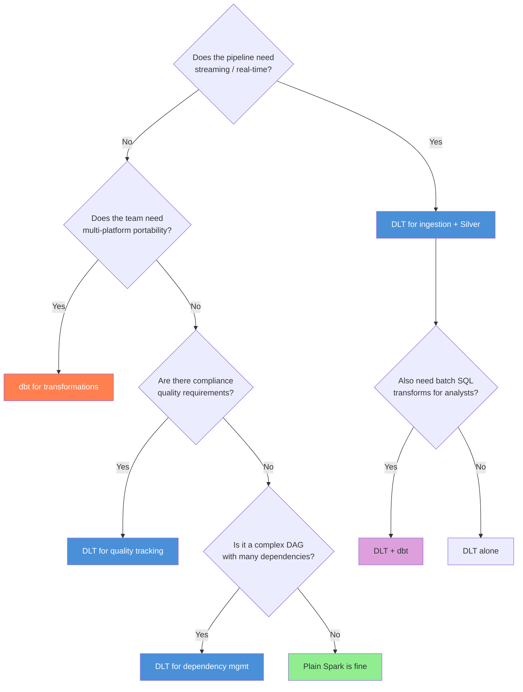

## The question

A customer says: "We're evaluating tools for our data pipeline. Should we use Delta Live Tables, Airflow, or dbt?" If your answer is "DLT, obviously" -- regardless of their situation -- you will lose credibility. These tools solve different problems, operate at different levels of the stack, and are often used together.

The honest answer starts with questions, not recommendations.

## DLT vs. Airflow: pipeline engine vs. orchestrator

This is the comparison that causes the most confusion, because people assume DLT and Airflow compete. They do not. They operate at different levels.

<strong>Orchestrator</strong>
A system that coordinates when things run, in what order, and what to do when they fail. Airflow is an orchestrator. It does not transform data itself -- it triggers other systems that do. An Airflow DAG might say: "At 2am, call the weather API. When that finishes, trigger the DLT pipeline. When that finishes, refresh the BI dashboard. If any step fails, send a Slack alert."

<strong>Pipeline engine</strong>
A system that actually moves and transforms data. DLT is a pipeline engine. It reads source data, applies transformations and quality rules, manages incremental state, and writes output tables. It does not know or care about the weather API or the BI dashboard -- it handles the data processing step.

In the wind utility's production architecture, both exist:

**Airflow triggers the DLT pipeline. DLT handles the data processing within it.** This is the standard pattern at most enterprises using Databricks[^1].

Databricks also has its own orchestrator -- **Databricks Workflows** -- which can trigger DLT pipelines, notebook jobs, SQL queries, and dbt projects from a single interface. For teams fully on Databricks, Workflows often replaces Airflow. For teams with cross-platform orchestration needs (triggering jobs on Databricks, Snowflake, and Kafka from the same DAG), Airflow remains the standard[^2].

### When Airflow alone is enough

If your pipeline is "run this SQL every morning," you do not need DLT. Airflow can trigger a Spark job or a SQL query directly. DLT adds value when you need streaming, incremental processing, quality tracking, or dependency management within the transformation layer.

### When DLT alone is enough

If your entire data workflow lives inside Databricks -- sources are in cloud storage, transformations are Spark/SQL, consumers are DBSQL dashboards -- DLT's built-in scheduling (triggered or continuous mode) might be sufficient without a separate orchestrator.

## DLT vs. dbt: streaming and quality vs. portability

This comparison is closer to a real trade-off because both tools handle data transformation. They overlap on batch SQL workloads. They diverge on everything else.

| Capability | DLT | dbt |
|-----------|-----|-----|
| **Language** | Python + SQL | SQL (Jinja-templated) + Python models |
| **Streaming** | Native (`read_stream`, continuous mode) | Limited (via dbt-databricks adapter) |
| **Quality rules** | Built-in expectations with metrics | dbt tests (post-hoc, no per-row metrics) |
| **Portability** | Databricks only | Snowflake, BigQuery, Redshift, Databricks, etc. |
| **Incremental processing** | Automatic (engine-managed state) | Manual (`is_incremental()` macro) |
| **Community** | Databricks ecosystem | Large open-source community, extensive packages |
| **Cost model** | DLT compute SKU (premium pricing) | Runs on standard compute |

### Where dbt wins

**Portability.** If the wind utility also runs analytics on Snowflake for its retail energy division, dbt models work on both platforms. DLT does not.

**SQL-native teams.** The 15 analysts at the wind utility know SQL. They do not know Python. dbt lets them own transformation logic in a language they already use, with version control, documentation, and testing built in.

**Community ecosystem.** dbt has thousands of open-source packages (dbt-utils, dbt-expectations, dbt-audit-helper) that accelerate common patterns. DLT's ecosystem is smaller and Databricks-specific.

### Where DLT wins

**Streaming.** If the SCADA pipeline needs to process readings within seconds of arrival (for real-time turbine alerts), DLT handles this natively. dbt is fundamentally batch-oriented.

**Quality metrics.** DLT expectations track pass/fail rates per row, per rule, per run, automatically. dbt tests tell you pass/fail at the table level after the transform completes. For NERC compliance, the per-row metrics from DLT are what auditors want[^3].

**Incremental processing.** DLT's engine manages state automatically. dbt's incremental models require you to write the `is_incremental()` logic correctly, manage the lookback window, and hope the macro handles edge cases. This is a common source of subtle bugs in dbt pipelines[^4].

### The honest answer for the wind utility

Use both. DLT for the streaming SCADA ingestion pipeline (Bronze through Silver) where you need real-time processing and quality tracking. dbt for the batch SQL transformations that build Gold tables and reporting views, where the analysts need to own and modify the logic. Airflow or Databricks Workflows to orchestrate the whole thing.

This is not a cop-out. It is how most mature data teams work.

## DLT vs. plain Spark: when is the overhead not worth it?

DLT adds value through automation, quality tracking, and managed incremental processing. But it also adds:

- **Cost.** DLT compute runs at a higher price per DBU than standard Spark clusters.
- **Complexity.** The DLT API has constraints: you cannot use arbitrary Spark operations, you must return DataFrames from decorated functions, and debugging requires understanding DLT's execution model.
- **Lock-in.** Code written with `import dlt` only runs on Databricks (though the new `from pyspark import pipelines` API will eventually be portable via open-source Spark).

### When plain Spark is fine

- **One-off or infrequent batch jobs.** A monthly reconciliation script that reads a CSV, transforms it, and writes a Delta table does not benefit from DLT's streaming or incremental features.
- **Simple transformations with no quality requirements.** If you are just converting file formats or doing straightforward aggregations with no compliance oversight, DLT's quality tracking is unused overhead.
- **Cost-sensitive workloads.** For large batch jobs where the DLT pricing premium matters, running the same logic on a standard Spark cluster can be significantly cheaper.

### When DLT is clearly better

- **Streaming or near-real-time ingestion.** The incremental state management alone justifies DLT.
- **Regulated environments.** The quality dashboard and automatic metrics recording are extremely difficult to replicate by hand.
- **Complex dependency graphs.** If your pipeline has 15 tables with cross-dependencies, DLT's automatic dependency resolution prevents the 3am failure cascade from Lecture 1.

## Enhanced Autoscaling: a DLT-specific advantage

<strong>Enhanced Autoscaling</strong>
DLT's autoscaling algorithm that scales compute up and down based on task slot utilization and queue depth, not just cluster-level CPU metrics. For streaming workloads, this is more responsive than standard Databricks autoscaling because it understands the pipeline's processing model, not just generic resource utilization[^5].

For serverless DLT pipelines (available since 2025), the system also selects the most cost-efficient instance types automatically. You specify a maximum worker count and DLT handles the rest -- scaling up during the morning SCADA data burst, scaling down during the quiet overnight hours[^5].

This matters for cost conversations. A customer worried about "paying for idle clusters at 3am" can be told: DLT serverless scales to near-zero when there is no data to process.

## Decision framework

When a customer asks "what should we use?", start with these questions:

**For the wind utility specifically:** DLT for the streaming SCADA pipeline (Bronze and Silver), where you need real-time processing, quality expectations, and NERC-auditable metrics. dbt or DLT SQL for Gold-layer business aggregations. Databricks Workflows to orchestrate the whole thing, triggering DLT pipelines and dbt runs on schedule or on data arrival.

## What to say in an interview

When asked "should a customer use DLT or dbt?", the worst answer is picking one without asking about the customer's situation. The best answer:

> "It depends on three things: do they need streaming, do they need cross-platform portability, and do they have compliance quality requirements? For streaming ingestion with quality tracking -- like a SCADA pipeline feeding a regulated reporting system -- DLT is clearly better. For batch SQL transformations that analysts need to own and that might run on multiple platforms -- dbt is stronger. Most production architectures I've seen use both, with an orchestrator coordinating them."

That answer demonstrates nuance. It shows you understand both tools. And it starts with the customer's problem, not the vendor's product.

## When DLT pipelines produce wrong data

The scariest DLT failure is not a crash -- it is a pipeline that runs successfully but produces incorrect results. Common causes:

1. **Expectation thresholds too loose** -- `@dlt.expect` warns but does not drop. If you are monitoring, you see the warning. If you are not watching the quality dashboard, bad data flows through.
2. **Stale streaming checkpoint** -- if you change a streaming table's logic but do not reset the checkpoint, DLT continues from where it left off with the OLD logic applied to already-processed data. Fix: full refresh (`pipelines.reset()` or toggle in the UI).
3. **Batch table picks up partial upstream data** -- a `dlt.read()` Gold table recomputes from Silver, but Silver's streaming update has not finished. Gold sees a partial day. Fix: use `dlt.read_stream()` for Gold too, or schedule Gold to run after Silver completes.

Debugging approach: check the pipeline's event log first (`event_type = 'flow_progress'` for data quality, `event_type = 'update_progress'` for pipeline state). The lineage graph in the DLT UI shows which tables updated and when.[^1]

## DLT cost context

DLT pipelines run on a dedicated compute SKU that costs more per DBU than standard Jobs compute. On AWS Premium tier, DLT compute is approximately $0.20/DBU (vs. $0.15/DBU for standard Jobs).[^6] For the wind utility's SCADA pipeline processing approximately 2 GB/day, this premium is small in absolute terms -- maybe $50-100/month more than an equivalent hand-coded Spark job. The value proposition is: DLT's quality tracking, automatic retry, and lineage would cost more than $100/month of engineering time to build manually. For large-scale pipelines (TBs/day), the DBU premium becomes significant and you should benchmark DLT vs. plain Spark with your own orchestration.

**Key takeaway: DLT, Airflow, and dbt solve different problems at different levels of the stack. Airflow is an orchestrator (triggers things in order), DLT is a pipeline engine (transforms data with quality tracking), and dbt is a SQL transformation framework (portable batch transforms). In production, they are often used together: Airflow triggers DLT for streaming ingestion, DLT handles quality enforcement in Bronze/Silver, and dbt builds Gold-layer analytics tables. The decision depends on the customer's streaming needs, portability requirements, and compliance obligations -- not on which tool is "best."**

---

[^1]: Databricks. "Lakeflow Spark Declarative Pipelines." Databricks documentation. https://docs.databricks.com/aws/en/ldp/

[^2]: Kujawski, M. "Databricks Orchestration: Databricks Workflows, Azure Data Factory, and Airflow." Medium, 2024. https://medium.com/@mariusz_kujawski/databricks-orchestration-databricks-workflows-azure-data-factory-and-airflow-fb44560fac08

[^3]: Databricks. "Manage Data Quality with Pipeline Expectations." Databricks documentation. https://docs.databricks.com/aws/en/ldp/expectations

[^4]: Sharma, R. "dbt vs Delta Live Tables." Medium, 2023. Discusses incremental processing differences and trade-offs. https://medium.com/@rahulxsharma/dbt-vs-delta-live-tables-ef629b627e0

[^5]: Databricks. "Optimize the Cluster Utilization of Lakeflow Spark Declarative Pipelines with Autoscaling." Databricks documentation. https://docs.databricks.com/aws/en/ldp/auto-scaling

[^6]: Databricks. "What's New in Lakeflow Declarative Pipelines: July 2025." Databricks Blog. https://www.databricks.com/blog/whats-new-lakeflow-declarative-pipelines-july-2025
