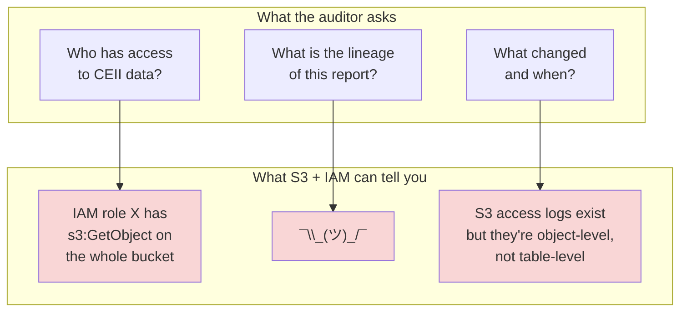

## The question

Your wind utility's data platform is humming. Delta tables are ACID-compliant. The medallion layers are clean. DLT pipelines catch bad data automatically. Then a letter arrives from NERC — the North American Electric Reliability Corporation — announcing a CIP compliance audit.

The auditor asks three questions:

1. **Who has access to your CEII data?** Show me a list. Show me when it was last reviewed. Show me who approved each entry.
2. **What is the lineage of your quarterly capacity report?** The number says 1.2 TWh. Trace that back to the raw SCADA readings. Every transformation, every filter, every aggregation.
3. **What changed and when?** On March 15, someone modified the Gold table that feeds the compliance dashboard. Who was it? What did they change? Was it authorized?

You look at your S3 bucket, your IAM roles, your Parquet files organized by date. You cannot answer a single one of these questions.

This is not a hypothetical. This is why enterprises buy Databricks.

## $10 million in concrete stakes

<strong>CEII (Critical Energy Infrastructure Information)</strong>
Specific engineering, vulnerability, and operational data about energy infrastructure — including generation capacity, grid topology, and physical security details — that FERC designates as requiring restricted access. For a wind utility, this includes turbine GPS coordinates, substation connection points, and generation capacity data that could reveal grid vulnerabilities.[^1]

In 2019, Duke Energy agreed to pay $10 million to settle 127 NERC CIP violations spanning 2015 to 2018. Thirteen of those violations were classified as "serious," and NERC stated they "collectively posed a serious risk to the security and reliability of the Bulk Power System."[^2] The root causes were not exotic cyberattacks. NERC cited "lack of management engagement, support, and accountability," organizational silos, and deficient processes.[^3]

Translation: Duke did not have adequate controls over who could access what, and they could not prove their compliance posture to auditors. The technology existed. The governance did not.

This is the gap Unity Catalog fills. Not faster queries — governed access, tracked lineage, and immutable audit trails.

## The three questions your data lake cannot answer

Consider what your sensor-analytics pipeline looks like at the 500-turbine scale. You have Bronze tables landing raw SCADA data every 10 minutes. Silver tables clean and validate it. Gold tables aggregate it for analyst dashboards and compliance reports. The data lives in S3, organized as Delta tables.

Now try to answer the auditor's questions with just S3 and IAM:

### Question 1: Who has access?

IAM operates at the storage layer — buckets, prefixes, objects. Your CEII data (turbine GPS coordinates, substation connections, generation capacity) lives in specific columns across dozens of tables. IAM cannot say "analyst Jane can see the `avg_power_kw` column but not the `latitude` and `longitude` columns in `wind_prod.scada.turbine_readings`." IAM sees files, not columns.[^4]

Worse, IAM roles are typically shared. The `data-analyst-role` might grant access to the entire `scada/` prefix. When the auditor asks "which specific people can see CEII data," you are reverse-engineering role assignments, group memberships, and assumed roles across multiple AWS accounts. This is not a governance posture. This is an incident response exercise.

### Question 2: What is the lineage?

The quarterly capacity report says your fleet produced 1.2 TWh. The auditor wants to see the chain: raw 10-minute readings from 500 turbines, cleaned to remove sensor errors, aggregated to hourly, aggregated to monthly, summed across the fleet. Which pipeline produced each step? What filters were applied? Were any readings excluded?

S3 has no concept of lineage. Your data files know nothing about where they came from. You could reconstruct this from job logs, notebook revision history, and Git commits — but that requires days of detective work, not a query. And the auditor is sitting across the table right now.

### Question 3: What changed?

Delta Lake gives you table versioning — you can see *that* the Gold table changed on March 15 and *what* the data looked like before and after. But Delta's transaction log does not record *who* made the change, *why* they made it, or whether they had authorization. The `commitInfo` field in the Delta log records the cluster ID and notebook path, not the human identity and their permission chain.

## Why "just use IAM roles" is not governance

IAM is access *control* — it decides whether a request is allowed or denied. Governance is the broader system: access control plus lineage plus audit plus discovery plus classification. Here is why the distinction matters for regulated industries:

| Requirement | IAM alone | Unity Catalog |
|---|---|---|
| Control access to a table | Approximate (via bucket/prefix) | Exact (table, column, row level) |
| Know who accessed CEII data last month | Possible with CloudTrail, but requires mapping object paths to table semantics | Built-in: `system.access.audit` |
| Trace a report back to source data | Not supported | Automatic column-level lineage |
| Prove access was reviewed quarterly | Manual process | Queryable permissions + audit trail |
| Mask GPS coordinates for non-CEII-cleared analysts | Not possible at storage layer | Column masking functions |

The fundamental mismatch: IAM governs *storage*. Unity Catalog governs *data*. Storage is buckets and objects. Data is tables, columns, rows, and the relationships between them. NERC auditors care about data, not storage.[^5]

## What Unity Catalog actually is

<strong>Unity Catalog</strong>
Databricks' centralized governance layer for all data and AI assets. It provides a three-level namespace (catalog, schema, table), fine-grained access control (including column masking and row filtering), automatic data lineage tracking, and immutable audit logs — all queryable through SQL. Open-sourced under Apache 2.0 in June 2024 and hosted at the Linux Foundation's LF AI & Data.[^6]

Unity Catalog sits between your users and your data. Every query, every access, every permission change passes through it. This is not optional overhead — it is the governance layer that lets you answer the auditor's three questions:

1. **Who has access?** `SHOW GRANTS ON TABLE wind_prod.scada.turbine_readings;` — returns every principal with access, at what level, granted by whom.
2. **What is the lineage?** Catalog Explorer shows the full graph from source tables through transformations to downstream dashboards, captured automatically at runtime.
3. **What changed?** `SELECT * FROM system.access.audit WHERE action_name = 'alterTable' AND request_params.full_name_arg = 'wind_prod.scada.gold_hourly_stats';` — returns who changed the table, when, and what the change was.

## Which NERC CIP standards apply to data platforms?

The NERC CIP framework includes over a dozen standards, but four are directly relevant to how a wind utility governs its data platform:

- **CIP-004 (Personnel & Training)** — Requires documented authorization for access to BES Cyber Systems and their associated information (BCSI). Requirement R4 mandates access management programs to "authorize, verify, and revoke" provisioned access, and R5 requires access revocation within defined timeframes when personnel change roles.[^7] Maps to Unity Catalog: who has `GRANT` access to CEII tables, and can you prove access was revoked when an analyst left the fleet operations team?

- **CIP-007 (Systems Security Management)** — Requirement R4 mandates "security event monitoring" including logging of "detected successful login attempts" and "detected failed access attempts and failed login attempts" at the BES Cyber System level, with a minimum 90-day log retention.[^8] Maps to UC: `system.access.audit` logs every query, every permission change, and every failed access attempt — retained as Delta tables you can query with SQL, not log files you need a SIEM to parse.

- **CIP-011 (Information Protection)** — Requires identification and protection of BES Cyber System Information (BCSI), including "procedures for the protection and secure handling" of such information "during storage, transit, and use."[^9] For a wind utility, BCSI includes CEII data like turbine GPS coordinates and substation connection details. Maps to UC: column masking on GPS coordinates, row filtering by region, and the ability to demonstrate programmatically which principals can access which BCSI columns.

- **CIP-013 (Supply Chain Risk Management)** — Requires documented plans for managing "supply chain cyber security risk" for BES Cyber Systems, including processes for vendor remote access management, software integrity verification, and risk assessment during procurement.[^10] When your data platform runs on a cloud vendor's infrastructure, CIP-013 requires you to document how you manage that vendor relationship. Maps to UC: external location management controls which storage credentials are used, Delta Sharing controls govern what data leaves the platform, and audit logs demonstrate vendor access patterns.

The key phrase auditors look for: "documented evidence of access control implementation and review." Unity Catalog's system tables provide this evidence programmatically — you do not need to maintain spreadsheets. A single SQL query against `system.access.audit` produces the evidence that a manual compliance process requires weeks of spreadsheet assembly to create.

## What does governance cost?

Unity Catalog itself has no separate SKU — it is included with every Databricks workspace on the Premium tier. But "included" does not mean "free." The cost is indirect:

- **Premium tier requirement** — UC requires Premium tier. On AWS and GCP, Databricks retired the Standard tier in October 2025 (Azure follows in October 2026), making Premium the base tier for all new deployments.[^11] For organizations that were previously on Standard, the historical uplift was roughly 30-40% more per DBU depending on cloud and workload type. Since Standard is no longer available for new customers on AWS/GCP, this is now simply the cost of Databricks.

- **System tables storage** — Audit logs, lineage data, and billing data are stored as Delta tables in your account's system catalog. Databricks provides a free retention period for each system table type. Beyond that, storage costs apply at your cloud provider's standard object storage rates. For a 15-analyst team running approximately 100 queries/day, the audit data volume is modest — on the order of a few GB per month — costing cents, not dollars, on S3.[^12]

- **Operational cost** — Someone needs to manage catalogs, schemas, permissions, and review audit logs. For the wind utility, this is probably 2-4 hours/week of a data engineer's time — defining new grants when analysts join, reviewing quarterly access reports for NERC compliance, and investigating audit anomalies.

The total governance overhead for the wind utility: approximately $0 in direct UC licensing + the standard Premium tier DBU rates (which you are paying regardless) + a few dollars/month in system table storage + roughly $500/month in staff time for access management and audit review. Compare this to the cost of a single NERC CIP violation — Duke Energy's 127 violations resulted in a $10 million settlement — and the ROI calculation is straightforward.

## The enterprise buying conversation

Most Databricks enterprise deals now hinge on Unity Catalog, not on Spark performance or Delta Lake features. The conversation in the room is rarely "can your engine run our queries fast enough." It is almost always some version of:

- "Can you prove to our compliance team who has access to regulated data?"
- "Can we govern data across our three cloud accounts and two business units?"
- "Our Snowflake instance handles SQL fine, but we need lineage and audit for our ML pipelines too."

Understanding this is critical for anyone in a customer-facing role. When a wind utility evaluates Databricks, the SCADA pipeline's performance requirements might be satisfied by DuckDB on a single VM. What DuckDB cannot provide is the governance posture that lets the utility pass a NERC CIP audit. That is the value proposition.

The next lecture covers the organizational structure that makes this governance possible: the three-level namespace.

[^1]: [FERC CEII Regulations](https://www.ferc.gov/enforcement-legal/ceii) — FERC defines CEII under 18 CFR 388.113.
[^2]: [Duke Energy fined $10M for cybersecurity lapses](https://www.utilitydive.com/news/duke-fined-10m-for-cybersecurity-lapses-since-2015/547528/) — Utility Dive, 2019.
[^3]: [U.S. Energy Firm Fined $10 Million for Security Failures](https://www.securityweek.com/us-energy-firm-fined-10-million-security-failures/) — SecurityWeek, 2019.
[^4]: [Unity Catalog overview](https://docs.databricks.com/aws/en/data-governance/unity-catalog/) — Databricks documentation on governance scope.
[^5]: [NERC CIP Standards](https://www.nerc.com/standards/reliability-standards/cip) — Full list of Critical Infrastructure Protection standards.
[^6]: [Open sourcing Unity Catalog](https://www.databricks.com/blog/open-sourcing-unity-catalog) — Databricks blog, June 2024.
[^7]: [CIP-004-7 — Cyber Security – Personnel & Training](https://www.nerc.com/pa/Stand/Reliability%20Standards/CIP-004-7.pdf) — NERC Reliability Standard, Requirements R4 (Access Management) and R5 (Access Revocation).
[^8]: [CIP-007-6 — Cyber Security – Systems Security Management](https://www.nerc.com/pa/Stand/Reliability%20Standards/CIP-007-6.pdf) — NERC Reliability Standard, Requirement R4 (Security Event Monitoring), Table R4.
[^9]: [CIP-011-3 — Cyber Security — Information Protection](https://www.nerc.com/pa/Stand/Reliability%20Standards/CIP-011-3.pdf) — NERC Reliability Standard, Requirement R1 (Information Protection Program).
[^10]: [CIP-013-2 — Cyber Security — Supply Chain Risk Management](https://www.nerc.com/globalassets/standards/reliability-standards/cip/cip-013-2.pdf) — NERC Reliability Standard, Requirement R1 (Supply Chain Cyber Security Risk Management Plan).
[^11]: [Azure Databricks Standard Tier End of Life](https://community.databricks.com/t5/community-articles/the-end-of-an-era-azure-databricks-is-retiring-the-standard-tier/td-p/144848) — Standard tier retired October 2025 on AWS/GCP; October 2026 on Azure.
[^12]: [Monitor account activity with system tables](https://docs.databricks.com/aws/en/admin/system-tables/) — Databricks documentation on system table storage and retention.
