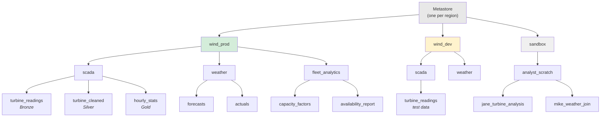

## The question

Your wind utility has 500 turbines producing SCADA telemetry, weather forecast data from three providers, a vibration model trained by the ML team, and 15 analysts running dashboards. You also have a development environment where engineers test pipeline changes, and a sandbox where analysts experiment with ad hoc queries.

How do you organize all of this so that (a) every table has a unique, unambiguous name, (b) permissions can be set at the right level of granularity, and (c) a new team member can find the table they need without asking six people?

The answer is a three-level namespace: **catalog.schema.table**.

## The hierarchy

<div class="definition">
<strong>Catalog</strong>
The top level of the Unity Catalog namespace hierarchy. A catalog is a logical container for schemas, analogous to a database in PostgreSQL or a top-level organizational boundary. Catalogs typically map to environments (dev, staging, prod), business units, or major domains. Every Unity Catalog metastore can contain multiple catalogs.[^1]
</div>

<div class="definition">
<strong>Schema</strong>
The second level of the namespace, contained within a catalog. A schema groups related tables, views, functions, and volumes. It maps to a functional area or data domain — like "scada," "weather," or "fleet_analytics." In traditional databases, this is sometimes called a "database" (confusingly). In Unity Catalog, it is always called a schema.[^1]
</div>

Every data asset in Unity Catalog has a three-part fully qualified name:

```
catalog.schema.object
```

For your wind utility, this might look like:



The fully qualified references:

- `wind_prod.scada.turbine_readings` — production Bronze SCADA data
- `wind_prod.weather.forecasts` — production weather forecasts
- `wind_prod.fleet_analytics.capacity_factors` — Gold table for compliance reporting
- `wind_dev.scada.turbine_readings` — development copy with test data
- `sandbox.analyst_scratch.jane_turbine_analysis` — analyst experimentation

## What each level is for

### Catalogs: organizational boundaries

Catalogs are your coarsest-grained boundary. They answer the question: "Who owns this data and what environment is it in?"

Common catalog strategies for the wind utility:

**By environment** (most common for mid-size organizations):

```sql
CREATE CATALOG wind_prod;
CREATE CATALOG wind_staging;
CREATE CATALOG wind_dev;
```

**By business unit** (common for larger enterprises):

```sql
CREATE CATALOG generation;    -- wind + solar assets
CREATE CATALOG transmission;  -- grid operations
CREATE CATALOG corporate;     -- finance, HR
```

**By environment and business unit** (large regulated enterprises):

```sql
CREATE CATALOG generation_prod;
CREATE CATALOG generation_dev;
CREATE CATALOG transmission_prod;
```

The key principle: permissions cascade. A `GRANT USE CATALOG ON wind_prod TO analysts` gives the analysts group the ability to see that the catalog exists and browse its schemas. It does not give them access to any data — that requires separate grants on schemas or tables. But if someone does not have `USE CATALOG`, they cannot see the catalog at all. This is your first line of defense.[^2]

### Schemas: domain boundaries

Within a catalog, schemas group related tables by domain or function. They answer: "What kind of data is this?"

```sql
USE CATALOG wind_prod;

CREATE SCHEMA scada
  COMMENT 'Raw and processed SCADA telemetry from all turbines';

CREATE SCHEMA weather
  COMMENT 'Weather forecasts and actuals from three providers';

CREATE SCHEMA fleet_analytics
  COMMENT 'Gold-quality aggregates for analyst dashboards and compliance';

CREATE SCHEMA ml_features
  COMMENT 'Feature tables for predictive maintenance models';
```

Schemas are where you typically grant team-level access:

```sql
-- Analysts can read fleet_analytics (Gold tables)
GRANT USE SCHEMA ON SCHEMA wind_prod.fleet_analytics TO `analysts@windutility.com`;
GRANT SELECT ON SCHEMA wind_prod.fleet_analytics TO `analysts@windutility.com`;

-- Data engineers can read and write scada
GRANT USE SCHEMA ON SCHEMA wind_prod.scada TO `data-engineers@windutility.com`;
GRANT ALL PRIVILEGES ON SCHEMA wind_prod.scada TO `data-engineers@windutility.com`;

-- ML team gets read access to scada (for training data) and write to ml_features
GRANT USE SCHEMA ON SCHEMA wind_prod.scada TO `ml-team@windutility.com`;
GRANT SELECT ON SCHEMA wind_prod.scada TO `ml-team@windutility.com`;
GRANT ALL PRIVILEGES ON SCHEMA wind_prod.ml_features TO `ml-team@windutility.com`;
```

### Tables: the actual data

Tables are the leaf nodes. In Unity Catalog, every table belongs to exactly one schema, and every table has a three-part name. There is no ambiguity — `wind_prod.scada.turbine_readings` is a different table from `wind_dev.scada.turbine_readings`, even though they might have the same schema.

```sql
USE CATALOG wind_prod;
USE SCHEMA scada;

CREATE TABLE turbine_readings (
  turbine_id      STRING    COMMENT 'Unique identifier: WTG-0001 through WTG-0500',
  reading_time    TIMESTAMP COMMENT 'UTC timestamp of the 10-minute interval',
  wind_speed_ms   DOUBLE    COMMENT 'Wind speed in meters per second at hub height',
  power_output_kw DOUBLE    COMMENT 'Active power output in kilowatts',
  rotor_rpm       DOUBLE    COMMENT 'Rotor speed in revolutions per minute',
  latitude        DOUBLE    COMMENT 'CEII: turbine GPS latitude',
  longitude       DOUBLE    COMMENT 'CEII: turbine GPS longitude'
) USING DELTA
COMMENT 'Bronze: raw 10-minute SCADA readings from all turbines'
TBLPROPERTIES ('quality' = 'bronze');
```

Notice the `COMMENT` on the `latitude` and `longitude` columns explicitly marking them as CEII. This is not just documentation — it signals to governance reviewers which columns need column masking (covered in the next lecture).

## The metastore: the invisible top level

Above the catalog hierarchy sits the **metastore** — one per cloud region, shared across all Databricks workspaces in that region. You almost never interact with the metastore directly. It exists so that when a data engineer in the engineering workspace and an analyst in the BI workspace both reference `wind_prod.scada.turbine_readings`, they are talking about the same table, governed by the same permissions.[^1]

This is the fundamental architectural difference from the legacy Hive Metastore, which was per-workspace. In the Hive world, each workspace had its own metastore with its own tables and its own permissions. There was no shared governance. If you wanted the ML workspace to see the same tables as the engineering workspace, you mounted the same S3 paths and hoped the schemas stayed in sync.

Unity Catalog eliminates this by making the metastore the single source of truth for all metadata, permissions, and lineage — shared across every workspace in the region.

## Managed tables vs. external tables

When you create a table in Unity Catalog, you choose between two storage models:

<div class="definition">
<strong>Managed table</strong>
A table where Unity Catalog controls both the metadata and the underlying data files. The data is stored in a managed storage location owned by the metastore. When you <code>DROP TABLE</code>, both the metadata and the data files are deleted. This is the default.[^3]
</div>

<div class="definition">
<strong>External table</strong>
A table where Unity Catalog controls the metadata but the data files live in a storage location you specify and own. When you <code>DROP TABLE</code>, only the metadata is removed — the data files remain. The storage location must be registered as an external location in Unity Catalog.[^3]
</div>

```sql
-- Managed: Databricks owns the data lifecycle
CREATE TABLE wind_prod.scada.turbine_readings_managed (
  turbine_id STRING,
  reading_time TIMESTAMP,
  power_output_kw DOUBLE
) USING DELTA;

-- External: you own the data, UC governs access
CREATE TABLE wind_prod.scada.turbine_readings_external (
  turbine_id STRING,
  reading_time TIMESTAMP,
  power_output_kw DOUBLE
) USING DELTA
LOCATION 's3://wind-utility-datalake/scada/turbine_readings/';
```

### When to use each

**Managed tables** are simpler. Unity Catalog handles storage location, cleanup, and optimization (including Predictive Optimization for compaction and vacuuming). Use them when:
- You are building new tables from scratch
- You do not have regulatory requirements to keep data in specific storage accounts
- You want the simplest operational model

**External tables** are necessary when:
- **Regulatory compliance requires data residency in your own cloud account** — common for CEII data where the utility's security team must control the encryption keys and storage policies
- **Data is already in S3/ADLS/GCS** and you are registering existing files, not creating new ones
- **Multiple systems write to the same location** — external tables let Unity Catalog govern access to data it does not own
- **You want DROP TABLE to be safe** — for production data, the safety net of "dropping the table does not delete the files" can prevent catastrophic mistakes

For the wind utility, a typical pattern: external tables for Bronze (SCADA data lands in the utility's own S3 bucket from their SCADA historian), managed tables for Silver and Gold (Databricks manages the optimized, cleaned data).[^4]

## Mapping this to what you already know

If you have worked with PostgreSQL, the mapping is straightforward:

| PostgreSQL | Unity Catalog | Wind utility example |
|---|---|---|
| Cluster (server) | Metastore | `us-east-1` metastore |
| Database | Catalog | `wind_prod` |
| Schema | Schema | `scada` |
| Table | Table | `turbine_readings` |

If you have worked with dbt:

| dbt | Unity Catalog | Notes |
|---|---|---|
| `project` | Catalog | Environment boundary |
| `schema` (custom) | Schema | Domain grouping |
| `model` | Table/View | Materialized asset |
| `source` | External table | Registered existing data |

If you have worked with Snowflake:

| Snowflake | Unity Catalog | Key difference |
|---|---|---|
| Account | Metastore | UC spans workspaces; Snowflake account is self-contained |
| Database | Catalog | Same concept |
| Schema | Schema | Same concept |
| Table | Table | Same concept |
| Warehouse | (separate) | UC does not manage compute — SQL Warehouses do |

The Snowflake mapping is almost 1:1 at the namespace level. The difference is scope: Snowflake's governance is tightly integrated with its compute and storage (which makes it simpler but vendor-locked). Unity Catalog governs data that can be stored anywhere and queried by any engine that speaks the Iceberg REST Catalog API.[^5]

## Common namespace mistakes

**Too many catalogs.** One catalog per team per environment per region creates a combinatorial explosion. Start with `dev`, `staging`, `prod`. Add business-unit catalogs only when you have genuinely separate governance domains.

**Too few schemas.** Dumping everything into `default` means you cannot grant permissions by domain. If analysts need access to Gold tables but not Bronze tables, they need to be in different schemas.

**Naming collisions between environments.** The table `scada.turbine_readings` should have the same schema definition in `wind_dev` and `wind_prod`. If dev evolves the schema without prod tracking, you get deployment failures. This is a pipeline discipline problem, not a Unity Catalog problem — but the namespace structure makes it visible.

**Forgetting USE CATALOG / USE SCHEMA defaults.** When a notebook connects to a cluster, it has a default catalog and schema. If an analyst's notebook defaults to `wind_prod` and they accidentally write test data, they are polluting production. Set developer defaults to `wind_dev` or `sandbox` at the workspace level.

The next lecture covers what most enterprises are actually paying for: access control, lineage, and audit.

[^1]: [What is Unity Catalog?](https://docs.databricks.com/aws/en/data-governance/unity-catalog/) — Databricks documentation on metastore, catalogs, and schemas.
[^2]: [Unity Catalog best practices](https://learn.microsoft.com/en-us/azure/databricks/data-governance/unity-catalog/best-practices) — Microsoft/Azure Databricks documentation on namespace design.
[^3]: [Create tables in Unity Catalog](https://docs.databricks.com/aws/en/data-governance/unity-catalog/create-tables) — Managed vs external table documentation.
[^4]: [Practical guide to catalog layout](https://medium.com/databricks-unity-catalog-sme/a-practical-guide-to-catalog-layout-data-sharing-and-distribution-with-databricks-unity-catalog-f34fa822a367) — Databricks Unity Catalog SME blog on namespace patterns.
[^5]: [What's new with Unity Catalog at Data + AI Summit 2025](https://www.databricks.com/blog/whats-new-databricks-unity-catalog-data-ai-summit-2025) — Iceberg REST Catalog API support for cross-engine access.
