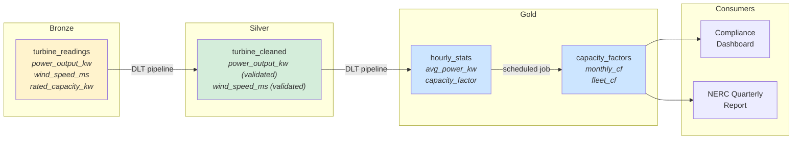
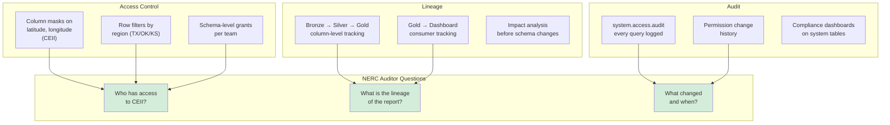

## The question

You have a three-level namespace. Your tables are organized. But organization is not governance. Your wind utility has 15 analysts, 5 data engineers, a 2-person ML team, and NERC CIP auditors who show up annually. Three things need to be true:

1. The analyst in Texas should see turbine data for Texas, not the GPS coordinates of turbines in Ohio (that is CEII).
2. When the compliance report says the fleet produced 1.2 TWh, you can trace that number back through every transformation to the raw 10-minute SCADA readings.
3. Every query against CEII data is logged, immutably, and queryable — not buried in an S3 access log you need a CloudTrail expert to parse.

These three capabilities — access control, lineage, and audit — are not nice-to-haves. They are the features that close enterprise Databricks deals.

## Access control: GRANT, REVOKE, and the principle of least privilege

Unity Catalog uses a familiar SQL-based permission model. Nothing is accessible by default — you must explicitly grant access. This is the opposite of the legacy Hive Metastore, where workspace access often implied data access.[^1]

### Basic grants

```sql
-- Grant an analyst group read access to Gold tables
GRANT USE CATALOG ON CATALOG wind_prod
  TO `analysts@windutility.com`;

GRANT USE SCHEMA ON SCHEMA wind_prod.fleet_analytics
  TO `analysts@windutility.com`;

GRANT SELECT ON SCHEMA wind_prod.fleet_analytics
  TO `analysts@windutility.com`;
```

Three separate grants are required because permissions do not cascade automatically for data access. `USE CATALOG` lets the group see the catalog exists. `USE SCHEMA` lets them browse the schema. `SELECT` lets them query tables. You need all three. Missing `USE CATALOG` and the analysts get a confusing "catalog not found" error even though the table exists — a common gotcha during initial setup.

```sql
-- Revoke access when an analyst changes teams
REVOKE SELECT ON SCHEMA wind_prod.fleet_analytics
  FROM `jane.doe@windutility.com`;
```

### Column masking: hiding CEII data in plain sight

Your `turbine_readings` table has `latitude` and `longitude` columns. These are CEII — they reveal the physical location of energy infrastructure. Most analysts need the operational data (power output, wind speed, temperatures) but should never see the coordinates. Historically, you would create a separate view that omits those columns. But views proliferate, get out of sync, and every downstream query needs to know which view to use.

<div class="definition">
<strong>Column mask</strong>
A SQL function applied to a column that dynamically transforms the value based on who is querying. The mask is attached to the column itself, not to a view — so every query against the table automatically applies the mask. The function receives the column value and returns the transformed value (which must be the same data type).[^2]
</div>

```sql
-- Create a masking function for CEII coordinates
CREATE OR REPLACE FUNCTION wind_prod.governance.mask_ceii_coordinate(
  val DOUBLE
)
RETURNS DOUBLE
RETURN CASE
  WHEN is_account_group_member('ceii-cleared')
    THEN val
  ELSE NULL
END;
```

```sql
-- Apply the mask to the CEII columns
ALTER TABLE wind_prod.scada.turbine_readings
  ALTER COLUMN latitude
  SET MASK wind_prod.governance.mask_ceii_coordinate;

ALTER TABLE wind_prod.scada.turbine_readings
  ALTER COLUMN longitude
  SET MASK wind_prod.governance.mask_ceii_coordinate;
```

Now when a CEII-cleared engineer queries the table, they see the actual coordinates. When an analyst without CEII clearance runs the same query, `latitude` and `longitude` return `NULL`. Same table. Same query. Different results based on the caller's identity. No separate views to maintain.[^2]

The masking function is a regular SQL UDF — it can contain any logic. Need to return a rounded value instead of NULL (so analysts can see approximate regions without pinpoint locations)?

```sql
-- Approximate to ~11km resolution instead of hiding entirely
CREATE OR REPLACE FUNCTION wind_prod.governance.mask_ceii_approx(
  val DOUBLE
)
RETURNS DOUBLE
RETURN CASE
  WHEN is_account_group_member('ceii-cleared')
    THEN val
  ELSE ROUND(val, 1)  -- ~11km at mid-latitudes
END;
```

### Row filtering: each region sees only its turbines

Your wind utility operates in Texas, Oklahoma, and Kansas. The Texas operations team should see Texas turbines. The Oklahoma team should see Oklahoma. The fleet analytics team sees everything. Row filters make this automatic.

<div class="definition">
<strong>Row filter</strong>
A SQL function applied to a table that dynamically filters rows based on who is querying. The function returns a boolean — <code>TRUE</code> keeps the row, <code>FALSE</code> hides it. Like column masks, the filter is attached to the table, not to a view.[^2]
</div>

```sql
-- Create a row filter function
CREATE OR REPLACE FUNCTION wind_prod.governance.filter_by_region(
  region_val STRING
)
RETURNS BOOLEAN
RETURN CASE
  WHEN is_account_group_member('fleet-wide-access') THEN TRUE
  WHEN is_account_group_member('texas-ops')
    AND region_val = 'TX' THEN TRUE
  WHEN is_account_group_member('oklahoma-ops')
    AND region_val = 'OK' THEN TRUE
  WHEN is_account_group_member('kansas-ops')
    AND region_val = 'KS' THEN TRUE
  ELSE FALSE
END;
```

```sql
-- Apply to the table
ALTER TABLE wind_prod.scada.turbine_readings
  SET ROW FILTER wind_prod.governance.filter_by_region
  ON (region);
```

A Texas analyst queries `SELECT * FROM wind_prod.scada.turbine_readings` and sees only Texas turbines. They do not know Oklahoma data exists. The fleet analytics team runs the same query and sees all 500 turbines. The WHERE clause is invisible and automatic — no application code changes needed.[^3]

## Lineage: tracing the compliance report back to raw readings

Your quarterly NERC compliance report states: "Fleet capacity factor for Q1 2026: 34.2%." The auditor asks: where did that number come from?

Without lineage, the answer is a scavenger hunt. You check the dashboard, find it reads from `wind_prod.fleet_analytics.capacity_factors`. You look at the pipeline code to find that table is populated from `wind_prod.scada.hourly_stats`. That table is produced by a DLT pipeline from `wind_prod.scada.turbine_cleaned`. Which comes from `wind_prod.scada.turbine_readings`. You traced it — but it took 30 minutes of notebook archaeology.

With Unity Catalog, lineage is captured automatically at runtime. Every query that reads from or writes to a table creates a lineage record. The lineage graph includes column-level tracking — you can see not just that `capacity_factors` depends on `turbine_readings`, but that the `capacity_factor` column specifically derives from `power_output_kw` and `rated_capacity_kw`.[^4]



### How lineage is captured

Unity Catalog captures lineage at query execution time — not by analyzing code statically. When a Spark job, SQL query, DLT pipeline, or notebook reads from `turbine_readings` and writes to `turbine_cleaned`, the runtime records that dependency. This means:

- Lineage is always accurate (it reflects what actually ran, not what the code says it should do)
- Lineage crosses languages — a Python notebook reading from a table that was written by a SQL pipeline is still tracked
- Lineage includes BI tools — a Tableau dashboard querying a Gold table shows up as a downstream consumer
- Lineage data is retained for one year and queryable via the lineage system tables[^4]

### Why auditors care about lineage

When the NERC auditor asks "how did you compute this fleet capacity factor," lineage lets you answer in seconds instead of hours. But the deeper value is **impact analysis**. Before you change the schema of `turbine_readings` — say, renaming `power_output_kw` to `active_power_kw` — lineage tells you every downstream table, view, dashboard, and ML model that depends on that column. You know what will break before you break it.

## Audit: every access, every change, immutable and queryable

<div class="definition">
<strong>System tables</strong>
A set of Delta tables in the <code>system</code> catalog that Unity Catalog populates automatically. They include audit logs (<code>system.access.audit</code>), lineage data (<code>system.lineage.table_lineage</code>, <code>system.lineage.column_lineage</code>), billing data, and more. These tables are queryable with standard SQL — you can build dashboards, alerts, and compliance reports directly on top of them.[^5]
</div>

The most important system table for compliance is `system.access.audit`. Every action that passes through Unity Catalog is logged:

```sql
-- Find all queries against CEII-containing tables in the last 30 days
SELECT
  event_time,
  user_identity.email AS who,
  action_name AS what,
  request_params.full_name_arg AS which_table,
  source_ip_address AS from_where
FROM system.access.audit
WHERE request_params.full_name_arg
      LIKE 'wind_prod.scada.turbine_readings%'
  AND event_time > DATEADD(DAY, -30, CURRENT_TIMESTAMP())
ORDER BY event_time DESC;
```

```sql
-- Find all permission changes in the last 7 days
SELECT
  event_time,
  user_identity.email AS changed_by,
  action_name,
  request_params
FROM system.access.audit
WHERE action_name IN ('updatePermissions', 'grantPermission',
                       'revokePermission')
  AND event_time > DATEADD(DAY, -7, CURRENT_TIMESTAMP())
ORDER BY event_time DESC;
```

### What makes this different from CloudTrail

AWS CloudTrail logs S3 API calls — `GetObject`, `PutObject`, `DeleteObject`. The log entry tells you that IAM role `arn:aws:iam::123456:role/databricks-cluster` accessed `s3://wind-lake/scada/part-00042.parquet`. Useful for storage forensics. Useless for governance questions like "did analyst Jane query turbine GPS coordinates?"

Unity Catalog audit logs operate at the *semantic* level. The log says `jane.doe@windutility.com` ran `SELECT latitude, longitude FROM wind_prod.scada.turbine_readings WHERE region = 'TX'` at `2026-04-08T14:23:17Z`. The difference is the difference between "someone accessed a file" and "Jane queried CEII coordinates for Texas turbines."

### Building compliance reports on system tables

Because system tables are just Delta tables, you can build dashboards and alerts on them:

```sql
-- Monthly compliance report: CEII data access summary
CREATE OR REPLACE VIEW wind_prod.governance.ceii_access_monthly AS
SELECT
  DATE_TRUNC('month', event_time) AS month,
  user_identity.email AS accessor,
  COUNT(*) AS query_count
FROM system.access.audit
WHERE request_params.full_name_arg
      LIKE 'wind_prod.scada.turbine_readings%'
  AND action_name = 'commandSubmit'
GROUP BY 1, 2
ORDER BY 1 DESC, 3 DESC;
```

This view is the answer to the NERC auditor's first question. Not a manually assembled spreadsheet — a live, queryable, automatically-maintained record of who accessed CEII data and when. The auditor can run the query themselves.[^5]

## Putting it all together: the compliance posture

Here is what the wind utility's governance looks like with all three capabilities active:



Every question the auditor asks has a SQL query for an answer. That is the value proposition — not "Databricks is faster than Snowflake" but "Databricks can prove your compliance posture through governed, auditable, traceable data access."

The next lecture covers the practical reality of getting here: migrating from Hive Metastore, and how Unity Catalog compares to the alternatives.

[^1]: [Unity Catalog overview](https://docs.databricks.com/aws/en/data-governance/unity-catalog/) — Default-deny permission model.
[^2]: [Row filters and column masks](https://docs.databricks.com/aws/en/data-governance/unity-catalog/filters-and-masks/) — Databricks documentation on dynamic data masking.
[^3]: [Manually apply row filters and column masks](https://learn.microsoft.com/en-us/azure/databricks/data-governance/unity-catalog/filters-and-masks/manually-apply) — Azure Databricks documentation with SQL examples.
[^4]: [View data lineage using Unity Catalog](https://docs.databricks.com/aws/en/data-governance/unity-catalog/data-lineage) — Column-level lineage and retention policies.
[^5]: [System tables reference](https://docs.databricks.com/aws/en/administration-guide/system-tables/index.html) — Audit logs, lineage tables, and billing tables.
[^6]: [Unity Catalog product page](https://www.databricks.com/product/unity-catalog) — Overview of governance capabilities.
