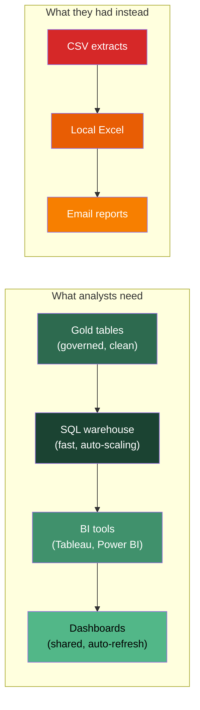

## The problem: fifteen versions of the truth

Your wind utility has done everything right so far. The SCADA data flows through DLT pipelines. Bronze captures every raw reading from 500 turbines. Silver cleans and validates it. Gold aggregates it into hourly capacity factors, availability percentages, and maintenance indicators. Unity Catalog governs it all -- who can see what, where it came from, what changed.

The data engineering team is proud of this stack. They should be.

But the 15 analysts who build the reports and dashboards that the CFO actually reads? They have never opened a notebook. They do not write Python. They do not know what a Spark cluster is, and they do not want to know. Their tools are SQL, Tableau, Power BI, and Excel.

Here is what happens every Monday morning. Three analysts present fleet capacity factors to the operations meeting. The numbers disagree. Not by much -- one says 32.1%, another says 31.8%, a third says 33.4%. The CFO asks: "Which one is right?"

Nobody can answer immediately because each analyst built their own pipeline:

- Analyst A downloaded last week's CSV extract from a shared drive, filtered out turbines under maintenance, and calculated capacity factor in Excel.
- Analyst B wrote a SQL query against an old Redshift table that has not been updated since the migration started.
- Analyst C connected Tableau directly to the Bronze layer (raw, uncleaned SCADA data) because nobody told her the Gold table existed.

Three analysts, three data sources, three definitions of "capacity factor," three answers. Multiply this by every metric the operations team tracks and you understand why the CFO is losing confidence in the data.

**The data platform is only as good as the analyst experience.** You can build the most elegant medallion architecture in the world, but if analysts cannot easily query the governed Gold tables through their preferred tools, they will route around it. They will download CSVs. They will build shadow pipelines. They will produce conflicting numbers. This is not a technology problem -- it is a last-mile delivery problem.

## What analysts actually need

After working through Modules 1 through 5, it is tempting to think the hard part is done. Spark handles scale. Delta Lake handles reliability. DLT handles pipelines. Unity Catalog handles governance. But none of those components face the analyst directly. Analysts need four things:

**Fast queries on governed data.** An analyst should be able to write `SELECT * FROM wind_ops.gold.fleet_capacity_factor WHERE state = 'TX' AND month = '2026-03'` and get results in seconds -- not minutes, and not after waiting for a cluster to start. The data must come from the governed Gold tables, not from a CSV extract or a stale copy[^1].

**Familiar SQL.** Not PySpark, not notebooks, not Scala. Standard SQL with standard functions. Analysts have years of muscle memory in SQL. Any platform that asks them to learn a new language has already lost[^2].

**BI tool connectivity.** Analysts live in Tableau, Power BI, Looker, or similar. They need a standard JDBC/ODBC connection from their tool to the data -- not a custom integration, not a file export, not an API they have to code against[^3].

**No infrastructure management.** An analyst should never have to think about cluster sizing, Spark configurations, or instance types. They write a query, they get results. Someone else (or something automated) handles the compute.

## Why a Spark cluster is wrong for this

You might think: "We already have Databricks. Just give the analysts access to our Spark clusters." This is a common mistake, and it fails for three reasons.

<strong>All-purpose cluster</strong>
A general-purpose Databricks compute resource designed for interactive development in notebooks. Supports Python, Scala, SQL, and R. Charges all-purpose compute DBU rates ($0.55/DBU on AWS Premium), starts in 4-8 minutes, and stays running until manually terminated or a timeout triggers. Designed for data engineers and data scientists, not SQL analysts.

**Startup time kills the workflow.** An all-purpose Spark cluster takes 4 to 8 minutes to start. An analyst opens Tableau, clicks "refresh dashboard," and waits. After 5 minutes, they give up and use their local CSV. A SQL warehouse starts in 2 to 6 seconds[^4]. That difference is not incremental -- it is the difference between a tool analysts use and a tool analysts avoid.

**Cost model is wrong.** All-purpose clusters charge $0.55/DBU on AWS Premium tier. They stay running between queries unless you configure aggressive auto-termination. Fifteen analysts running ad-hoc queries throughout the day on always-on clusters is expensive. SQL warehouses auto-suspend after idle periods (default 10 minutes) and scale based on query queue depth, not headcount[^5].

**Complexity is wrong.** A Spark cluster exposes configuration options that analysts should never see: executor memory, shuffle partitions, Spark session configs, library dependencies. A SQL warehouse exposes one thing: a SQL endpoint. Write your query. Get your results.

## The gap between engineering and analysis

This is a pattern that shows up in every enterprise data platform, not just Databricks. Data engineers build pipelines in notebooks using Python and Spark. Data analysts consume data using SQL and BI tools. These are fundamentally different workflows with fundamentally different requirements:

| | Data engineer | SQL analyst |
|---|---|---|
| Primary language | Python, Spark SQL | SQL, maybe some Excel formulas |
| Primary tool | Notebooks, IDE | Tableau, Power BI, SQL editor |
| Compute preference | Long-running cluster for iterative development | Instant-on, per-query compute |
| Cost sensitivity | Less sensitive (fewer users, larger jobs) | More sensitive (many users, many small queries) |
| Infrastructure tolerance | High -- will tune Spark configs | Zero -- "it should just work" |
| Governance interaction | Produces governed data | Consumes governed data |

<strong>Databricks SQL (DBSQL)</strong>
The analyst-facing query layer of the Databricks platform. Provides SQL warehouses -- dedicated compute endpoints optimized for BI workloads -- that connect to Delta tables governed by Unity Catalog. Analysts query through SQL, BI tools, or the built-in SQL editor. DBSQL is Databricks' answer to the question: "How do SQL analysts use the lakehouse?"

There's a role between data engineer and SQL analyst that this picture misses: the **analytics engineer** -- someone who writes SQL transformations in dbt, builds data models, and maintains the Silver-to-Gold pipeline logic. Analytics engineers need DBSQL for interactive development AND a CI/CD workflow for deploying dbt models. On Databricks, they use DBSQL for ad-hoc queries and testing, but deploy through Databricks Workflows or dbt Cloud. This role is increasingly common and bridges the gap between the two workflows in the table above.

Databricks SQL bridges this gap. It provides a SQL-native interface on top of the same Delta tables and Unity Catalog governance that the engineering team built. The analyst writes SQL against `wind_ops.gold.fleet_capacity_factor`. Under the hood, a Photon-powered SQL warehouse executes the query against the governed Delta table. The analyst does not know or care that the data went through a DLT pipeline -- they just see a table[^6].

**This is what solves the CFO problem.** When all 15 analysts query the same governed Gold table through the same SQL warehouse, there is only one version of the capacity factor. Not because you told them to agree, but because there is only one source of truth and only one way to reach it.

## What comes next

The next three lectures unpack the components:

- **SQL warehouses and Photon** -- what they are mechanically, how they differ from Spark clusters, and how Photon's vectorized execution makes SQL fast enough to compete with Snowflake.
- **Databricks SQL vs. Snowflake** -- the honest comparison every customer conversation requires.
- **BI tools and the analyst experience** -- JDBC/ODBC connectivity, Partner Connect, query monitoring, result caching, and the Python connector for programmatic access.

The goal: you should be able to sit down with a frustrated SQL analyst, understand their pain, and explain exactly how DBSQL solves it -- without overselling and without hand-waving about "the lakehouse."

[^1]: [Databricks SQL documentation](https://docs.databricks.com/aws/en/sql/index.html) -- overview of the SQL analytics layer.
[^2]: [Databricks SQL language reference](https://docs.databricks.com/aws/en/sql/language-manual/index.html) -- DBSQL supports ANSI SQL with Spark SQL extensions.
[^3]: [Business intelligence tools](https://docs.databricks.com/aws/en/ai-bi/tools) -- supported BI tool integrations including Tableau, Power BI, Looker, and others.
[^4]: [SQL warehouse types](https://docs.databricks.com/aws/en/compute/sql-warehouse/warehouse-types) -- serverless warehouses start in 2 to 6 seconds vs. several minutes for pro/classic.
[^5]: [SQL warehouse sizing and scaling](https://docs.databricks.com/aws/en/compute/sql-warehouse/warehouse-behavior) -- auto-suspend, auto-scaling, and queuing behavior.
[^6]: [Databricks SQL product page](https://www.databricks.com/product/databricks-sql) -- positioning DBSQL as the analyst-facing lakehouse interface.
