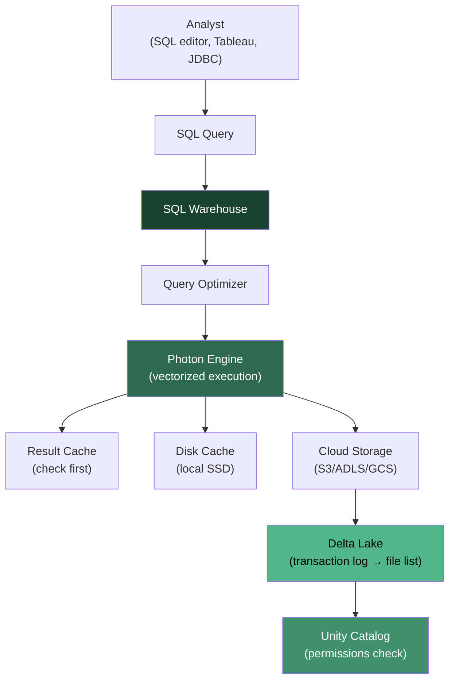

## The question

Your wind utility's 15 analysts need fast SQL access to governed Gold tables. You know they need a SQL warehouse, not a Spark cluster. But what actually *is* a SQL warehouse? When an analyst runs `SELECT AVG(capacity_factor) FROM wind_ops.gold.fleet_daily WHERE state = 'TX'`, what happens between the keystroke and the result?

## What a SQL warehouse is

<div class="definition">
<strong>SQL warehouse</strong>
A dedicated compute endpoint in Databricks optimized for SQL analytics workloads. Unlike an all-purpose cluster (which supports notebooks, Python, Scala, and interactive development), a SQL warehouse accepts only SQL queries and is tuned for BI query patterns: fast startup, automatic scaling based on query queue depth, and automatic suspension when idle. It runs the Photon engine for vectorized query execution against Delta tables governed by Unity Catalog.
</div>

A SQL warehouse is not a separate product from Databricks -- it is a different compute configuration on the same platform. It reads from the same Delta tables, respects the same Unity Catalog permissions, and accesses the same data that your Spark jobs write to. The difference is in how compute is provisioned and optimized.

When an analyst submits a query through the SQL editor, Tableau, or the JDBC connector, the request hits the SQL warehouse. The warehouse parses and optimizes the query, reads the relevant Parquet files from cloud storage (using Delta Lake's transaction log to know which files are current), executes the query using the Photon engine, and returns results. If the warehouse was suspended, it wakes up first -- in seconds for serverless, in minutes for classic[^1].



## Three warehouse types

Databricks offers three SQL warehouse types. The differences come down to where the compute runs, how fast it starts, and what performance features are available.

### Classic

The original warehouse type. Classic warehouses provision VMs in *your* cloud account (AWS, Azure, or GCP). They support Photon but nothing else from the advanced performance stack. Startup takes approximately 4 minutes because Databricks must provision and configure VMs from scratch. Classic warehouses are being phased out -- Databricks recommends migrating to Pro or Serverless[^2].

### Pro

Pro warehouses also run in your cloud account, but they add Photon and Predictive I/O (prefetching data based on query patterns). Startup is still approximately 4 minutes. Pro is the middle ground: better performance than Classic, but without the startup speed or intelligent workload management of Serverless.

### Serverless

Serverless warehouses run in *Databricks'* cloud account on pre-warmed compute pools. This is what enables the 2 to 6 second startup time -- the VMs already exist, Databricks just assigns your query to available capacity. Serverless includes all performance features: Photon, Predictive I/O, and Intelligent Workload Management (IWM), which dynamically routes queries across available compute to minimize queue wait times[^3].

<div class="definition">
<strong>Intelligent Workload Management (IWM)</strong>
A serverless-only feature that dynamically manages how queries are distributed across compute resources. Instead of rigid cluster-based scaling (add a whole new cluster when the queue is full), IWM can adjust resource allocation at a finer granularity, responding to changing query demand more quickly and cost-effectively than manual or rules-based auto-scaling.
</div>

| Feature | Classic | Pro | Serverless |
|---|---|---|---|
| Startup time | ~4 min | ~4 min | 2-6 sec |
| Photon | Yes | Yes | Yes |
| Predictive I/O | No | Yes | Yes |
| Intelligent Workload Management | No | No | Yes |
| Compute location | Your account | Your account | Databricks account |
| Auto-scaling responsiveness | Slow (full VMs) | Slow (full VMs) | Fast (pre-warmed) |

**For your wind utility:** Use Serverless. The 15 analysts query intermittently throughout the day. Serverless starts instantly when someone opens a dashboard, scales up during the Monday morning operations meeting when everyone queries at once, and suspends when nobody is running queries. You pay only for active compute time.

## What Photon actually does

<div class="definition">
<strong>Photon</strong>
A query execution engine written in C++ that replaces Spark's JVM-based execution layer for SQL workloads. Photon processes data in columnar batches using SIMD (Single Instruction, Multiple Data) CPU instructions, achieving 3x to 10x speedups over standard Spark SQL for typical analytics queries. It is not a separate product -- it is the execution engine inside SQL warehouses and can be enabled on all-purpose clusters.
</div>

Photon is often described as "Databricks' faster engine" or "C++ instead of JVM." That is technically true but misses the important part. The performance gain comes from a fundamentally different execution model, not just a language change.

### Row-at-a-time vs. vectorized execution

Traditional Spark SQL processes data through a tree of operators (scan, filter, aggregate, join). Each operator processes one row at a time, calling virtual functions to evaluate expressions. This is flexible -- you can plug in any expression -- but it has overhead. Every row means a function call. Every function call means branch prediction, instruction cache misses, and no opportunity for the CPU to use its widest data paths.

Photon switches to **vectorized execution**: operators process batches of values (typically 1024 or more) stored in columnar format. Instead of evaluating `temperature > 35.0` one row at a time, Photon loads a batch of temperature values into a contiguous memory buffer and applies the comparison to the entire batch using SIMD instructions. One CPU instruction compares 4, 8, or 16 values simultaneously[^4].

```sql
-- This query benefits enormously from vectorized execution
SELECT
    turbine_id,
    AVG(capacity_factor) AS avg_cf,
    COUNT(*) AS hours
FROM wind_ops.gold.fleet_hourly
WHERE state = 'TX'
  AND month >= '2026-01'
  AND capacity_factor > 0.2
GROUP BY turbine_id
ORDER BY avg_cf DESC
LIMIT 20;
```

For this query, Photon:
1. **Scans** the `state` column as a contiguous batch, filters to 'TX' using SIMD string comparison
2. **Scans** `month` and `capacity_factor` columns in batch, applies both filters simultaneously
3. **Hashes** `turbine_id` values in batch for the GROUP BY
4. **Aggregates** `capacity_factor` values using vectorized SUM and COUNT operations
5. **Sorts** the results in batch for ORDER BY

Each step processes thousands of values per CPU instruction cycle instead of one. The SIGMOD 2022 paper on Photon reports that this approach, combined with the move from JVM to native C++ (eliminating garbage collection pauses and enabling direct memory management), produces 3x average speedups with peaks above 10x for scan-heavy queries[^5].

### What Photon does not do

Photon is not a full replacement for Spark. It accelerates a subset of operations -- primarily the scan, filter, aggregation, join, and sort operations that dominate SQL analytics workloads. Complex UDFs, Python-based transformations, and some Spark-specific operations still fall back to the JVM engine. This is transparent to the user -- the query optimizer decides which parts to execute in Photon and which to execute in Spark[^6].

For the wind utility's analysts, this does not matter. Their queries are exactly the kind Photon accelerates: filter by turbine, group by time period, aggregate capacity factors, join with weather data. Pure SQL analytics.

## The cost model

<div class="definition">
<strong>DBU (Databricks Unit)</strong>
The billing unit for Databricks compute. One DBU represents a normalized unit of processing capability per hour. The dollar cost per DBU varies by workload type, cloud provider, and tier. DBU consumption depends on the size of the cluster or warehouse -- a larger warehouse uses more DBUs per hour but completes queries faster.
</div>

Understanding DBSQL pricing requires knowing that you pay two bills: one to Databricks (DBU charges) and one to your cloud provider (VM and storage costs). For serverless warehouses, the cloud compute cost is included in the DBU rate[^7].

Current AWS Premium tier DBU rates (as of early 2026):

| Workload type | DBU rate ($/hour) | Notes |
|---|---|---|
| SQL Serverless | $0.70 | Includes cloud compute |
| SQL Pro | $0.55 | + separate cloud VM costs |
| All-Purpose Compute | $0.55 | For notebooks, interactive dev |
| Jobs Compute | $0.30 | For scheduled production jobs |
| Jobs Lite Compute | $0.22 | For lightweight jobs |

The serverless rate looks higher ($0.70 vs. $0.55 for Pro), but it includes the underlying VM cost. When you add the AWS EC2 bill to Pro warehouse costs, serverless is often comparable or cheaper -- especially for bursty analyst workloads where auto-suspend matters[^8].

### Right-sizing for the wind utility

A small SQL warehouse (2X-Small, roughly 1 cluster unit) consumes about 4 DBUs per hour on serverless. At $0.70/DBU, that is $2.80/hour of active compute. With auto-suspend set to 10 minutes, an analyst who runs queries for 30 minutes in the morning and 30 minutes in the afternoon uses about 1.5 hours of compute -- roughly $4.20/day.

For 15 analysts, assuming some concurrency (dashboards refreshing, overlapping queries), a Small warehouse (8 DBUs/hour) with auto-scaling might cost $40-60/day during active hours. That is $800-1200/month -- far less than running a dedicated Spark cluster 24/7 or maintaining a separate Snowflake deployment for the same workload.

The key cost levers:
- **Auto-suspend**: Aggressively suspend when idle. 10 minutes is the default; 5 minutes works for interactive use.
- **Right-size**: Start small, let auto-scaling handle peaks. A 2X-Small warehouse handles most single-user queries fine.
- **Result caching**: Repeated queries (dashboard refreshes) hit the cache instead of consuming compute. This is free.
- **Serverless over Pro/Classic**: Faster suspend/resume means less idle compute time. The per-DBU premium often pays for itself.

**Key takeaway: A SQL warehouse is a dedicated, SQL-only compute endpoint powered by Photon's vectorized C++ engine. Serverless warehouses start in seconds, scale automatically, and suspend when idle -- making them dramatically more suitable for analyst workloads than all-purpose Spark clusters. The cost model rewards right-sizing and auto-suspend, which matters when you have 15 analysts with intermittent query patterns.**

[^1]: [SQL warehouse types](https://docs.databricks.com/aws/en/compute/sql-warehouse/warehouse-types) -- architecture and feature comparison of Classic, Pro, and Serverless.
[^2]: [SQL warehouse types](https://docs.databricks.com/aws/en/compute/sql-warehouse/warehouse-types) -- Databricks recommends serverless for most workloads.
[^3]: [SQL warehouse sizing and scaling](https://docs.databricks.com/aws/en/compute/sql-warehouse/warehouse-behavior) -- Intelligent Workload Management and auto-scaling behavior.
[^4]: [What is Photon?](https://docs.databricks.com/aws/en/compute/photon) -- Databricks documentation on the Photon execution engine.
[^5]: [Photon: A Fast Query Engine for Lakehouse Systems](https://people.eecs.berkeley.edu/~matei/papers/2022/sigmod_photon.pdf) -- SIGMOD 2022 paper describing Photon's vectorized architecture and performance benchmarks.
[^6]: [Photon product page](https://www.databricks.com/product/photon) -- overview of which operations Photon accelerates and fallback behavior.
[^7]: [Databricks SQL Pricing](https://www.databricks.com/product/pricing/databricks-sql) -- official DBU rates for SQL warehouse types.
[^8]: [Databricks Pricing Explained](https://www.dawiso.com/glossary/databricks-pricing-explained-real-cost-breakdown-for-2025) -- analysis of total cost including cloud compute charges.
