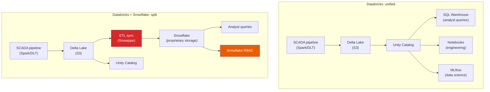

## Why this comparison matters more than any other

Every customer conversation about Databricks SQL eventually arrives at the same question: "How does this compare to Snowflake?" This is not optional territory -- it comes up in sales calls, architecture reviews, job interviews, and internal platform debates. If you cannot give a nuanced, honest answer, you lose credibility. And if your answer is a one-sided sales pitch, you lose it even faster.

The wind utility makes this concrete. The parent company's retail division already runs Snowflake. The CFO asks why the wind operations team needs a different platform. The CTO asks whether they should consolidate on one. A Databricks sales rep says "replace Snowflake with DBSQL." A Snowflake sales rep says "just connect Snowflake to the data lake." Both are oversimplifying.

Your job is to give the answer that actually helps the customer make the right decision -- even when that answer is "it depends" or "keep both."

## Where Snowflake wins

This section comes first deliberately. If you cannot articulate Snowflake's genuine strengths, your Databricks advocacy sounds like marketing.

### SQL maturity and optimizer quality

Snowflake has been a SQL-first platform since its founding in 2012. Its query optimizer has had over a decade of tuning for SQL analytics patterns. DBSQL's optimizer (built on Spark's Catalyst with Photon acceleration) has improved dramatically -- particularly since 2022 -- but Snowflake's optimizer handles certain complex SQL patterns (deeply nested subqueries, multi-way joins with skewed data, certain window function combinations) more predictably. For organizations where SQL is the primary language and queries are complex, Snowflake's optimizer maturity is a real advantage[^1].

### Concurrency model

<div class="definition">
<strong>Virtual warehouse (Snowflake)</strong>
Snowflake's compute unit. A named, independently scalable cluster of compute resources. Multiple virtual warehouses can query the same data simultaneously without contention. Snowflake's multi-cluster warehouse feature automatically adds compute clusters when concurrent queries exceed capacity -- no configuration required beyond setting a maximum cluster count.
</div>

Snowflake's concurrency scaling "just works" in a way that DBSQL is still catching up to. When 50 analysts hit a Snowflake virtual warehouse simultaneously, Snowflake spins up additional clusters automatically and the analysts barely notice. DBSQL's Serverless Intelligent Workload Management handles this scenario well now, but Pro and Classic warehouses scale by adding entire cluster units, which is slower and coarser-grained[^2].

For the wind utility's Monday morning operations meeting -- when all 15 analysts refresh dashboards at 8am -- Snowflake's concurrency handling is demonstrably smoother if you are running Pro or Classic warehouses. Serverless DBSQL narrows this gap significantly.

### SQL tool ecosystem depth

Snowflake has deeper, more battle-tested integrations with the SQL tool ecosystem. Fivetran, dbt, Sigma, Hex, Census, Hightouch -- the whole modern data stack was built with Snowflake as a first-class citizen. DBSQL integrations exist for all of these (and have improved substantially), but Snowflake integrations tend to be more mature, better documented, and more thoroughly tested. When an analyst says "I need to connect Tool X to the warehouse," the probability that the Snowflake integration works without friction is higher[^3].

### Simplicity for SQL-only teams

If your team does SQL and only SQL -- no Python, no ML, no streaming, no complex data engineering -- Snowflake is simpler. There is less to configure, fewer concepts to understand, and a gentler learning curve. Snowflake's interface assumes you are a SQL user and does not expose the complexity of the underlying distributed system. DBSQL has gotten much better at this, but it still lives inside the broader Databricks workspace, which has notebooks, clusters, jobs, MLflow, and other concepts that can overwhelm a pure SQL team.

## Where Databricks wins

### Unified platform -- no data movement

This is the single biggest advantage and it is structural, not incremental. In the wind utility's Databricks deployment, the SCADA ingestion pipeline (Spark), the DLT transformations, the Unity Catalog governance, and the DBSQL analytics layer all operate on the same Delta tables in the same cloud storage. There is no ETL between systems. When a data engineer writes a new Gold table, an analyst can query it immediately -- same table, same catalog, same permissions.

With Snowflake in the picture, data must move. The Spark pipeline writes to Delta Lake in S3. Then an ETL process copies or syncs that data into Snowflake's proprietary storage format. This sync introduces latency (minutes to hours), cost (Snowpipe ingestion charges), and failure modes (what happens when the sync breaks?). It also creates a governance gap: Unity Catalog governs the data in Delta Lake, but Snowflake has its own access controls. You now maintain two governance systems for the same data[^4].



### Open formats

Databricks stores data in Delta Lake (Parquet files + transaction log). This is an open format -- you can read these files with DuckDB, Polaris, Trino, or any engine that understands Parquet. If you leave Databricks, your data stays exactly where it is in exactly the format it was written.

Snowflake stores data in a proprietary format inside Snowflake-managed storage. You cannot read Snowflake data files directly. To get data out, you must export it -- via COPY INTO, Snowpipe, or the Snowflake API. This is not a hypothetical concern; it affects migration cost, multi-engine access, and vendor lock-in calculations. Snowflake has added Iceberg table support (Apache Iceberg Tables, GA in 2025), which stores data in open Parquet/Iceberg format, but this is opt-in per table and not the default path[^5].

### Streaming and ML on the same platform

The wind utility's vibration-based predictive maintenance model (Module 7) trains on the same data the analysts query. In Databricks, the MLflow experiment reads from `wind_ops.gold.vibration_features` -- the same table an analyst can query in DBSQL. The model is registered in Unity Catalog with lineage back to its training data.

In a Snowflake-based architecture, the ML team either works in a separate platform (SageMaker, Vertex AI) with data exported from Snowflake, or uses Snowflake's newer Cortex AI capabilities -- which are functional for applying pre-built models but substantially less capable than Databricks for custom model training, fine-tuning, and full lifecycle management[^6].

### Governance across all workloads

Unity Catalog governs everything: the Bronze raw data, the Silver cleaned data, the Gold aggregates, the ML features, the models, and the analyst queries. One lineage graph from raw SCADA readings to the CFO's dashboard. One audit trail for NERC compliance. One set of access controls.

Snowflake has strong governance for data *inside Snowflake*, but it cannot govern the upstream pipeline (which runs in Spark) or the ML models (which live elsewhere). The governance story is complete within Snowflake but fragmented across the full data lifecycle.

## The decision framework

The answer to "Databricks or Snowflake?" is not a universal recommendation. It depends on the workload mix:

**If you only do SQL analytics:** Snowflake is probably the simpler, more mature choice. Its optimizer is proven, its concurrency model is smoother, its SQL tool integrations are deeper, and its learning curve is gentler. DBSQL is competitive, but you would be choosing it for strategic reasons (open format, future ML plans) rather than day-one SQL productivity.

**If you do engineering + analytics:** Databricks avoids the data movement tax. One platform, one governance layer, no sync jobs to maintain. The analyst experience in DBSQL may not be quite as polished as Snowflake's, but the architectural simplicity of one platform outweighs that for most organizations.

**If you do engineering + analytics + ML:** Databricks is the clear choice. The unified platform advantage compounds with each workload type you add. Running Spark, DLT, DBSQL, and MLflow against the same governed data is qualitatively different from stitching together Spark + Snowflake + SageMaker with ETL between each.

**If you already have both:** Many enterprises run both. This is not failure -- it is pragmatic. The retail division keeps Snowflake (it works, their analysts are productive). The wind operations team uses Databricks end-to-end. Delta Sharing or Snowflake's Iceberg table support bridges the data where needed. Consolidation is a goal for cost reduction, not an urgent requirement.

## What to say in customer conversations

### Scenario 1: "Why not just use Snowflake for everything?"

> "Snowflake is excellent for SQL analytics -- it has a mature optimizer, smooth concurrency scaling, and deep BI tool integrations. If your workload is SQL-only, it is a strong choice. The challenge is that your wind operations also need streaming ingestion from SCADA sensors, data engineering pipelines, and predictive maintenance models. Running those in Databricks and syncing data to Snowflake introduces latency, cost, and a governance gap. The question is whether the SQL maturity advantage of Snowflake outweighs the operational simplicity of one platform. For most organizations with mixed workloads, the unified platform wins."

### Scenario 2: "We already have Snowflake. Should we migrate analysts to DBSQL?"

> "Not necessarily. If your analysts are productive in Snowflake and their BI tool integrations work, that is real value. The case for migrating is strongest when: (a) analysts are querying tables produced by Databricks pipelines and the Snowflake sync adds latency, (b) you want one governance layer across engineering and analytics, or (c) you want to reduce vendor count and licensing cost. The wrong answer is a blanket recommendation. Let us look at the specific query patterns and latency requirements."

### Scenario 3: "We are evaluating both for a new deployment"

> "Start with the workload question: Is this SQL-only, or will you also need data engineering and ML? If SQL-only, evaluate both on query performance, concurrency handling, and BI tool integration for your specific patterns. If mixed workloads, Databricks' unified platform avoids the architectural complexity of maintaining two systems and syncing data between them. Run a proof-of-concept with your actual queries on both -- the benchmarks from vendors are marketing, your workload is what matters."

## Optimization context: Liquid clustering vs. Z-ordering

Both Databricks and Snowflake have automatic query optimization features. In Databricks, the two you need to know are Z-ordering and its successor, Liquid clustering.

<div class="definition">
<strong>Z-ordering</strong>
A data layout technique that co-locates related values within the same set of Parquet files. When you Z-order a Delta table by <code>sensor_id</code>, the OPTIMIZE command rewrites files so that readings from the same sensor tend to be in the same files. This enables data skipping -- queries filtered by <code>sensor_id</code> can skip files that do not contain the target sensor, dramatically reducing I/O.
</div>

<div class="definition">
<strong>Liquid clustering</strong>
The successor to Z-ordering and partitioning for Delta Lake tables, GA since 2024. Unlike Z-ordering (which rewrites the entire table on each OPTIMIZE), Liquid clustering is incremental -- it only reorganizes new or unclustered data. Clustering keys can be changed without rewriting the table. Databricks handles re-clustering automatically in the background. For new tables, Liquid clustering is the recommended approach.
</div>

```sql
-- Z-ordering: manual, rewrites entire table each time
OPTIMIZE wind_ops.gold.fleet_hourly
ZORDER BY (sensor_id, date);

-- Liquid clustering: set it once, Databricks maintains it
ALTER TABLE wind_ops.gold.fleet_hourly
CLUSTER BY (sensor_id, date);
-- Then just run OPTIMIZE (or let it happen automatically)
OPTIMIZE wind_ops.gold.fleet_hourly;
```

The practical difference: Z-ordering has significant write amplification because every OPTIMIZE rewrites all data. On a large table (the fleet's 3 years of hourly readings), this means long-running OPTIMIZE jobs and high compute cost. Liquid clustering only reorganizes unclustered data -- new ingestion batches -- making it 7x faster for incremental workloads in Databricks' internal benchmarks[^7]. For new tables, always use Liquid clustering. For existing Z-ordered tables, the migration is straightforward.

Snowflake handles this differently. Its micro-partition pruning is automatic and does not require explicit optimization commands. Data is automatically organized during ingestion. This is simpler for the user but offers less control over the layout. For most SQL analytics workloads, both approaches produce comparable query performance -- the difference is in maintenance overhead (Databricks requires explicit or scheduled optimization; Snowflake does not).

**Key takeaway: The Snowflake comparison is not "one is better." It is "each is better at different things." Snowflake wins on SQL maturity, concurrency simplicity, and SQL tool ecosystem depth. Databricks wins on unified platform (no data movement), open formats, and ML integration. The right choice depends on the workload mix. If you can only articulate one side, you are not ready for the customer conversation.**

[^1]: [Databricks vs Snowflake -- 2026 Comparison](https://bigdataboutique.com/blog/databricks-vs-snowflake-2026-comparison-d731b5) -- independent technical comparison updated for 2026.
[^2]: [Databricks vs Snowflake -- 2025 take](https://bpcs.com/blog/databricks-vs-snowflake) -- Blueprint Technologies analysis of concurrency and scaling differences.
[^3]: [Databricks vs Snowflake: 5 key features compared](https://www.flexera.com/blog/finops/snowflake-vs-databricks/) -- Flexera comparison including ecosystem and tool integration depth.
[^4]: [Databricks SQL documentation](https://docs.databricks.com/aws/en/sql/index.html) -- DBSQL architecture showing unified access to Delta tables.
[^5]: [Snowflake Iceberg Tables documentation](https://docs.snowflake.com/en/user-guide/tables-iceberg) -- Snowflake's open format support via Apache Iceberg.
[^6]: [Snowflake vs Databricks for ML](https://bigdataboutique.com/blog/databricks-vs-snowflake-2026-comparison-d731b5) -- comparison of ML capabilities across platforms.
[^7]: [Use liquid clustering for Delta Lake tables](https://docs.databricks.com/aws/en/delta/clustering) -- Databricks documentation on Liquid clustering, including migration from Z-ordering.
