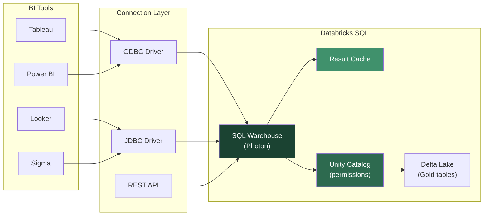
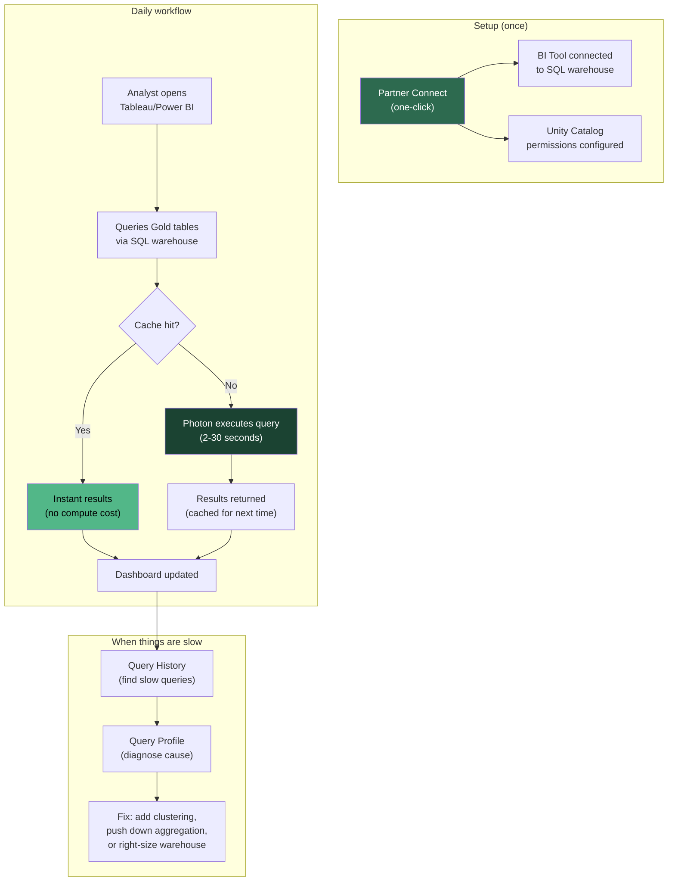

## The question

You have built governed Gold tables. You have provisioned a serverless SQL warehouse. Now: how does an analyst in Tableau, Power BI, or Looker actually *connect* to this data and start building dashboards? And when a dashboard is slow or returns stale results, how do you diagnose the problem?

This lecture covers the practical mechanics of the analyst experience -- the last-mile details that determine whether your carefully built platform actually gets used.

## JDBC/ODBC: the universal connector

<div class="definition">
<strong>JDBC/ODBC</strong>
Industry-standard database connectivity protocols. JDBC (Java Database Connectivity) is used by Java-based tools. ODBC (Open Database Connectivity) is used by most desktop BI tools. Both provide a standard interface for submitting SQL queries and receiving results. DBSQL supports both, which means any BI tool that speaks JDBC or ODBC can connect to Databricks -- which is effectively every BI tool that exists.
</div>

Every SQL warehouse exposes connection details: a server hostname, an HTTP path, and an authentication credential (personal access token or OAuth). These three values are all a BI tool needs to connect.

The connection flow for Tableau:
1. Open Tableau Desktop
2. Connect > Databricks
3. Enter the server hostname (e.g., `dbc-a1b2c3d4-e5f6.cloud.databricks.com`)
4. Enter the HTTP path (e.g., `/sql/1.0/warehouses/abc123def456`)
5. Authenticate with a personal access token or OAuth
6. Browse the Unity Catalog namespace: select catalog, schema, table
7. Start building visualizations

For Power BI, the Databricks connector uses the same credentials but through Power Query's interface. Power BI Desktop 2.143.878.0 (May 2025) and later supports service principal authentication, which is important for production dashboards that should not be tied to an individual user's token[^1].



### The driver matters

Databricks provides its own ODBC and JDBC drivers, optimized for DBSQL. These drivers support Arrow-based data transfer (which is significantly faster than row-based transfer for large result sets), cloud fetch (downloading results directly from cloud storage rather than through the warehouse), and Unity Catalog three-level namespace browsing[^2].

Do not use generic Spark ODBC/JDBC drivers. The Databricks-specific drivers are tuned for DBSQL's architecture and include features like automatic retry and connection pooling that generic drivers lack.

## Partner Connect: one-click setup

<div class="definition">
<strong>Partner Connect</strong>
A Databricks feature that provides one-click integration setup for supported BI tools and other data platform services. Instead of manually configuring server hostnames, HTTP paths, and drivers, Partner Connect automatically provisions a SQL warehouse (if needed), generates credentials, and opens the partner tool with the connection pre-configured. Supported partners include Tableau, Power BI, Fivetran, dbt, Sigma, and others.
</div>

Partner Connect removes the most common source of analyst friction: connection configuration. In the Databricks workspace, navigate to Partner Connect, select Tableau or Power BI, and click Connect. Databricks creates a service principal, assigns it appropriate Unity Catalog permissions, and generates a Tableau `.tds` or Power BI `.pbids` file that opens the tool with the connection already configured[^3].

For the wind utility's 15 analysts, this means setup time drops from "30 minutes of configuration plus a support ticket when the ODBC driver doesn't work" to "click a button and start querying." The reduction in friction is worth more than any performance optimization.

## Query history and performance monitoring

When an analyst says "my dashboard is slow," you need to diagnose the problem. DBSQL provides two primary tools for this.

### Query history

Navigate to SQL > Query History in the Databricks workspace. Every query executed against every SQL warehouse is logged with:
- The SQL text
- The warehouse that executed it
- Start time, end time, and total duration
- Rows returned
- The user who ran it
- The query status (succeeded, failed, canceled)

You can filter by warehouse, user, time range, and status. This is the first place to look when diagnosing slow dashboards -- find the specific queries that are slow.

### Query profile

Click into any query in the history to see its execution profile. The profile shows the physical plan: which operators ran, how long each took, how much data was scanned, how much was shuffled, and whether the result cache was used. This is analogous to Snowflake's query profile but shows Photon-specific details like vectorized operator execution times.

Common findings when debugging slow analyst queries:
- **Full table scan** -- the query scanned all data files instead of pruning. Solution: add Liquid clustering on the filtered columns.
- **Large result set** -- the query returned millions of rows to the BI tool. Solution: push aggregation into the SQL query instead of fetching raw data.
- **Cache miss after data change** -- a pipeline wrote new data, invalidating the result cache. The first query after a data write is always slower. This is expected.
- **Warehouse cold start** -- the warehouse was suspended and needed to restart. With serverless, this is 2-6 seconds. With Pro/Classic, this is 4+ minutes.

### System tables for monitoring at scale

For programmatic monitoring, Databricks provides system tables that log query execution metrics as queryable Delta tables. The `system.query.history` table contains the same data as the UI but accessible via SQL -- which means you can build dashboards to monitor query performance across all warehouses and users[^4].

```sql
-- Find the slowest analyst queries this week
SELECT
    user_name,
    warehouse_id,
    statement_text,
    total_duration_ms,
    rows_produced
FROM system.query.history
WHERE start_time > DATEADD(DAY, -7, CURRENT_TIMESTAMP())
  AND total_duration_ms > 30000  -- queries over 30 seconds
ORDER BY total_duration_ms DESC
LIMIT 20;
```

## Result caching: free performance

<div class="definition">
<strong>Result cache</strong>
A multi-tier caching system in DBSQL that stores query results for reuse. When an identical query is submitted and the underlying data has not changed, DBSQL returns the cached result without re-executing the query. This is transparent to the user and costs no compute. DBSQL maintains both a local cache (on the warehouse's SSD) and a remote cache (serverless only, persisted in workspace storage so it survives warehouse restart).
</div>

Result caching is the single easiest performance win for analyst workloads. Here is why: dashboards refresh on a schedule -- every 5 minutes, every hour, on page load. Most of those refreshes query data that has not changed since the last refresh. Without caching, every refresh executes the full query. With caching, repeated queries return instantly.

DBSQL has three caching layers:

1. **Result cache** -- stores the result set of previously executed queries. If the same SQL text is submitted and the underlying Delta table has not been modified, the cached result is returned. Both local (on-warehouse SSD) and remote (serverless only, survives warehouse restart) result caches exist. Cache entries expire after 24 hours[^5].

2. **Disk cache** -- caches frequently accessed data files on the warehouse's local SSD. Even when the result cache misses (because the query is different or data changed), the disk cache avoids re-reading files from cloud storage.

3. **Predictive I/O** -- pre-fetches data files based on observed query patterns. If analysts consistently query the most recent week of turbine data, DBSQL pre-loads those files into the disk cache before the queries arrive.

### When result caching does not help

- **After data writes.** When a DLT pipeline writes new data to a Gold table, the result cache for queries against that table is invalidated. The next query executes fully. This is correct behavior -- you want fresh data, not stale cache.
- **Different SQL text.** The cache keys on the exact SQL string. `SELECT * FROM t WHERE x = 1` and `SELECT * FROM t WHERE x =1` (extra space) are different cache keys. BI tools that parameterize queries may generate different SQL text for the same logical query.
- **Non-deterministic queries.** Queries with `CURRENT_TIMESTAMP()`, `RAND()`, or other non-deterministic functions are not cached.

## DBSQL dashboards

The Databricks SQL editor includes built-in dashboarding capabilities. You can create dashboards directly from query results: add visualizations (line charts, bar charts, tables, counters), arrange them on a canvas, set auto-refresh intervals, and share them with other workspace users.

These dashboards are functional for basic use cases -- the wind utility's sensor status overview, daily capacity factor trends, alert counts by state. For anything more complex (interactive filtering, drill-downs, calculated fields, publication-quality formatting), analysts will use Tableau or Power BI. Think of DBSQL dashboards as the "quick and dirty" option for data engineers who want to visualize their pipeline output without leaving the workspace, not as a replacement for proper BI tools.

## The Python connector: programmatic access

For applications that need to query DBSQL programmatically -- a custom alerting service, a data quality report generator, a downstream microservice -- the `databricks-sql-connector` Python package provides a DB API 2.0 compliant interface[^6].

```python
from databricks import sql

connection = sql.connect(
    server_hostname="dbc-a1b2c3d4.cloud.databricks.com",
    http_path="/sql/1.0/warehouses/abc123",
    access_token="dapi..."  # Use env vars, not hardcoded
)

cursor = connection.cursor()
cursor.execute("""
    SELECT turbine_id, AVG(capacity_factor) AS avg_cf
    FROM wind_ops.gold.fleet_daily
    WHERE state = 'TX' AND month = '2026-03'
    GROUP BY turbine_id
    ORDER BY avg_cf DESC
""")

for row in cursor.fetchall():
    print(f"{row.turbine_id}: {row.avg_cf:.3f}")

cursor.close()
connection.close()
```

The connector uses Apache Arrow for data transfer, which is significantly faster than row-based fetch for large result sets. Starting from version 4.0 (early 2026), SQLAlchemy support has been extracted into a separate `databricks-sqlalchemy` package for use with ORMs and tools that expect a SQLAlchemy engine[^7].

**When to use the Python connector vs. a BI tool:** If a human needs to explore and visualize data interactively, use a BI tool. If a program needs to query data and process results, use the Python connector. The wind utility's automated daily compliance report (which queries Gold tables and generates a PDF) is a good use case for the Python connector. An analyst exploring turbine performance trends is a good use case for Tableau.

## Putting it together: the analyst workflow

Here is the complete workflow for your wind utility's analysts after DBSQL is set up:



The analyst never thinks about Spark, Delta Lake, or DLT pipelines. They see a catalog of tables, they write SQL or drag columns in Tableau, and they get results. The platform complexity is invisible to them -- which is exactly the point.

**Key takeaway: The analyst experience is about removing friction at every step. Partner Connect eliminates setup friction. JDBC/ODBC provides universal connectivity. Result caching eliminates repeat compute cost. Query history provides diagnostic visibility. The Python connector enables programmatic access for applications. When all of these work well, the analyst never has to download a CSV again -- and the CFO gets one version of the truth.**

[^1]: [Connect Power BI Desktop to Databricks](https://docs.databricks.com/aws/en/partners/bi/power-bi-desktop) -- Power BI connection setup including service principal authentication.
[^2]: [SQL connectors, libraries, drivers, APIs, and tools](https://docs.databricks.com/aws/en/dev-tools/sql-drivers-tools) -- overview of Databricks-provided drivers and their capabilities.
[^3]: [Business intelligence tools](https://docs.databricks.com/aws/en/ai-bi/tools) -- Partner Connect and supported BI tool integrations.
[^4]: [System tables](https://docs.databricks.com/aws/en/administration-guide/system-tables/) -- using system.query.history for programmatic query monitoring.
[^5]: [Query caching](https://docs.databricks.com/aws/en/sql/user/queries/query-caching) -- result cache, disk cache, and cache invalidation behavior.
[^6]: [Databricks SQL Connector for Python](https://docs.databricks.com/aws/en/dev-tools/python-sql-connector) -- Python DB API 2.0 connector documentation.
[^7]: [databricks-sql-connector on PyPI](https://pypi.org/project/databricks-sql-connector/) -- version history showing the SQLAlchemy extraction in 4.0.
