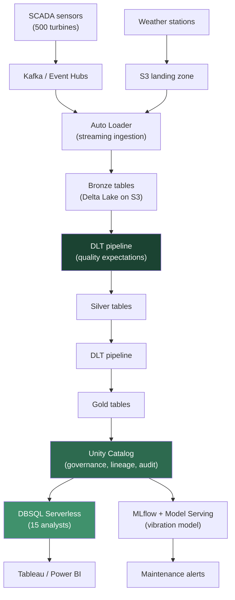
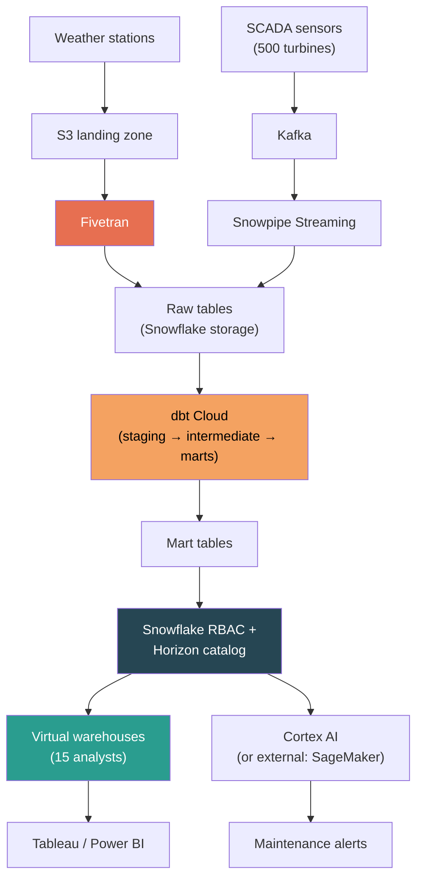
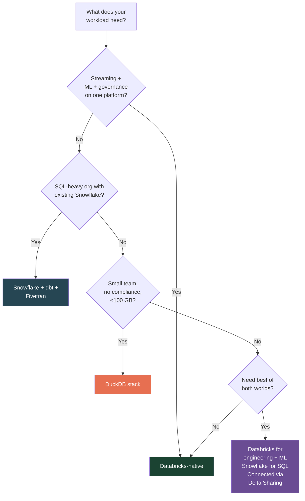

## The question nobody asks correctly

Your wind utility's CTO does not ask "Should we use Delta Lake or Iceberg?" or "Is Photon faster than Snowflake's query engine?" Those are component questions. The actual question is: "Show me what a Databricks platform looks like end-to-end, and show me the alternative. I need to compare apples to apples, not features to features."

This is the right question. A data platform is not a single product -- it is a stack of tools that must work together: ingestion, storage, transformation, orchestration, governance, analytics, ML, and BI. Comparing Databricks SQL to Snowflake warehouses is like comparing a car engine to a different car engine without asking what transmission, suspension, and frame each one is bolted into. The total cost, operational complexity, and capability of the *stack* is what determines the right choice.

Here are three stacks, mapped to the same wind utility requirements: 500 turbines, ~2 GB/day SCADA telemetry, 15 SQL analysts, a 2-person data science team running a vibration-based predictive maintenance model, and NERC CIP compliance audits twice a year.

## Stack A: Databricks-native

Everything on one platform. One vendor, one governance layer, one billing relationship.

| Layer | Tool | Role |
|-------|------|------|
| **Ingestion** | Auto Loader + Kafka connector | Streaming from S3/ADLS; real-time SCADA via Kafka |
| **Storage** | Delta Lake on S3/ADLS | Open Parquet + transaction log; you own the files |
| **Transformation** | DLT (Lakeflow Declarative Pipelines) | Bronze-to-Silver-to-Gold with `@dlt.expect` quality gates |
| **Orchestration** | Databricks Workflows | Scheduling, dependency management, retry logic |
| **Governance** | Unity Catalog | Access control, column masking for CEII, lineage, audit logs |
| **Analytics** | DBSQL Serverless warehouses | SQL interface for 15 analysts; Photon-accelerated |
| **ML** | MLflow + Feature Store + Model Serving | Experiment tracking, model registry, real-time inference |
| **BI** | Tableau / Power BI via JDBC/ODBC | Dashboards connected to Gold tables through Unity Catalog |

The structural advantage: every layer reads from and writes to the same Delta tables, governed by the same Unity Catalog. There is no ETL between systems. When the DLT pipeline writes a new Gold table, an analyst can query it immediately. When a NERC auditor asks "who accessed CEII data last quarter," one system table answers.

## Stack B: Snowflake + dbt + Fivetran

The "modern data stack" -- best-of-breed tools stitched together. Three vendors minimum, each excellent at its layer.

<strong>Fivetran</strong>
A managed data integration (ELT) service. Fivetran provides pre-built connectors that extract data from hundreds of sources (databases, SaaS APIs, event streams) and load it into a destination warehouse. You configure a connector, Fivetran handles schema detection, incremental loading, and error handling. Pricing is based on Monthly Active Rows (MAR) -- the number of rows created, updated, or deleted per month per connector.

<strong>dbt Cloud</strong>
A managed service for running dbt (data build tool) transformations. dbt defines transformations as SQL SELECT statements organized into models, with dependency management, testing, and documentation built in. dbt Cloud adds scheduling, a browser IDE, CI/CD for model changes, and a semantic layer. Its staging/intermediate/marts pattern is the functional equivalent of Bronze/Silver/Gold.

<strong>Snowpipe</strong>
Snowflake's continuous data loading service. Snowpipe monitors a cloud storage location (S3, GCS, Azure Blob) and automatically loads new files into Snowflake tables as they arrive. As of December 2025, Snowpipe uses simplified per-GB pricing (0.0037 credits per GB) instead of the previous compute-based model. Snowpipe Streaming extends this to low-latency row-level ingestion from Kafka.

<strong>Snowflake Cortex</strong>
Snowflake's AI/ML layer, providing SQL-accessible machine learning functions (forecasting, anomaly detection, classification) and LLM capabilities (text completion, summarization, semantic search) that run directly inside Snowflake without moving data to an external platform. Functional for applying pre-built models but less capable than Databricks for custom model training and full lifecycle management.

| Layer | Tool | Role |
|-------|------|------|
| **Ingestion** | Fivetran (batch) + Snowpipe Streaming (real-time) | Pre-built connectors; Kafka integration for SCADA |
| **Storage** | Snowflake internal (proprietary) or Iceberg tables | Managed storage; Iceberg opt-in for open format |
| **Transformation** | dbt Cloud | SQL models with tests, docs; staging/intermediate/marts |
| **Orchestration** | dbt Cloud scheduler + Airflow for cross-system | dbt handles transformation DAGs; Airflow for everything else |
| **Governance** | Snowflake RBAC + Horizon catalog | Role-based access, dynamic masking, row-level security |
| **Analytics** | Snowflake virtual warehouses | Auto-scaling multi-cluster; mature SQL optimizer |
| **ML** | Cortex (SQL ML) or SageMaker/Vertex (custom models) | Built-in for simple models; external for serious ML |
| **BI** | Tableau / Power BI via Snowflake connector | Deeper native integrations than Databricks for some tools |

The structural advantage: each layer uses the best tool for that specific job. Snowflake's SQL optimizer is more mature. dbt's transformation workflow has a massive community and deep testing framework. Fivetran's connectors cover more sources with less engineering effort.

The structural cost: three vendor relationships, three billing models, and data movement between systems. The ML story requires either accepting Cortex's limitations or adding a fourth vendor (SageMaker, Vertex) with data export.

## Stack C: DuckDB + dbt + cloud storage

For honesty: when is neither enterprise platform needed?

| Layer | Tool | Role |
|-------|------|------|
| **Ingestion** | Python scripts + cron (or Airflow) | Custom code; no managed connectors |
| **Storage** | Parquet or Delta on S3 | Open files; you manage organization |
| **Transformation** | dbt-duckdb | Local execution; no cloud compute charges |
| **Orchestration** | Airflow or cron | Self-managed scheduling |
| **Governance** | IAM policies + manual docs | No catalog, no lineage, no audit trail |
| **Analytics** | DuckDB (local) or MotherDuck (shared) | Single-node analytical engine; fast on small data |
| **ML** | MLflow OSS + scikit-learn | Self-managed experiment tracking |
| **BI** | Streamlit or Metabase | Lightweight dashboards |

**When this works:** a team of fewer than 5, data under 100 GB, no regulatory compliance requirements, no real-time streaming, and the team has engineering skills to maintain custom code. A solar startup with 20 inverters and 2 engineers? This stack is perfect. The wind utility with 500 turbines and NERC auditors? This stack fails on governance alone.

**MotherDuck** (DuckDB's cloud service) narrows part of the gap by adding shared access and collaboration, but it does not provide governance, lineage, or compliance features[^1].

## The honest comparison

| Dimension | Databricks-native | Snowflake + dbt + Fivetran | DuckDB stack |
|-----------|-------------------|----------------------------|--------------|
| **Monthly cost (wind utility)** | $4,000--8,000[^2] | $5,000--10,000[^3] | $500--1,500[^4] |
| **Time to production** | 4--8 weeks | 6--12 weeks | 2--4 weeks |
| **Streaming support** | Native (Auto Loader, Structured Streaming) | Snowpipe Streaming (good); Fivetran is batch-only | Manual; no managed streaming |
| **NERC compliance readiness** | Strong (Unity Catalog lineage, audit logs, column masking) | Good (Snowflake RBAC, masking, Horizon); lineage partial | None; manual documentation only |
| **ML integration** | Unified (MLflow, Feature Store, Model Serving) | Fragmented (Cortex for simple; SageMaker for custom) | Self-managed (MLflow OSS) |
| **Vendor lock-in** | Medium (Delta is open; compute is Databricks-specific) | High (Snowflake storage is proprietary by default) | Low (all open source) |
| **Team skill requirements** | Data engineering + SQL | SQL-heavy; Fivetran reduces engineering needs | Strong engineering; weak analyst tooling |
| **Operational complexity** | One platform to manage | Three vendors to coordinate | Everything is DIY |

### Cost estimates for the wind utility

These are order-of-magnitude estimates for the wind utility's workload: ~2 GB/day SCADA ingestion, 15 concurrent analysts running dashboards, 1 ML model in production, NERC-compliant governance.

**Databricks-native ($4,000--8,000/month):** DLT pipelines for ingestion and transformation (~$800--1,500 in DBUs at $0.30--0.54/DBU), DBSQL Serverless for 15 analysts (~$1,500--3,000 at $0.70/DBU), Jobs compute for ML training (~$500--1,000), Model Serving (~$300--800), cloud storage and infrastructure (~$800--1,500). Premium tier required for Unity Catalog[^5].

**Snowflake + dbt + Fivetran ($5,000--10,000/month):** Snowflake Enterprise compute for analysts (~$2,000--4,000 on Medium warehouse at $3/credit), Snowflake storage (~$200), Snowpipe Streaming (~$100--200), Fivetran for SCADA connectors (~$500--1,500 depending on MAR volume), dbt Cloud (~$500--1,000 for a small team), SageMaker for ML if needed (~$500--1,500), cloud storage (~$200)[^6].

**DuckDB stack ($500--1,500/month):** EC2 instances for Airflow and processing (~$300--700), S3 storage (~$50), MotherDuck for shared queries (~$100--300), engineer time is the real cost -- probably 0.5 FTE maintaining custom pipelines, which at loaded cost dwarfs the infrastructure spend[^7].

The DuckDB stack looks cheapest on infrastructure. Factor in the engineer time to maintain it and the inability to pass a NERC audit, and the total cost of ownership flips. For the wind utility specifically, the DuckDB stack is not viable -- not because of data volume, but because of compliance.

## The decision framework

**If you need streaming + ML + governance on one platform:** Databricks. The wind utility's combination of real-time SCADA ingestion, predictive maintenance models, and NERC compliance requirements makes this the natural fit. One vendor, one governance layer, no data movement between systems.

**If you are a SQL-heavy organization with existing Snowflake investment:** Snowflake + dbt. The retail division already runs Snowflake; the analysts know the tool; the BI integrations are mature. Adding dbt for transformation and Fivetran for ingestion gives a complete stack without retraining the team.

**If you are a small team without compliance needs:** DuckDB stack. A 3-person team with 50 GB of data does not need enterprise platform overhead. Ship fast, keep costs low, migrate when you outgrow it.

**If you need the best of both:** Databricks for data engineering and ML, Snowflake for SQL analytics, connected via Delta Sharing. This is more common than vendors want to admit. Many enterprises run both platforms and optimize each for its strength.

## The conversation scripts

### Scenario 1: Greenfield -- customer has nothing

> "Let's start with your workload mix. You have streaming SCADA data, a data science team building predictive models, 15 SQL analysts, and NERC compliance requirements. That combination -- streaming, ML, analytics, and governance -- is where a unified platform pays for itself. With Databricks, your data flows from Kafka through DLT pipelines into governed Delta tables that your analysts query directly in DBSQL and your data scientists access through MLflow. No ETL between systems, no governance gaps. The alternative is Snowflake for analytics, SageMaker for ML, Fivetran for ingestion, and dbt for transformation -- all excellent tools, but you are now coordinating four vendors and maintaining data movement between them. For a greenfield deployment with your workload mix, one platform is operationally simpler."

### Scenario 2: Customer has Snowflake, wants to add ML and streaming

> "Do not rip out Snowflake. Your analysts are productive there and your BI dashboards work. What Snowflake does not do well is custom ML model lifecycle management and low-latency streaming pipelines. Add Databricks alongside Snowflake: use it for SCADA streaming ingestion, DLT transformations, and MLflow for your vibration model. Connect the two platforms with Delta Sharing so your analysts can access ML-generated features and real-time tables from their existing Snowflake environment. Over time, you can evaluate whether consolidating onto one platform saves enough to justify the migration. But right now, adding Databricks for what Snowflake cannot do is faster and lower-risk than replacing what Snowflake already does well."

### Scenario 3: Customer has Databricks, analysts are unhappy with SQL

> "This is a real pattern. DBSQL has improved dramatically -- serverless warehouses, result caching, Partner Connect for BI tools -- but if your analysts came from Snowflake, they may find the experience less polished. Before adding Snowflake, try three things: (1) move analysts to Serverless warehouses, which have faster startup and better concurrency than Pro or Classic; (2) set up Partner Connect so Tableau/Power BI configuration is one-click; (3) enable result caching and Liquid clustering on the Gold tables analysts query most. If the experience is still not meeting their needs after those optimizations, then adding Snowflake for the analytics layer -- connected to Databricks via Delta Sharing -- is a legitimate architecture. But try the optimizations first. The cost and complexity of running two platforms is real."

---

**Key takeaway: The question is never "which tool is better at X." It is "which stack serves all of my requirements with the least operational complexity and the most honest cost." For the wind utility -- with streaming, ML, governance, and SQL analytics -- Databricks-native is the most architecturally coherent choice. But that answer changes for a SQL-only team, a team with existing Snowflake investment, or a team small enough that enterprise platforms are overhead they do not need. Know all three answers.**

[^1]: [MotherDuck pricing](https://motherduck.com/product/pricing/) -- DuckDB cloud service pricing tiers and capabilities.
[^2]: [Databricks DBU pricing: complete rate tables for every workload](https://www.databrickspricing.com/dbu-pricing-explained) -- DBU rates by workload type (Jobs at $0.15/DBU, DBSQL Serverless at $0.70/DBU, DLT at $0.30--0.54/DBU on Premium).
[^3]: [Snowflake pricing guide 2026](https://mammoth.io/blog/snowflake-pricing/) -- Enterprise edition at $3/credit, warehouse sizing, and storage costs.
[^4]: [Databricks vs. Snowflake: a CTO's guide to TCO](https://dateonic.com/databricks-vs-snowflake-a-ctos-guide-to-total-cost-of-ownership-tco/) -- total cost of ownership comparison including operational overhead.
[^5]: [Databricks pricing guide 2026](https://www.chaosgenius.io/blog/databricks-pricing-guide/) -- Premium tier requirements and DBU rate multipliers.
[^6]: [Fivetran pricing](https://www.fivetran.com/pricing) -- MAR-based pricing model; connector-level billing effective 2025. [dbt Cloud pricing](https://www.getdbt.com/pricing) -- per-seat plus consumption-based model.
[^7]: [Snowflake vs Databricks: $36K vs $28K/year](https://tech-insider.org/snowflake-vs-databricks-2026/) -- independent cost comparison including hidden costs and operational overhead.
