## The $1.08 million notebook

Your wind utility's data science team spent three months building a vibration model. The goal: predict bearing failure in nacelle gearboxes 48 hours before it happens, so you can schedule maintenance during low-wind periods instead of reacting to catastrophic failures.

In the notebook, the model performed beautifully. 94% recall on the held-out test set. The team presented to the VP of Operations. Everyone was excited. They deployed it.

In the first quarter of production, the model:

- **Missed 3 bearing failures.** Bearings seized without warning. Emergency crane mobilization, replacement parts, lost generation. Cost: approximately $200,000 per event = **$600,000** in unplanned repairs[^1].
- **Flagged 200 false alarms.** Each alarm dispatched a technician to a remote turbine site. Average cost per false dispatch (truck roll, technician time, lost productivity): $2,400. Total: **$480,000** in wasted field operations.

The VP of Operations asks a simple question: *What changed between the notebook and production?*

The data science team cannot answer. They cannot answer because they don't know which version of the model is running. They don't know what training data it was built on. They don't know if someone retrained it with different features. They don't know if the input data in production looks different from training data.

This is not a hypothetical. This is the most common failure mode in industrial ML deployments[^2].

## Why the notebook lied

The model didn't lie — it performed exactly as tested. The problem is that the test conditions didn't match production conditions. Here are the four root causes, each of which would have been caught with proper experiment tracking:

### 1. The training data was a snapshot nobody can reproduce

The data scientist queried the Gold table on March 15th. By April, two things had changed: a backfill job corrected 40,000 historical temperature readings, and a new sensor calibration shifted vibration baselines on 12 turbines. The model was trained on data that no longer exists in the table.

Without a record of *which* data the model was trained on, there's no way to know whether the training set matches what you think it matches.

### 2. Feature engineering happened in the notebook, not the pipeline

The data scientist engineered features interactively — a rolling 24-hour standard deviation of vibration, a ratio of vibration to rotor speed, a temperature delta between gearbox and ambient. These transformations lived in notebook cells, not in a reproducible pipeline. When the model was "deployed," someone re-implemented the features in the serving code. They got the rolling window wrong: 24 hours in the notebook, 24 *readings* (4 hours at 10-minute intervals) in production.

### 3. Nobody knows which model version is running

The team iterated through dozens of model variants. The one they deployed was "the good one from last Thursday." There was no version number, no link to the training run, no record of which hyperparameters produced the 94% recall.

### 4. Input distributions shifted and nobody noticed

<strong>Data drift (input drift)</strong>
A change in the statistical distribution of input features between training and serving. If a model was trained on summer vibration patterns (higher ambient temperatures, different thermal expansion) and deployed into winter (lower temperatures, different vibration baselines), the inputs it sees in production are outside the distribution it learned from. The model's predictions become unreliable even though nothing about the model itself changed.

There are actually three distinct types of drift, and they require different responses:

1. **Input drift (covariate shift)** -- The distribution of input features changes. Example: a new wind farm in a colder climate sends vibration readings with different baseline patterns. The model hasn't seen these patterns and misclassifies them. Fix: retrain on data that includes the new climate zone.

2. **Label drift (prior probability shift)** -- The frequency of the target changes. Example: a batch of bearings from a new supplier fails at 2x the historical rate. The model was calibrated for the old failure rate and under-alerts. Fix: update the decision threshold or retrain with recent data.

3. **Concept drift** -- The relationship between features and the target changes. Example: a firmware update changes how vibration is measured, so the same bearing condition produces different sensor values. The old model's learned patterns are now wrong. Fix: retrain from scratch with post-firmware data.

MLflow doesn't detect drift automatically -- but it gives you the tools to investigate. Compare the feature distributions of training data (logged as an artifact) with current production data to identify which type of drift occurred.

The model was trained on 18 months of data, but the training set was dominated by summer readings (the wind utility had a data gap during a SCADA system migration in winter 2024). When winter arrived, vibration patterns looked different from anything in the training set. The model's confidence scores dropped, but nobody was monitoring them.

## The gap between experimentation and production

Every one of these failures has the same root cause: the absence of systematic tracking between what happened in the notebook and what runs in production.

```mermaid
graph LR
    subgraph "Notebook (Experimentation)"
        N1[Query Gold table] --> N2[Engineer features]
        N2 --> N3[Train model]
        N3 --> N4[Evaluate: 94% recall]
        N4 --> N5["Deploy (copy code)"]
    end

    subgraph "Production (Serving)"
        P1[Live SCADA data] --> P2[Re-implemented features]
        P2 --> P3["Which model version?"]
        P3 --> P4["Missed failures + false alarms"]
    end

    N5 -.->|"No version tracking<br/>No data lineage<br/>No feature consistency<br/>No drift monitoring"| P1

    style N5 fill:#d32f2f,color:#fff
    style P3 fill:#d32f2f,color:#fff
    style P4 fill:#d32f2f,color:#fff
```

The dotted line is where things break. In traditional software engineering, you have version control (git), CI/CD pipelines, and deployment manifests. You can always answer "what code is running in production?" and "how do I reproduce this build?"

ML has an additional dimension: the model is a function of *code + data + configuration*. Version-controlling the code is necessary but insufficient. You also need to track:

- **What data** was used for training (not just "the Gold table" — which version, which query, which date range)
- **What parameters** were used (hyperparameters, feature selections, preprocessing decisions)
- **What metrics** resulted (not just the headline number — the full evaluation across slices)
- **What artifacts** were produced (the serialized model, feature importance plots, confusion matrices)

## The cost of ML failure in predictive maintenance

Predictive maintenance has an asymmetric cost structure that makes ML failures especially painful:

| Failure mode | Cost per event | Frequency (Q1) | Total cost |
|---|---|---|---|
| Missed bearing failure | ~$200,000 (crane, parts, lost generation) | 3 | $600,000 |
| False alarm dispatch | ~$2,400 (truck roll, technician time) | 200 | $480,000 |
| **Total** | | | **$1,080,000** |

A quick clarification on what "94% recall" means here: recall measures the fraction of actual bearing failures that the model catches. 94% recall means the model detected 94 out of every 100 real failures. The flip side is **precision** -- the fraction of the model's alerts that are real failures (as opposed to false alarms). In production, the model's precision dropped dramatically: it flagged 200 alerts but only a handful were real. The cost asymmetry matters: a missed failure costs $200K (emergency crane), a false alarm costs $2,400 (dispatch a technician who finds nothing). With this asymmetry, you want high recall (catch every failure) but the false alarm cost adds up fast at 200 dispatches.

Compare this to the alternative: scheduled inspections every 6 months cost roughly $800 per turbine. For 500 turbines, that's $400,000/year — predictable and budgetable. The broken ML model cost more in one quarter than a year of scheduled inspections.

This doesn't mean predictive maintenance is a bad idea. A *well-tracked* model that actually delivers 94% recall in production would catch bearing failures weeks early, avoiding the $200K emergency repairs. The ROI is enormous — *if* the model works as tested. The tracking and lifecycle management is what bridges "works in the notebook" to "works in the field."

## "It worked on my cluster"

If you've worked in software engineering, you've heard "it works on my machine." ML has its own version: "it worked on my cluster." The specific failure modes are:

- **Different library versions.** The notebook used scikit-learn 1.4; the serving environment has 1.3. A subtle change in default parameters produces different results.
- **Different random seeds.** The data scientist set `random_state=42` in the notebook but the production code doesn't set a seed. Results are non-deterministic.
- **Different data.** The training query ran against a table that was later backfilled, corrected, or partitioned differently.
- **Different feature computation.** Features were engineered in notebook cells that don't map cleanly to a production pipeline.

<strong>Reproducibility</strong>
The ability to produce the same model — with the same performance — given the same inputs. In ML, this requires tracking not just code but data versions, library versions, hyperparameters, random seeds, and the compute environment. MLflow was built specifically to solve this problem[^3].

## What the solution looks like

The solution is not "be more careful." The solution is systematic tracking that makes reproducibility automatic rather than relying on human discipline. That's MLflow — and on Databricks, it integrates with the governance layer (Unity Catalog) you already know from Module 5.

The next lecture covers exactly what MLflow tracks and how the model lifecycle works: from experiment to registered model to production deployment.

But before we get there, internalize this: **the vibration model didn't fail because the data science team was incompetent. It failed because the tooling didn't enforce reproducibility.** Every team that deploys ML without experiment tracking eventually has this story. The question is whether it costs you $1 million or whether you catch it in staging[^4].

---

[^1]: Sheng, S. "Wind Turbine Gearbox Reliability Database, Condition Monitoring, and Operation and Maintenance Research Update." National Renewable Energy Laboratory, 2023. Emergency gearbox replacements typically cost $150,000--$300,000 including crane mobilization, parts, and lost generation revenue.

[^2]: Paleyes, A. et al. "Challenges in Deploying Machine Learning: A Survey of Case Studies." *ACM Computing Surveys*, 2022. The most frequently reported challenges in production ML are data management, model monitoring, and reproducibility — not model accuracy.

[^3]: Zaharia, M. et al. "Accelerating the Machine Learning Lifecycle with MLflow." *IEEE Data Engineering Bulletin*, 2018. MLflow was designed to address the "ML reproducibility crisis" by tracking experiments, packaging code, and managing model deployment.

[^4]: Databricks. "IoT and Predictive Maintenance — Wind Turbine Demo." https://www.databricks.com/resources/demos/tutorials/lakehouse-platform/iot-and-predictive-maintenance — Databricks provides pre-built accelerators for wind turbine predictive maintenance that include MLflow tracking as a core component.
