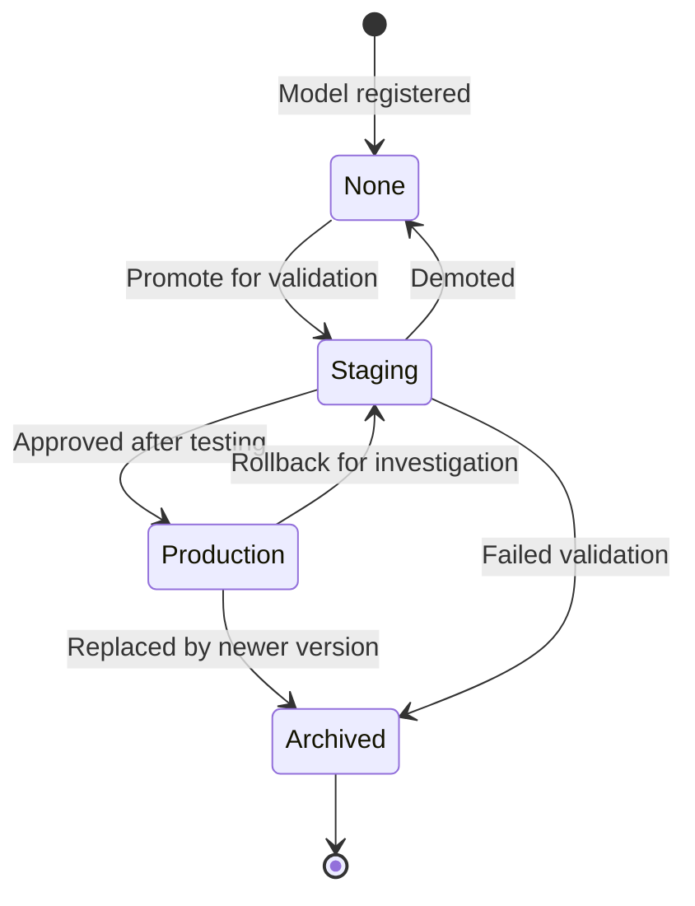
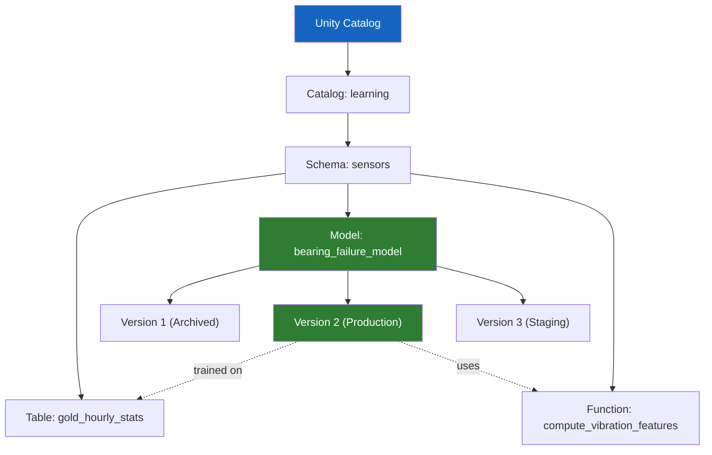

## The question

Your vibration model failed in production because nobody could answer four questions: What data was it trained on? What parameters were used? Which version is running? How do we get back to the one that worked?

MLflow exists to make those questions trivially answerable. But what does it actually *do*?

## What MLflow is (and isn't)

<div class="definition">
<strong>MLflow</strong>
An open-source platform for managing the ML lifecycle. MLflow tracks experiments (parameters, metrics, artifacts), packages models for reproducible deployment, and manages model versions through a registry. Originally created at Databricks in 2018, it is now the most widely adopted ML lifecycle tool, with over 20 million monthly downloads. MLflow 3, released in 2025, extended the platform to handle generative AI applications, AI agents, and prompt versioning alongside traditional ML[^1].
</div>

MLflow is *not* a training framework. It does not replace scikit-learn, PyTorch, or XGBoost. It wraps around whatever training code you write and tracks what happened. Think of it as git for ML experiments — except it versions data and metrics alongside code.

## The four things MLflow tracks

Every ML experiment produces four categories of information. MLflow captures all four automatically or with minimal instrumentation:

### 1. Parameters

The inputs to your experiment: hyperparameters, feature selections, data filters, preprocessing choices. For the vibration model:

```python
mlflow.log_param("contamination", 0.10)
mlflow.log_param("features", ["vibration_rms", "temp_delta", "rotor_speed"])
mlflow.log_param("training_window", "2023-01-01 to 2025-06-30")
mlflow.log_param("n_estimators", 100)
```

When the model fails in production and someone asks "what was this trained with?", the answer is one API call away — not buried in a notebook someone might have modified since.

### 2. Metrics

The outputs of your evaluation: precision, recall, F1, RMSE, or any custom metric. MLflow stores these per run, so you can compare 10 experiments side by side:

```python
mlflow.log_metric("recall", 0.94)
mlflow.log_metric("precision", 0.87)
mlflow.log_metric("f1", 0.90)
mlflow.log_metric("false_alarm_rate", 0.03)
```

Critically, MLflow also supports *step metrics* — logging a metric at multiple steps (e.g., training loss at each epoch). This produces the training curves you need to diagnose overfitting.

### 3. Artifacts

Any file associated with the run: the serialized model, feature importance plots, confusion matrices, the training dataset schema, even a sample of the training data. Artifacts are stored alongside the run metadata, so everything is in one place:

```python
mlflow.sklearn.log_model(model, "vibration-model")
mlflow.log_artifact("confusion_matrix.png")
mlflow.log_dict(feature_importance, "feature_importance.json")
```

### 4. Code version

MLflow automatically captures the git commit hash (if you're in a git repo) and the notebook revision (if you're on Databricks). This answers "which code produced this model?" without relying on anyone to write it down.

## Experiments and runs

<div class="definition">
<strong>Experiment</strong>
A named container for related MLflow runs. An experiment groups all the training attempts for a particular task — for example, "bearing-failure-prediction" might contain 50 runs with different hyperparameters, feature sets, and training windows. Experiments make it possible to compare runs and find the best-performing configuration.
</div>

<div class="definition">
<strong>Run</strong>
A single execution of training code within an experiment. Each run records its own parameters, metrics, artifacts, and code version. Runs are immutable once logged — you can't go back and change the metrics of a past run, which preserves the integrity of your experiment history.
</div>

Here's what a typical experiment workflow looks like for the vibration model:

```python
import mlflow

mlflow.set_experiment("bearing-failure-prediction")

for contamination in [0.05, 0.10, 0.15, 0.20]:
    with mlflow.start_run(run_name=f"iforest_c{contamination}"):
        mlflow.log_param("contamination", contamination)

        model = IsolationForest(contamination=contamination)
        model.fit(X_train)

        predictions = model.predict(X_test)
        recall = recall_score(y_test, predictions)
        mlflow.log_metric("recall", recall)

        mlflow.sklearn.log_model(model, "model")
```

After four runs, you open the MLflow UI and see a table: contamination values on one axis, recall/precision/F1 on the other. The best model is immediately obvious. More importantly, *the path to the best model is recorded* — you can always re-derive how you got there.

## The Model Registry: from experiment to production

Tracking experiments solves the reproducibility problem. But there's a second problem: managing the *lifecycle* of a model once you've picked the best one. Which model is in staging? Which is in production? Who approved the transition? What happens when you need to roll back?

<div class="definition">
<strong>Registered Model</strong>
A named entry in the MLflow Model Registry that represents a deployable model. A registered model can have multiple versions, each linked to a specific MLflow run. The registry tracks which version is in which stage and who transitioned it there. On Databricks, registered models live in Unity Catalog as governed objects with the same access control, lineage, and audit trails as Delta tables[^2].
</div>

### The lifecycle stages



In practice, here's how this works for the vibration model:

1. **None.** The data scientist registers the best model from the experiment. It exists in the registry but hasn't been validated for any environment.
2. **Staging.** The ML engineer promotes it to Staging and runs it against a held-out validation dataset and a shadow deployment (predictions are made but not acted on). The false alarm rate is acceptable.
3. **Production.** After validation, the model is promoted to Production. The serving endpoint automatically picks up the new version. The old Production version is archived.
4. **Archived.** When a newer model replaces it, the old version is archived — still accessible for comparison or rollback, but not actively served.

### Registering and loading models

Registering a model from a run:

```python
# After an experiment run
run_id = "abc123"
model_uri = f"runs:/{run_id}/model"

# Register in Unity Catalog (MLflow 3 default)
mlflow.register_model(
    model_uri,
    "learning.sensors.bearing_failure_model"
)
```

Loading the production model for serving:

```python
# Load whatever version is currently in Production
model = mlflow.pyfunc.load_model(
    "models:/learning.sensors.bearing_failure_model@production"
)
predictions = model.predict(new_scada_data)
```

The `@production` alias means the serving code never changes — when a new model is promoted to Production, the next prediction call automatically uses the new version. Rollback is just transitioning the old version back to Production.

## Unity Catalog integration: models governed like data

This is where the story connects to Module 5. In MLflow 3 on Databricks, the default model registry is Unity Catalog[^3]. This means:

- **Models follow the three-level namespace.** `learning.sensors.bearing_failure_model` lives in the `learning` catalog, `sensors` schema — right next to the Delta tables the model was trained on.
- **Access control is inherited.** If an analyst can't see the `sensors` schema, they can't see the model either. The NERC compliance officer who governs data access also governs model access.
- **Lineage is automatic.** Unity Catalog records which notebook created which model, which data it was trained on, and which serving endpoint consumes it. When the auditor asks "what data went into the model that triggered this maintenance dispatch?", the answer is a lineage graph query.
- **Metrics and parameters are visible in the registry.** MLflow 3 enhanced the Unity Catalog model registry so that when you register a model, its metrics and parameters are available directly in the registry UI — no need to navigate back to the experiment[^4].



## The migration context

If you're working with an existing Databricks customer, there's a practical detail worth knowing: the legacy Workspace Model Registry (pre-Unity Catalog) stored models in a workspace-local registry with no cross-workspace access and limited governance. Since April 2024, Databricks has disabled the Workspace Model Registry for new workspaces where the default catalog is in Unity Catalog[^5]. Existing customers may still be migrating.

The migration path is straightforward — models are re-registered in Unity Catalog and serving endpoints are updated to point to the new URIs — but it's operational work that someone has to plan and execute. Knowing this migration is happening is useful consulting knowledge.

## From registry to serving

Registering a model in Unity Catalog doesn't deploy it. To serve the vibration model in real-time:

1. **Create a serving endpoint** (Databricks UI --> Serving --> Create). Select the registered model and version. Choose compute size (CPU for simple models, GPU for deep learning). Enable auto-scaling if query volume varies.

2. **Test the endpoint** -- Send a sample payload via REST API:
```python
import requests
response = requests.post(
    'https://<workspace>.databricks.net/serving-endpoints/vibration-model/invocations',
    headers={'Authorization': f'Bearer {token}'},
    json={'dataframe_records': [{'rms_vibration': 4.2, 'temperature': 68.5}]}
)
print(response.json())  # {'predictions': [0.87]}
```

3. **Monitor in production** -- Use Lakehouse Monitoring (or Inference Tables) to track prediction distributions over time. If the distribution shifts (mean prediction changes, or the model starts predicting failure 3x more often than baseline), investigate for drift.

The cost: a single-model CPU endpoint starts at ~$0.07/hour (~$50/month). GPU endpoints are ~10x more. For the wind utility's vibration model (predicting once per turbine per hour = 500 predictions/hour), a small CPU endpoint is sufficient[^6].

## What this solves for the vibration model

Go back to the four failures from the previous lecture:

| Failure | What MLflow provides |
|---|---|
| Can't reproduce training data | Run logs the data source, query, and version |
| Feature engineering differs | Features logged as parameters; model artifact includes preprocessing |
| Unknown model version in production | Registry tracks exactly which version is serving |
| Input drift undetected | Metrics from training vs. serving can be compared; monitoring hooks available |

The vibration model with MLflow tracking would have been deployed with a clear version number, linked to a specific training run, with recorded parameters and metrics. When production performance degraded, the team could compare production inputs against training distributions and identify the drift. The $1.08 million failure becomes a Slack alert: "Model v2 recall dropped below 90% threshold — investigate before next dispatch cycle."

---

[^1]: MLflow. "MLflow 3 Release Notes." 2025. https://mlflow.org/releases/3 — MLflow 3 redesigned the platform for GenAI with agent observability, prompt versioning, and the Unity Catalog model registry as the default backend.

[^2]: Databricks. "Manage model lifecycle in Unity Catalog." https://docs.databricks.com/aws/en/machine-learning/manage-model-lifecycle/ — Models in Unity Catalog inherit centralized access control, auditing, lineage, and cross-workspace discovery.

[^3]: Databricks. "Model Registry improvements with MLflow 3." https://docs.databricks.com/aws/en/mlflow/model-registry-3 — The default registry URI in MLflow 3 is `databricks-uc`, meaning the Unity Catalog model registry is used by default.

[^4]: MLflow. "ML Model Registry." https://mlflow.org/docs/latest/ml/model-registry/ — Registered model versions capture metrics and parameters directly, making them available across all workspaces.

[^6]: Databricks. "Model Serving pricing." https://docs.databricks.com/aws/en/machine-learning/model-serving/ -- Serverless model serving pricing varies by compute size; CPU endpoints start at fractional DBU rates per hour.

[^5]: Databricks. "Manage model lifecycle using the Workspace Model Registry (legacy)." https://docs.databricks.com/aws/en/machine-learning/manage-model-lifecycle/workspace-model-registry — Since April 2024, Workspace Model Registry is disabled for new workspaces with Unity Catalog as the default catalog.
