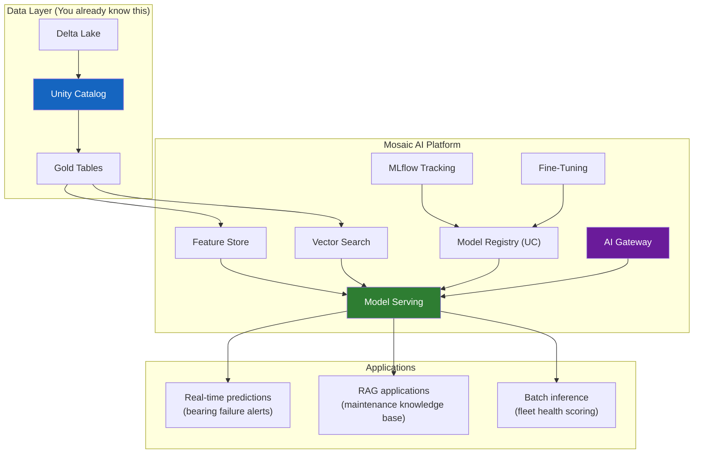

## The thesis

Databricks used to pitch itself as a "data lakehouse platform." Starting in 2023 with the Mosaic AI acquisition and accelerating through 2025, the pitch changed: Databricks is an "AI platform." The argument is straightforward:

1. Your AI models need your data (training data, feature data, context for RAG).
2. Your data is governed in Databricks (Delta Lake, Unity Catalog, lineage).
3. Therefore, your AI should live in Databricks — where it can access governed data without moving it to another system.

This is a coherent argument. It is also self-serving. Your job in a customer conversation is to know where it's genuinely strong and where it's a stretch. This lecture walks through each component of the Databricks AI platform, what it does, and an honest assessment.

## The components



### Feature Store: why ML teams need it

<div class="definition">
<strong>Feature Store</strong>
A centralized repository for computed features (engineered variables) used in ML models. The Feature Store ensures that the same feature computation used during training is used during serving — eliminating the "training-serving skew" that caused the vibration model's feature mismatch in Lecture 1. On Databricks, any Delta table in Unity Catalog with a primary key can serve as a feature table[^1].
</div>

Remember the vibration model failure: features were engineered in a notebook (rolling 24-hour standard deviation), then re-implemented differently in the serving pipeline (rolling 24 readings = 4 hours). A Feature Store prevents this by computing features once and serving them to both training and inference.

For the wind utility, this means:

- **Training time:** The model pulls `vibration_rms_24h`, `temp_delta_gearbox_ambient`, and `rotor_speed_ratio` from the feature table. These were computed by a DLT pipeline from the Silver layer.
- **Serving time:** The model serving endpoint performs a *point-in-time lookup* against the same feature table. The features are identical — no re-implementation, no skew.

```python
from databricks.feature_engineering import FeatureEngineeringClient

fe = FeatureEngineeringClient()

# Define a training set with features from the store
training_set = fe.create_training_set(
    df=labeled_bearings,  # DataFrame with labels
    feature_lookups=[
        FeatureLookup(
            table_name="learning.sensors.turbine_features",
            feature_names=["vibration_rms_24h", "temp_delta"],
            lookup_key="turbine_id",
        )
    ],
    label="bearing_failure",
)
```

The Feature Store also handles **online serving** — publishing features to a low-latency store (like DynamoDB or Cosmos DB) so that real-time prediction requests can look up the latest feature values in milliseconds rather than querying Delta Lake[^2].

### Vector Search: for RAG applications

<div class="definition">
<strong>Vector Search</strong>
A service that indexes and retrieves data based on semantic similarity rather than exact keyword matching. Text (or other data) is converted to numerical vectors (embeddings), and queries find the most similar vectors. On Databricks, Vector Search integrates directly with Delta tables — as your data changes, the vector index updates automatically[^3].
</div>

For the wind utility, the RAG use case is a maintenance knowledge base. Field engineers need to diagnose problems at turbine sites. They have 15 years of maintenance reports, OEM technical bulletins, and incident investigations — thousands of documents. Instead of keyword search through a document management system, a RAG-powered assistant lets them ask: "What were the symptoms before the Turbine 347 gearbox failure in 2024?"

The architecture:

1. Maintenance documents are chunked and embedded, stored in a Delta table with a Vector Search index.
2. When a field engineer asks a question, the query is embedded and matched against the document chunks.
3. The most relevant chunks are passed to an LLM as context.
4. The LLM generates an answer grounded in the utility's own maintenance history.

Databricks redesigned Vector Search in 2025 with a storage-optimized architecture that separates compute from storage, enabling billion-scale vector indexes at 7x lower cost than the original implementation[^4]. For the wind utility, this means the full corpus of maintenance history can be indexed without cost being a barrier.

### Model Serving: real-time inference

<div class="definition">
<strong>Model Serving endpoint</strong>
A managed API endpoint that serves predictions from an MLflow model. Databricks Model Serving provides serverless, auto-scaling infrastructure — endpoints scale from zero (no cost when idle) to thousands of queries per second (over 25,000 QPS with sub-50ms overhead). Models registered in Unity Catalog can be deployed to a serving endpoint with a few clicks or API calls[^5].
</div>

For the vibration model, Model Serving provides the real-time prediction endpoint that SCADA data flows through:

```python
# Serving endpoint configuration
endpoint_config = {
    "name": "bearing-failure-predictor",
    "config": {
        "served_entities": [{
            "entity_name": "learning.sensors.bearing_failure_model",
            "entity_version": "2",
            "scale_to_zero_enabled": True,
        }]
    }
}
```

The critical feature for production ML: when you promote a new model version in the registry, you can update the serving endpoint to use it without any code changes. Traffic routing (e.g., 90% to the current model, 10% to the new candidate) enables safe rollouts.

Model Serving also hosts **Foundation Model APIs** — Databricks provides access to open-source LLMs (Llama, DBRX, Mixtral) through the same serving infrastructure, with pay-per-token pricing and no GPU management required.

### AI Gateway: centralized LLM governance

<div class="definition">
<strong>AI Gateway</strong>
A unified API proxy for all LLM interactions — whether models are hosted on Databricks, on external providers (OpenAI, Anthropic, Google), or self-hosted. The AI Gateway provides rate limiting, usage tracking, cost attribution, PII detection, safety guardrails, and automatic fallback between providers. It went generally available in 2025[^6].
</div>

For a wind utility subject to NERC CIP, the AI Gateway answers a compliance question that would otherwise be difficult: "Which LLM providers have access to our data, and what are the usage patterns?" Every LLM request flows through the Gateway, so you get:

- **Audit logging** of every prompt and response (or just the metadata, depending on sensitivity)
- **Rate limiting** per user, team, or application
- **Cost attribution** by project or department
- **Guardrails** that detect and block prompts containing CEII or PII before they reach an external provider

The Gateway exposes an OpenAI-compatible API, so developers write their application once and switch between models (GPT-4, Claude, Llama, DBRX) by changing a configuration parameter — not the application code.

### LLM fine-tuning

Databricks offers managed fine-tuning for open-source LLMs using your enterprise data. For the wind utility, this could mean fine-tuning a model on maintenance reports so it understands domain-specific terminology (nacelle, yaw system, SCADA, curtailment) without hallucinating definitions.

The fine-tuning runs on Databricks' serverless GPU compute, and the resulting model is registered in Unity Catalog with full lineage back to the training data. This means the NERC compliance officer can trace: which data was used to fine-tune the model, who initiated the training, and what evaluation metrics were achieved.

## Where the thesis is strong

The Databricks AI platform argument is strongest in three areas:

**1. Governance.** No other AI platform integrates model governance, data governance, and LLM governance in one system. If you're already using Unity Catalog for data access control and lineage, extending it to models and LLM usage is natural. For regulated industries (energy, finance, healthcare), this is often the deciding factor. Databricks was named a leader in the IDC MarketScape for Unified AI Governance Platforms (2025-2026)[^7].

**2. Feature consistency.** The Feature Store eliminates training-serving skew by serving the same computed features to both training and inference. This is the direct fix for the vibration model's failure mode.

**3. Data proximity.** Training ML models requires data. If your data is already in Delta Lake tables governed by Unity Catalog, training on Databricks avoids the ETL overhead of copying data to another platform. For the wind utility's 3 years of SCADA history, this is meaningful — you don't want to export terabytes to S3 in a format SageMaker understands.

## Where the thesis is weaker

**1. Specialized ML tooling.** SageMaker has a more mature suite of ML-specific tools: built-in algorithms, hyperparameter tuning (Bayesian optimization), data labeling (Ground Truth), model monitoring (Model Monitor), and pipeline orchestration (SageMaker Pipelines). If your ML team needs advanced AutoML, distributed training across many GPU nodes, or custom training containers, SageMaker or Vertex AI have deeper capabilities.

**2. GPU availability and cost.** Databricks serverless GPU compute is still in beta as of 2025. For heavy training workloads (fine-tuning a 70B parameter model), dedicated GPU clusters on AWS or GCP may be more cost-effective and offer more control over instance types. Vertex AI has the additional advantage of TPU access for certain workloads.

**3. Ecosystem maturity for pure ML teams.** A team of ML engineers who don't work with data pipelines may find Databricks' notebook-centric workflow less natural than SageMaker Studio or Vertex AI Workbench, which are designed ML-first. Databricks is strongest when the data engineering and ML teams overlap or collaborate closely.

**4. LLM ecosystem.** For teams primarily building LLM applications (not training custom models), the AI Gateway and Vector Search are solid but relatively new compared to LangChain ecosystem tools, Pinecone for vector search, or cloud-native offerings. The advantage is integration; the disadvantage is maturity.

## The wind utility view

For the wind utility specifically, the Databricks AI platform makes sense because:

- The data is already in Delta Lake (SCADA telemetry, weather, maintenance records)
- Governance is already in Unity Catalog (NERC CIP compliance)
- The ML use case (predictive maintenance) depends heavily on feature consistency between training and serving
- The team is small (a few data scientists, not a dedicated ML platform team) — managed infrastructure matters

The case would be weaker if the utility had a large, dedicated ML engineering team that wanted fine-grained control over training infrastructure, or if the primary use case was LLM-based rather than traditional ML.

---

[^1]: Databricks. "Feature Store." https://docs.databricks.com/aws/en/machine-learning/feature-store/ — Any Delta table in Unity Catalog with a primary key can serve as a feature table for model training or inference.

[^2]: Databricks. "Databricks Online Feature Stores." https://docs.databricks.com/aws/en/machine-learning/feature-store/online-feature-store — Online feature stores provide low-latency feature lookups for real-time model serving.

[^3]: Databricks. "Mosaic AI Vector Search." https://docs.databricks.com/aws/en/vector-search/vector-search — Vector Search indexes are automatically synced with Delta tables, keeping embeddings up to date as data changes.

[^4]: Databricks. "Beyond Simple RAG: Unlocking Quality, Scale and Cost-Efficient Retrieval With Mosaic AI Vector Search." Data + AI Summit 2025. The storage-optimized architecture separates compute from storage, enabling billion-scale indexes at 7x lower cost.

[^5]: Databricks. "Model Serving." https://docs.databricks.com/aws/en/machine-learning/model-serving/ — Serverless model serving supports over 25,000 QPS with sub-50ms overhead latency, scaling from zero to meet demand.

[^6]: Databricks. "AI Gateway." https://docs.databricks.com/aws/en/ai-gateway/ — AI Gateway provides a unified entry point for all AI services with centralized governance, usage logging, and control. GA in 2025.

[^7]: Databricks. "Named a Leader in the IDC MarketScape: Worldwide Unified AI Governance Platforms 2025-2026 Vendor Assessment." https://www.databricks.com/blog/databricks-named-leader-idc-marketscape-worldwide-unified-ai-governance-platforms-2025-2026
