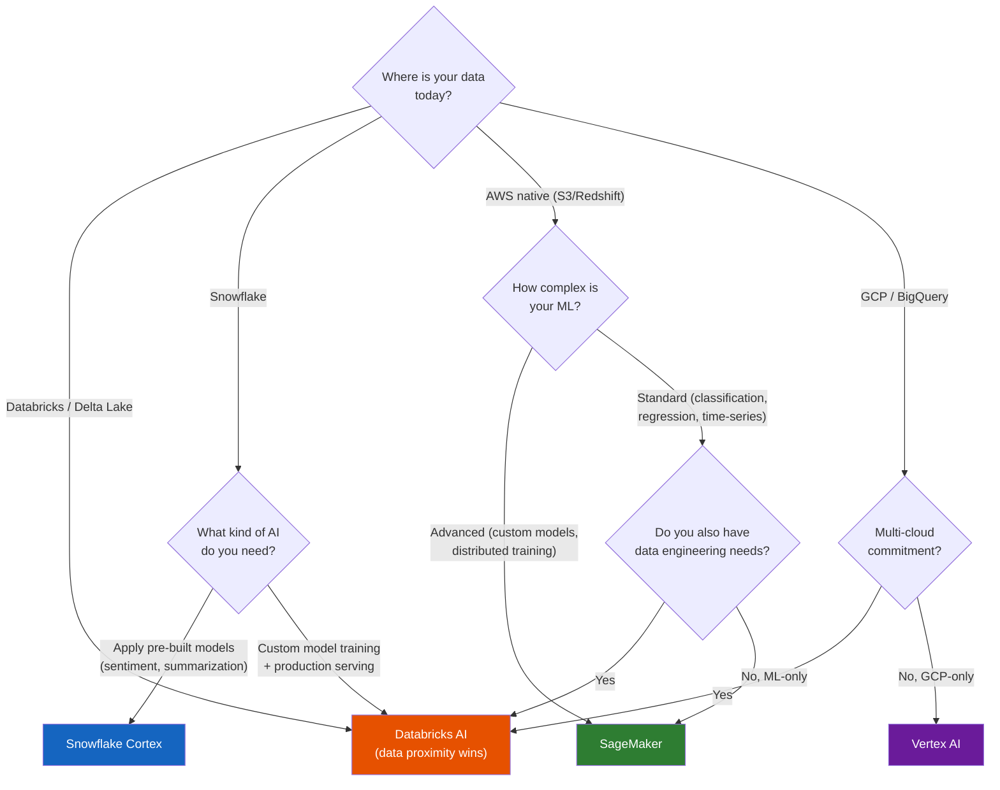

## The question you will always be asked

Every customer conversation about Databricks AI eventually arrives at: "We're also looking at SageMaker" or "Why wouldn't we just use Snowflake Cortex?" or "Our team already uses standalone MLflow — why do we need the Databricks version?"

You need honest, nuanced answers. A Databricks sales pitch disguised as advice destroys credibility. Saying "it depends" without specifics is equally useless. This lecture gives you the concrete trade-offs for each comparison, and a decision framework to guide the conversation.

## Databricks AI vs. AWS SageMaker

SageMaker is the comparison you'll encounter most often, because most enterprise data platforms run on AWS.

**Where SageMaker is stronger:**

- **Depth of ML tooling.** SageMaker has more built-in algorithms, more mature hyperparameter tuning (Bayesian optimization with warm starts), dedicated data labeling (Ground Truth), and a full pipeline orchestration system (SageMaker Pipelines). For teams doing heavy, iterative ML development, SageMaker's toolbox is deeper.
- **GPU infrastructure.** SageMaker has years of production GPU management experience. Custom training containers, distributed training across multi-node GPU clusters, and spot instance training are all mature features. Databricks' serverless GPU compute is newer.
- **AWS-native integration.** SageMaker connects natively to S3, IAM, Lambda, Step Functions, and the rest of the AWS ecosystem. If your infrastructure is all-in on AWS, SageMaker's integration is frictionless.

**Where Databricks is stronger:**

- **Data proximity.** If your data engineering is on Databricks (Delta Lake, Unity Catalog, DLT pipelines), training on Databricks avoids the ETL cost of copying data to SageMaker. For the wind utility's SCADA data, this is the difference between "query the Gold table directly" and "export to S3 in SageMaker-compatible format, manage a separate data pipeline."
- **Unified governance.** Models in Unity Catalog follow the same access control and lineage as data. SageMaker Model Registry is a separate governance system — you'd need to manually maintain the relationship between SageMaker models and whatever data catalog you use.
- **Feature Store integration.** Databricks' Feature Store is a Delta table in Unity Catalog. SageMaker Feature Store is a separate service. For teams that want features computed by the same pipelines that process data, Databricks is simpler.
- **One platform for data + ML.** Data engineers and data scientists share one workspace, one governance model, one set of tables. On AWS, the equivalent is Glue + SageMaker + Lake Formation — three services to stitch together[^1].

**The conversation script:**

> "SageMaker is a great choice if your primary constraint is ML engineering depth — you need advanced tuning, distributed GPU training, or custom containers. Where Databricks wins is when data engineering and ML are tightly coupled — the same governed data feeds both your pipelines and your models, without the integration tax of connecting separate services."

## Databricks AI vs. Google Vertex AI

Vertex AI is relevant when the customer is on Google Cloud or evaluating multi-cloud.

**Where Vertex AI is stronger:**

- **BigQuery integration.** If the customer's analytics are in BigQuery, Vertex AI's connection is seamless. BigQuery ML lets analysts train models from SQL without leaving their analytics environment — lower barrier to entry than Databricks notebooks.
- **TPU access.** For specific workloads (large-scale fine-tuning, certain model architectures), Google's TPUs offer better performance-per-dollar than GPUs. Databricks doesn't offer TPUs.
- **Managed GenAI workflows.** In 2025-2026, Vertex AI has arguably the most mature managed GenAI pipeline: Gemini models, built-in evaluation, grounding with Google Search, and straightforward RAG setup[^2].
- **Simpler managed deployment.** Vertex AI's endpoint management tends to require less configuration than Databricks Model Serving for standard deployment patterns.

**Where Databricks is stronger:**

- **Multi-cloud.** Databricks runs on AWS, Azure, and GCP. Vertex AI is GCP-only. For customers with multi-cloud commitments or hybrid environments, this matters.
- **Data engineering integration.** Same story as SageMaker: if the data pipelines are on Databricks, keeping ML there avoids a second data platform.
- **Open-source foundation.** MLflow and Delta Lake are open source. Vertex AI's tooling is proprietary. For customers wary of cloud lock-in, the open-source base matters.

**The conversation script:**

> "If you're all-in on Google Cloud and BigQuery, Vertex AI has a simpler path — especially for GenAI workloads. Databricks makes more sense when you're multi-cloud, when your data engineering team is already on the platform, or when you want open-source portability."

## Databricks AI vs. Snowflake Cortex

This comparison comes up constantly because many Databricks customers also have Snowflake in their organization.

<strong>Snowflake Cortex</strong>
Snowflake's AI layer, providing SQL-callable functions for LLM inference, embeddings, classification, anomaly detection, and summarization. Cortex runs within Snowflake's compute, so data never leaves the platform. It is designed for SQL-first teams that want to apply AI to their data without managing infrastructure or writing Python[^3].

**Where Snowflake Cortex is stronger:**

- **Simplicity for SQL teams.** Cortex lets analysts call `SNOWFLAKE.CORTEX.SENTIMENT(text_column)` or `SNOWFLAKE.CORTEX.SUMMARIZE(document)` directly from SQL. No notebooks, no Python, no MLflow. For 15 analysts who just want to add AI enrichment to their queries, this is dramatically simpler.
- **No infrastructure management.** Cortex runs on Snowflake's existing warehouses. There's no separate serving endpoint to configure, no model registry to manage, no GPU instances to provision.
- **Governed by default.** Data stays in Snowflake. Cortex functions respect Snowflake's access control. For compliance teams, "the data never leaves Snowflake" is an easy-to-verify guarantee.

**Where Databricks is stronger:**

- **Custom model training.** Cortex is primarily for inference — applying pre-built models to your data. If you need to train a custom vibration model on your SCADA data, Cortex can't do it. Databricks (with MLflow, Feature Store, and GPU compute) can.
- **Complex ML workflows.** Feature engineering, experiment tracking, model versioning, A/B testing, model monitoring — Databricks has the full lifecycle. Cortex provides point-of-use AI functions, not an ML platform.
- **Streaming + ML.** The vibration model needs to process real-time SCADA data and generate predictions continuously. Databricks' Structured Streaming feeds directly into Model Serving. Snowflake's streaming capabilities (Snowpipe Streaming) are less mature for this pattern.
- **Open ecosystem.** Databricks uses open formats (Delta/Parquet, MLflow). Snowflake Cortex is a proprietary service. If you want to take your model and deploy it elsewhere, Databricks doesn't lock you in.

**The conversation script:**

> "Snowflake Cortex is the right choice when your team is SQL-first and the use case is applying pre-built AI to your data — sentiment analysis, summarization, anomaly detection. Where Databricks AI wins is custom model training, complex ML pipelines, and real-time inference. Most large organizations will end up using both: Cortex for SQL analysts, Databricks for the ML team. The question is where the center of gravity should be."

Snowflake CEO Sridhar Ramaswamy put it well: "Most organizations don't need to train foundation models. They need to put AI to work on their governed, trusted data." That's Cortex's value proposition — and it's correct for a large segment of the market. Databricks' counter-argument is that the organizations that *do* need custom models are the ones with the most complex (and highest-value) AI use cases[^4].

## Standalone MLflow vs. MLflow on Databricks

This is the subtlest comparison, because MLflow is open source and you can run it anywhere.

**What standalone MLflow gives you:**

- Experiment tracking (parameters, metrics, artifacts)
- Model packaging and serving
- A model registry with lifecycle stages
- Runs on any infrastructure (your laptop, a VM, Kubernetes)
- Free

**What MLflow on Databricks adds:**

- **Managed tracking server.** No infrastructure to maintain. On standalone MLflow, you need to run and maintain a tracking server, configure artifact storage (S3 bucket, database), and manage access control yourself.
- **Unity Catalog integration.** Models governed as first-class catalog objects. Standalone MLflow's model registry has basic access control; Unity Catalog provides enterprise-grade governance with lineage, audit trails, and cross-workspace access.
- **Automatic notebook integration.** Every Databricks notebook run automatically captures the notebook revision as part of the MLflow run. No manual instrumentation needed.
- **Serverless model serving.** Deploying a model to a serving endpoint is a few clicks. Standalone MLflow requires you to set up your own serving infrastructure (Docker, Kubernetes, or a cloud-managed endpoint).
- **MLflow 3 features.** Some MLflow 3 capabilities — like the enhanced model registry UI with inline metrics, trace integration for monitoring served models, and agent observability — are optimized for the Databricks environment[^5].

**The decision:**

If your team is small (1-3 data scientists), your models are simple, and you don't need enterprise governance, standalone MLflow is fine. It's a great tool.

If you're in a regulated industry, have multiple teams sharing models, need production serving with auto-scaling, or want model governance integrated with data governance, the managed version pays for itself in operational overhead you don't have to carry.

For the wind utility: standalone MLflow could work for initial experimentation. But the moment the vibration model needs to serve predictions to 500 turbines with NERC audit trails, you need the managed platform.

## Decision framework

When a customer asks "which AI platform should we use?", walk through these questions:

The real differentiator is rarely the AI capabilities themselves — it's the integration story. The best AI platform is the one closest to where your data already lives, governed by the system your compliance team already trusts.

## The summary table

| Dimension | Databricks AI | SageMaker | Vertex AI | Snowflake Cortex |
|---|---|---|---|---|
| **Best for** | Data-heavy ML with governance | Advanced ML engineering on AWS | GenAI on GCP + BigQuery | SQL-first AI enrichment |
| **Custom training** | Strong | Strongest | Strong | Not available |
| **Governance** | Strongest (Unity Catalog) | Moderate (IAM-based) | Moderate (IAM-based) | Strong (Snowflake RBAC) |
| **Feature Store** | Integrated (Delta tables) | Separate service | Separate service | Not available |
| **Serving** | Serverless, auto-scaling | Mature, flexible | Managed, simpler | Built into SQL |
| **GenAI/LLM** | AI Gateway + fine-tuning | Bedrock integration | Gemini + Vertex AI Studio | Cortex functions |
| **Multi-cloud** | Yes (AWS/Azure/GCP) | AWS only | GCP only | Multi-cloud |
| **Lock-in risk** | Low (open source base) | High (AWS proprietary) | High (GCP proprietary) | Moderate |

---

[^1]: Apptension. "Best SaaS MLOps Platforms: Vertex AI vs SageMaker vs Databricks." 2025. https://apptension.com/guides/best-saas-mlops-platforms-for-production-ml-teams-vertex-ai-vs-sagemaker-vs-databricks — Comprehensive comparison of the three platforms' ML capabilities and operational characteristics.

[^2]: TrueFoundry. "Top 6 Vertex AI Alternatives in 2026." https://www.truefoundry.com/blog/vertex-ai-alternatives — Analysis of Vertex AI's strengths and how alternatives compare in the 2026 landscape.

[^3]: SmartData. "Snowflake Cortex AI: What It Is, What It Isn't, and Whether You Need It." https://www.smartdata.net/blog/snowflake-cortex-ai — Honest assessment of Cortex's capabilities and limitations, distinguishing inference from training.

[^4]: Flexera. "Databricks vs Snowflake: 5 key features compared (2026)." https://www.flexera.com/blog/finops/snowflake-vs-databricks/ — Comparison covering AI/ML, SQL analytics, governance, and pricing. Notes that Databricks' acquisition of Neon (Lakebase) in 2025 expanded its platform into OLTP territory.

[^5]: MLflow. "MLflow 3 Release Notes." https://mlflow.org/releases/3 — MLflow 3 features including Unity Catalog model registry as default, enhanced metrics display, trace integration, and GenAI support.
